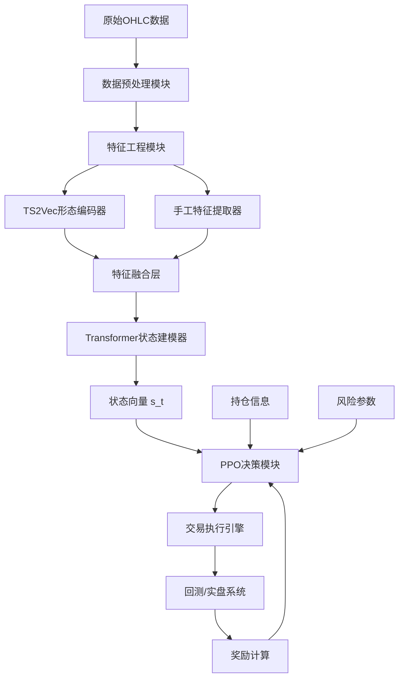
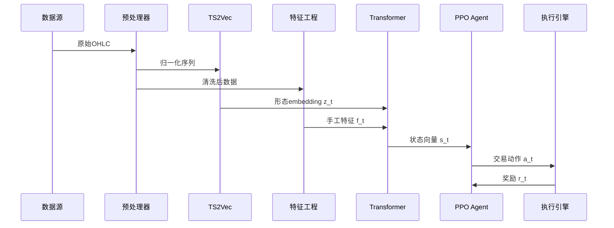

# AI交易系统结构化设计方案

## 文档版本
- 版本：v1.0
- 创建日期：2025-11-20
- 项目名称：基于TS2Vec-Transformer-PPO的智能交易系统

---

## 1. 需求分析与理解

### 1.1 核心业务目标
构建一个融合"形态识别 → 状态建模 → 动作决策"的三层智能交易系统，用于5分钟级别期货交易，实现自动化交易决策和风险控制。

### 1.2 关键功能需求

#### 1.2.1 形态特征提取
- 使用TS2Vec进行无监督时间序列表征学习
- 从原始OHLC数据中提取深层形态特征
- 输出固定维度的embedding向量供下游使用

#### 1.2.2 市场状态建模
- 融合TS2Vec形态特征与27维手工特征
- 使用Transformer捕捉时序依赖关系
- 输出高维市场状态向量

#### 1.2.3 交易决策执行
- 基于PPO强化学习算法
- 输出离散动作（开仓方向）和连续动作（仓位、止损止盈）
- 考虑风险控制和持仓信息

### 1.3 技术要求

#### 1.3.1 数据要求
- 数据源：雅虎金融（Yahoo Finance）
- 数据频率：5分钟K线
- 数据维度：OHLC（开高低收）
- 时间范围：建议至少2-3年历史数据用于训练

#### 1.3.2 模型要求
- **TS2Vec**：预训练模型，参数离线保存
- **Transformer**：状态建模层，融合多源特征
- **PPO**：强化学习决策层，输出交易动作

#### 1.3.3 性能要求
- 训练稳定性：多seed运行结果方差小
- 泛化能力：验证集与测试集性能降幅<20%
- 实时性：推理延迟<100ms（单次决策）

---

## 2. 系统架构设计

### 2.1 整体架构图



### 2.2 模块划分

#### 2.2.1 数据层
- **数据采集模块**：从Yahoo Finance获取OHLC数据
- **数据清洗模块**：处理缺失值、异常值、时间对齐
- **数据存储模块**：本地缓存与增量更新

#### 2.2.2 特征层
- **TS2Vec编码器**：形态特征提取（预训练）
- **手工特征计算器**：27维技术指标计算
- **特征归一化器**：StandardScaler/RobustScaler处理
- **特征验证器**：特征有效性检验

#### 2.2.3 模型层
- **Transformer状态建模器**：融合特征→状态向量
- **PPO策略网络**：状态→动作映射
- **PPO价值网络**：状态价值估计

#### 2.2.4 执行层
- **交易信号生成器**：动作→具体交易指令
- **风险管理器**：仓位控制、止损止盈
- **回测引擎**：历史数据模拟交易
- **实盘接口**：对接交易所API

#### 2.2.5 评估层
- **性能评估器**：Sharpe、CAGR、MaxDD等指标
- **特征重要性分析器**：置换重要性、消融实验
- **过拟合检测器**：Walk-forward验证

### 2.3 技术栈选型

#### 2.3.1 核心框架
- **深度学习框架**：PyTorch 2.0+
- **强化学习库**：Stable-Baselines3 或 CleanRL
- **数据处理**：Pandas、NumPy
- **技术指标**：TA-Lib 或 Pandas-TA

#### 2.3.2 回测框架
- **推荐方案1**：Backtrader（成熟稳定）

#### 2.3.3 数据获取
- **yfinance**：Yahoo Finance数据接口
- **备选**：Tushare、AKShare（国内数据源）

#### 2.3.4 实验管理
- **MLflow**：实验跟踪与模型管理
- **Weights & Biases**：可视化与超参数优化
- **TensorBoard**：训练过程监控

#### 2.3.5 部署工具
- **模型序列化**：ONNX（跨平台推理）
- **容器化**：Docker
- **API服务**：FastAPI

### 2.4 数据流设计



### 2.5 组件交互关系

#### 2.5.1 训练阶段
1. **TS2Vec预训练**（独立阶段）
   - 输入：历史OHLC滑动窗口
   - 输出：预训练权重文件
   - 训练方式：对比学习（contrastive learning）

2. **Transformer+PPO联合训练**
   - 加载冻结的TS2Vec权重
   - Transformer学习状态表征
   - PPO通过交互学习策略

#### 2.5.2 推理阶段
1. 实时数据流入
2. TS2Vec提取形态特征（离线加载）
3. 计算手工特征
4. Transformer生成状态向量
5. PPO输出交易决策
6. 执行引擎下单

---

## 3. AI模型训练方案

### 3.1 TS2Vec形态编码器训练方案

#### 3.1.1 数据采集与标注策略

**数据来源**
- 主数据源：Yahoo Finance API（yfinance库）
- 目标品种：主流期货合约（如ES、NQ、CL等）
- 时间跨度：至少2-3年历史数据
- 数据频率：5分钟K线

**数据规模**
- 单品种数据量：约100,000-150,000根K线（2-3年）
- 训练样本数：通过滑动窗口生成，约80,000-120,000个样本
- 验证集比例：20%（时间序列分割，非随机）

**标注策略**
- TS2Vec为无监督学习，无需人工标注
- 通过对比学习自动学习时间序列表征
- 正样本对：同一序列的不同增强视图
- 负样本对：不同时间段的序列

**数据质量标准**
- 完整性：缺失值<1%
- 一致性：价格序列无跳变（除正常跳空）
- 时效性：数据延迟<5分钟
- 准确性：与交易所官方数据对比误差<0.01%

#### 3.1.2 数据预处理方案

**数据清洗**
```
1. 缺失值处理
   - 前向填充（forward fill）用于价格
   - 零填充用于成交量（若缺失）
   - 连续缺失>5根K线则删除该段

2. 异常值检测
   - 价格跳变检测：|ret| > 5σ 标记为异常
   - 成交量异常：volume > 10 * rolling_mean(20) 标记
   - 人工复核异常点，决定保留或删除

3. 时间对齐
   - 统一时区为UTC
   - 处理夏令时切换
   - 剔除非交易时段数据
```

**数据增强**
```
1. 时间遮蔽（Temporal Masking）
   - 随机遮蔽10-30%的时间步
   - 用于生成对比学习的正样本对

2. 时间扭曲（Time Warping）
   - 轻微拉伸/压缩时间轴（±5%）
   - 保持价格趋势不变

3. 幅度缩放（Magnitude Scaling）
   - 随机缩放价格幅度（0.9-1.1倍）
   - 保持相对关系

4. 时间平移（Time Shifting）
   - 随机平移起始点（±10根K线）
   - 增加样本多样性
```

**归一化方案**
```
1. 滑动窗口归一化
   - 对每个窗口内的OHLC独立归一化
   - 方法：Z-score标准化
   - 公式：x_norm = (x - μ_window) / σ_window

2. 全局归一化（备选）
   - 使用训练集全局统计量
   - 避免look-ahead bias
   - 保存scaler用于推理
```

**滑动窗口生成**
```
窗口长度：L = 256（可调：128/512）
步长：stride = 1（密集采样）
样本生成：
  for i in range(len(data) - L):
      sample = data[i:i+L]
      samples.append(sample)
```

#### 3.1.3 模型选型与架构

**模型选择理由**
- TS2Vec是专为时间序列设计的对比学习框架
- 无需标注数据，适合金融时序
- 能捕捉多尺度时间依赖
- 生成的embedding具有良好的下游迁移性

**网络架构**
```
TS2Vec架构：
1. 输入层
   - 输入维度：[batch, seq_len=256, 4]（OHLC）
   
2. 时序编码器（Dilated CNN）
   - 层数：10层
   - 卷积核大小：3
   - 膨胀率：[1,2,4,8,16,32,64,128,256,512]
   - 通道数：[64,64,128,128,256,256,256,256,256,256]
   
3. 投影头（Projection Head）
   - 全连接层：256 → 128 → 128
   - 激活函数：ReLU
   - 输出：embedding维度 D=128
   
4. 对比学习头
   - 温度参数：τ = 0.1
   - 损失函数：NT-Xent（归一化温度交叉熵）
```

**关键设计**
- 使用膨胀卷积捕捉长期依赖
- 时序dropout（0.2-0.5）增强鲁棒性
- 层归一化（Layer Normalization）稳定训练

#### 3.1.4 训练策略

**超参数配置**
```python
训练配置：
{
    "window_size": 256,
    "embedding_dim": 128,
    "batch_size": 64,
    "learning_rate": 1e-3,
    "optimizer": "AdamW",
    "weight_decay": 1e-4,
    "temperature": 0.1,
    "temporal_dropout": 0.3,
    "max_epochs": 100,
    "early_stopping_patience": 10
}
```

**损失函数**
```
对比学习损失（NT-Xent）：
L = -log(exp(sim(z_i, z_j)/τ) / Σ_k exp(sim(z_i, z_k)/τ))

其中：
- z_i, z_j：同一样本的两个增强视图的embedding
- sim(·,·)：余弦相似度
- τ：温度参数（0.1）
- k：batch内所有负样本
```

**优化器配置**
```
优化器：AdamW
- 学习率：1e-3
- β1：0.9
- β2：0.999
- weight_decay：1e-4

学习率调度：
- 策略：CosineAnnealingLR
- T_max：100 epochs
- η_min：1e-6
- Warmup：前5个epoch线性增长
```

**训练流程**
```
1. 数据准备
   - 加载历史OHLC数据
   - 生成滑动窗口样本
   - 划分训练/验证集（80/20，时间分割）

2. 训练循环
   for epoch in range(max_epochs):
       for batch in train_loader:
           # 生成两个增强视图
           view1 = augment(batch)
           view2 = augment(batch)
           
           # 前向传播
           z1 = encoder(view1)
           z2 = encoder(view2)
           
           # 计算对比损失
           loss = contrastive_loss(z1, z2)
           
           # 反向传播
           loss.backward()
           optimizer.step()
       
       # 验证
       val_loss = validate(val_loader)
       
       # 早停检查
       if early_stopping(val_loss):
           break

3. 模型保存
   - 保存最佳验证loss的模型权重
   - 保存为：ts2vec_best.pth
```

**批次大小与训练轮数**
- Batch size：64（根据GPU显存调整）
- 训练轮数：100 epochs（带早停）
- 梯度累积：若显存不足，使用4步累积

#### 3.1.5 评估指标体系

**训练阶段指标**
```
1. 对比损失（Contrastive Loss）
   - 目标：持续下降
   - 收敛标准：验证loss连续10 epoch无改善

2. Embedding质量
   - 正样本对相似度：>0.8
   - 负样本对相似度：<0.3
   - 分离度：正负样本相似度差距>0.5
```

**下游任务评估**
```
1. 线性探测（Linear Probing）
   - 冻结TS2Vec，训练线性分类器
   - 任务：预测未来5根K线涨跌
   - 指标：准确率、AUC

2. 聚类质量
   - 对embedding进行K-means聚类
   - 评估：轮廓系数（Silhouette Score）
   - 目标：>0.3

3. 可视化
   - t-SNE降维可视化embedding
   - 检查：相似形态是否聚集
```

**特征表达能力**
```
1. 重构误差
   - 训练简单解码器重构原始序列
   - MSE < 0.1（归一化后）

2. 互信息（Mutual Information）
   - 计算embedding与未来收益的MI
   - 显著高于随机baseline（p<0.05）
```

---

### 3.2 Transformer状态建模器训练方案

#### 3.2.1 数据采集与标注策略

**数据来源**
- 基础数据：与TS2Vec相同的OHLC数据
- 形态特征：加载预训练TS2Vec模型生成
- 手工特征：实时计算27维技术指标

**数据规模**
- 训练样本：约60,000-80,000个时间步
- 验证样本：约15,000-20,000个时间步
- 测试样本：约15,000-20,000个时间步
- 时间分割：严格按时间顺序，无重叠

**标注策略**
- Transformer为监督学习（辅助任务）+ 强化学习（主任务）
- 辅助任务标签：未来N根K线的收益率（回归）
- 主任务：通过PPO的奖励信号端到端训练
- 标签生成：
  ```
  label_return = log(close[t+N] / close[t])
  label_direction = sign(label_return)
  ```

**数据质量标准**
- 特征完整性：27维手工特征无缺失
- 特征有效性：通过置换重要性检验（p<0.05）
- 时间对齐：TS2Vec embedding与手工特征严格对齐
- 无未来信息泄露：所有特征仅使用历史数据

#### 3.2.2 数据预处理方案

**手工特征计算**
```python
特征分组计算：

1. 价格与收益（5维）
   ret_1 = log(close[t] / close[t-1])
   ret_5 = log(close[t] / close[t-5])
   ret_20 = log(close[t] / close[t-20])
   price_slope_20 = linregress(close[-20:]).slope
   C_div_MA20 = close[t] / MA(close, 20)

2. 波动率与区间（5维）
   ATR14_norm = ATR(14) / close[t]
   vol_20 = std(close[-20:])
   range_20_norm = (max(high[-20:]) - min(low[-20:])) / close[t]
   BB_width_norm = (BB_upper - BB_lower) / close[t]
   parkinson_vol = sqrt(1/(4*log(2)) * log(high/low)^2)

3. 均线与动量（4维）
   EMA20 = EMA(close, 20)
   stoch = stochastic(9, 3, 3)
   MACD = MACD(12, 26, 9)
   VWAP = sum(price*volume) / sum(volume)

4. 成交量结构（4维）
   volume = volume[t]
   volume_zscore = (volume - mean(volume[-20:])) / std(volume[-20:])
   volume_change_1 = (volume[t] - volume[t-1]) / volume[t-1]
   OBV_slope_20 = linregress(OBV[-20:]).slope

5. K线位置结构（7维）
   pos_in_range_20 = (close - min(low[-20:])) / (max(high[-20:]) - min(low[-20:]))
   dist_to_HH20_norm = (close - max(high[-20:])) / close
   dist_to_LL20_norm = (close - min(low[-20:])) / close
   body_ratio = abs(close - open) / (high - low)
   upper_shadow_ratio = (high - max(open, close)) / (high - low)
   lower_shadow_ratio = (min(open, close) - low) / (high - low)
   FVG = 计算公允价值缺口

6. 时间周期特征（2维）
   hour_angle = 2π * hour / 24
   sin_tod = sin(hour_angle)
   cos_tod = cos(hour_angle)
```

**特征归一化**
```python
归一化策略：

1. StandardScaler（12维）
   - 适用特征：收益率、价格斜率、成交量变化等
   - 方法：z = (x - μ) / σ
   - 应用于：ret_1, ret_5, ret_20, price_slope_20, C_div_MA20,
            volume_zscore, volume_change_1, pos_in_range_20,
            dist_to_HH20_norm, dist_to_LL20_norm, body_ratio,
            upper_shadow_ratio, lower_shadow_ratio, FVG

2. RobustScaler（13维）
   - 适用特征：波动率、技术指标等（对异常值鲁棒）
   - 方法：z = (x - median) / IQR
   - 应用于：ATR14_norm, vol_20, range_20_norm, BB_width_norm,
            parkinson_vol, EMA20, stoch, MACD, VWAP, volume,
            OBV_slope_20

3. 无需归一化（2维）
   - sin_tod, cos_tod（已在[-1,1]范围）

归一化原则：
- 仅使用历史数据计算统计量（避免look-ahead）
- 训练集计算scaler，验证/测试集使用相同scaler
- 滚动窗口更新scaler（实盘场景）
```

**特征融合**
```python
特征拼接：
1. TS2Vec embedding：z_t ∈ R^128（L2归一化）
2. 手工特征：f_t ∈ R^27（归一化后）
3. 融合向量：x_t = concat([z_t, f_t]) ∈ R^155

融合策略：
- 简单拼接（Concatenation）
- 可选：加权融合（学习权重α）
  x_t = α * z_t ⊕ (1-α) * f_t
```

**时序窗口构建**
```python
Transformer输入序列：
- 序列长度：T = 64（可调：32/128）
- 输入形状：[batch, T, 155]
- 滑动步长：1（密集采样）

样本生成：
for i in range(len(data) - T):
    # TS2Vec embedding序列
    z_seq = ts2vec_embeddings[i:i+T]  # [T, 128]
    
    # 手工特征序列
    f_seq = manual_features[i:i+T]    # [T, 27]
    
    # 拼接
    x_seq = concat([z_seq, f_seq], dim=-1)  # [T, 155]
    
    # 标签（可选，用于辅助任务）
    y = future_return[i+T]
    
    samples.append((x_seq, y))
```

#### 3.2.3 模型选型与架构

**模型选择理由**
- Transformer擅长捕捉长距离时序依赖
- 自注意力机制能自动学习特征重要性
- 位置编码保留时间顺序信息
- 适合处理多模态特征融合

**网络架构**
```python
Transformer架构：

1. 输入层
   - 输入维度：[batch, seq_len=64, feature_dim=155]
   - 输入嵌入：Linear(155, D_model=256)
   
2. 位置编码
   - 类型：正弦位置编码（Sinusoidal）
   - 公式：
     PE(pos, 2i) = sin(pos / 10000^(2i/D_model))
     PE(pos, 2i+1) = cos(pos / 10000^(2i/D_model))
   
3. Transformer编码器
   - 层数：N = 6
   - 每层结构：
     a. 多头自注意力（Multi-Head Attention）
        - 头数：8
        - 每头维度：D_model / 8 = 32
        - Dropout：0.1
     b. 前馈网络（Feed-Forward）
        - 隐藏层：D_model * 4 = 1024
        - 激活函数：GELU
        - Dropout：0.1
     c. 残差连接 + 层归一化
   
4. 输出层
   - 池化：取最后时间步 或 平均池化
   - 状态向量：s_t ∈ R^256
   - 可选辅助头：
     - 回归头：Linear(256, 1) → 预测未来收益
     - 分类头：Linear(256, 3) → 预测涨跌平
```

**关键设计**
```python
1. 注意力掩码
   - 因果掩码（Causal Mask）：防止看到未来信息
   - 实现：上三角矩阵掩码
   
2. 正则化
   - Dropout：0.1（注意力、前馈网络）
   - Layer Normalization：每个子层后
   - Weight Decay：1e-4
   
3. 残差连接
   - 每个子层使用残差连接
   - 缓解梯度消失问题
```

#### 3.2.4 训练策略

**超参数配置**
```python
训练配置：
{
    "seq_len": 64,
    "d_model": 256,
    "n_layers": 6,
    "n_heads": 8,
    "d_ff": 1024,
    "dropout": 0.1,
    "batch_size": 128,
    "learning_rate": 1e-4,
    "optimizer": "AdamW",
    "weight_decay": 1e-4,
    "max_epochs": 50,
    "warmup_steps": 1000,
    "gradient_clip": 0.5
}
```

**损失函数**
```python
多任务损失：

1. 主任务：强化学习（PPO）
   - 由PPO模块提供奖励信号
   - 端到端训练Transformer

2. 辅助任务：监督学习（可选）
   a. 回归损失（预测收益率）
      L_reg = MSE(pred_return, true_return)
   
   b. 分类损失（预测方向）
      L_cls = CrossEntropy(pred_direction, true_direction)
   
   c. 对比损失（状态表征）
      L_contrast = 相似状态应接近，不同状态应远离

3. 总损失
   L_total = L_RL + λ1*L_reg + λ2*L_cls + λ3*L_contrast
   
   权重建议：
   - λ1 = 0.1（辅助回归）
   - λ2 = 0.05（辅助分类）
   - λ3 = 0.01（对比学习）
```

**优化器配置**
```python
优化器：AdamW
- 学习率：1e-4
- β1：0.9
- β2：0.98
- ε：1e-9
- weight_decay：1e-4

学习率调度：
1. Warmup阶段（前1000步）
   lr = base_lr * (step / warmup_steps)

2. 余弦退火阶段
   lr = lr_min + 0.5 * (lr_max - lr_min) * (1 + cos(π * step / total_steps))

3. 梯度裁剪
   max_grad_norm = 0.5
```

**训练流程**
```python
训练流程：

阶段1：预训练（监督学习）
for epoch in range(pretrain_epochs):
    for batch in train_loader:
        # 前向传播
        state = transformer(batch.features)
        pred_return = regression_head(state)
        pred_direction = classification_head(state)
        
        # 计算损失
        loss_reg = mse_loss(pred_return, batch.label_return)
        loss_cls = ce_loss(pred_direction, batch.label_direction)
        loss = loss_reg + 0.5 * loss_cls
        
        # 反向传播
        loss.backward()
        clip_grad_norm_(model.parameters(), max_norm=0.5)
        optimizer.step()
    
    # 验证
    val_loss = validate(val_loader)
    
    # 保存最佳模型
    if val_loss < best_val_loss:
        save_checkpoint("transformer_pretrain.pth")

阶段2：强化学习微调（与PPO联合训练）
# 见PPO训练方案
```

**批次大小与训练轮数**
- Batch size：128（根据GPU显存调整）
- 预训练轮数：20-30 epochs
- 强化学习微调：与PPO同步训练
- 梯度累积：若显存不足，使用2-4步累积

#### 3.2.5 评估指标体系

**监督学习指标（预训练阶段）**
```python
1. 回归任务
   - MSE（均方误差）：< 0.01
   - MAE（平均绝对误差）：< 0.005
   - R²（决定系数）：> 0.3
   - 方向准确率：> 55%

2. 分类任务
   - 准确率（Accuracy）：> 55%
   - AUC-ROC：> 0.6
   - F1-Score：> 0.5
   - 混淆矩阵分析

3. 状态表征质量
   - 状态向量方差：> 0.1（避免坍缩）
   - 状态向量范数：稳定在合理范围
   - t-SNE可视化：不同市场状态分离
```

**强化学习指标（微调阶段）**
```python
1. 策略性能
   - 平均奖励：持续上升
   - 累积收益：> 基准策略
   - 夏普比率：> 1.0
   - 最大回撤：< 20%

2. 状态价值估计
   - 价值函数MSE：< 0.1
   - TD误差：持续下降
   - 优势函数方差：稳定
```

**泛化能力指标**
```python
1. 时间泛化
   - 验证集性能：与训练集差距<20%
   - 测试集性能：与验证集差距<15%
   - 不同时间段稳定性：CV < 0.3

2. 市场状态泛化
   - 牛市表现：正收益
   - 熊市表现：控制回撤
   - 震荡市表现：低波动
```

**特征重要性分析**
```python
1. 注意力权重分析
   - 提取各层注意力权重
   - 可视化特征关注度
   - 识别关键特征

2. 置换重要性
   - 对每个特征做置换测试
   - 计算性能下降幅度
   - p-value < 0.05为显著

3. 消融实验
   - 逐个移除特征组
   - 对比性能变化
   - 识别冗余特征
```

---

### 3.3 PPO强化学习训练方案

#### 3.3.1 数据采集与标注策略

**数据来源**
- 状态数据：Transformer输出的状态向量s_t
- 持仓信息：当前仓位、入场价格、持仓时长
- 风险参数：账户余额、浮盈浮亏、最大杠杆
- 市场数据：实时价格、成交量（用于执行）

**数据规模**
- 训练episode：1000-5000个交易周期
- 每个episode长度：500-2000个时间步（约2-7天）
- 总交互步数：500,000-10,000,000步
- 经验回放：使用GAE缓冲区，容量10,000步

**标注策略**
- 强化学习无需预先标注
- 通过环境交互获得奖励信号
- 奖励由交易结果实时计算
- 使用回测引擎模拟真实交易环境

**环境设计**
```python
交易环境（Trading Environment）：

状态空间（State Space）：
- Transformer状态向量：s_t ∈ R^256
- 持仓信息：
  - position_size ∈ [-1, 1]（-1=满仓空，0=空仓，1=满仓多）
  - entry_price ∈ R（入场价格，归一化）
  - holding_time ∈ [0, ∞)（持仓时长，归一化）
  - unrealized_pnl ∈ R（浮盈浮亏，归一化）
- 风险参数：
  - account_balance ∈ R（账户余额，归一化）
  - leverage ∈ [1, 10]（当前杠杆）
  - max_drawdown ∈ [0, 1]（当前最大回撤）
- 总维度：256 + 7 = 263

动作空间（Action Space）：
- 离散动作：direction ∈ {0, 1, 2}
  - 0: 平仓/空仓
  - 1: 做多
  - 2: 做空
- 连续动作：
  - position_size ∈ [0, 1]（仓位比例）
  - stop_loss ∈ [0.001, 0.05]（止损百分比）
  - take_profit ∈ [0.002, 0.10]（止盈百分比）

奖励函数（Reward Function）：
见下文详细设计
```

#### 3.3.2 数据预处理方案

**状态归一化**
```python
状态预处理：

1. Transformer状态向量
   - 已由Transformer输出归一化
   - 可选：额外L2归一化

2. 持仓信息归一化
   position_size: 已在[-1,1]
   entry_price: (price - mean_price) / std_price
   holding_time: log(1 + time) / log(max_time)
   unrealized_pnl: tanh(pnl / account_balance)

3. 风险参数归一化
   account_balance: log(balance / initial_balance)
   leverage: leverage / max_leverage
   max_drawdown: 已在[0,1]

4. 状态拼接
   state_rl = concat([s_t, position_info, risk_info])
```

**动作后处理**
```python
动作映射：

1. 离散动作（direction）
   - 网络输出：logits ∈ R^3
   - 采样：Categorical分布
   - 输出：direction ∈ {0, 1, 2}

2. 连续动作
   a. position_size
      - 网络输出：μ, σ（高斯分布参数）
      - 采样：N(μ, σ)
      - 裁剪：clip到[0, 1]
      - 映射：实际仓位 = position_size * max_position
   
   b. stop_loss
      - 网络输出：logit
      - 激活：sigmoid(logit)
      - 映射：0.001 + sigmoid * (0.05 - 0.001)
   
   c. take_profit
      - 网络输出：logit
      - 激活：sigmoid(logit)
      - 映射：0.002 + sigmoid * (0.10 - 0.002)
```

**经验缓冲区**
```python
经验存储（Experience Buffer）：

存储内容：
- 状态：s_t
- 动作：a_t = (direction, position_size, stop_loss, take_profit)
- 奖励：r_t
- 下一状态：s_{t+1}
- 完成标志：done
- 价值估计：V(s_t)
- 对数概率：log π(a_t|s_t)
- 优势函数：A_t（使用GAE计算）

缓冲区大小：
- 容量：10,000步
- 更新频率：每2048步更新一次策略
- 采样方式：全部使用（on-policy）
```

#### 3.3.3 模型选型与架构

**模型选择理由**
- PPO是稳定的on-policy算法
- 适合连续+离散混合动作空间
- 裁剪机制防止策略更新过大
- 易于调参，收敛稳定

**网络架构**
```python
PPO架构（Actor-Critic）：

1. 策略网络（Actor）
   输入：state_rl ∈ R^263
   
   共享层：
   - FC1: 263 → 512, ReLU, Dropout(0.1)
   - FC2: 512 → 256, ReLU, Dropout(0.1)
   
   离散动作头（direction）：
   - FC: 256 → 3
   - 输出：logits（用于Categorical分布）
   
   连续动作头（position_size）：
   - FC_mean: 256 → 1, Tanh
   - FC_std: 256 → 1, Softplus
   - 输出：μ, σ（用于高斯分布）
   
   连续动作头（stop_loss）：
   - FC: 256 → 1, Sigmoid
   - 映射到[0.001, 0.05]
   
   连续动作头（take_profit）：
   - FC: 256 → 1, Sigmoid
   - 映射到[0.002, 0.10]

2. 价值网络（Critic）
   输入：state_rl ∈ R^263
   
   网络结构：
   - FC1: 263 → 512, ReLU, Dropout(0.1)
   - FC2: 512 → 256, ReLU, Dropout(0.1)
   - FC3: 256 → 1
   - 输出：V(s_t)（状态价值）

3. 参数共享（可选）
   - 策略网络和价值网络可共享前几层
   - 减少参数量，加速训练
   - 但可能降低表达能力
```

**关键设计**
```python
1. 动作分布
   - 离散动作：Categorical(logits)
   - 连续动作：Normal(μ, σ)
   - 独立采样，联合执行

2. 熵正则化
   - 鼓励探索
   - 熵系数：0.01
   - H(π) = -Σ π(a|s) log π(a|s)

3. 价值函数归一化
   - 使用running mean/std归一化奖励
   - 稳定训练
```

#### 3.3.4 训练策略

**超参数配置**
```python
PPO超参数：
{
    # 网络结构
    "hidden_dim": 512,
    "n_layers": 2,
    "dropout": 0.1,
    
    # PPO参数
    "gamma": 0.99,              # 折扣因子
    "gae_lambda": 0.95,         # GAE参数
    "clip_epsilon": 0.2,        # PPO裁剪参数
    "value_clip": 0.2,          # 价值函数裁剪
    "entropy_coef": 0.01,       # 熵系数
    "value_coef": 0.5,          # 价值损失系数
    "max_grad_norm": 0.5,       # 梯度裁剪
    
    # 训练参数
    "n_steps": 2048,            # 每次更新的步数
    "batch_size": 64,           # mini-batch大小
    "n_epochs": 10,             # 每次更新的epoch数
    "learning_rate_actor": 1e-4,
    "learning_rate_critic": 3e-4,
    "optimizer": "AdamW",
    "weight_decay": 1e-5,
    
    # 探索参数
    "initial_std": 1.0,         # 初始标准差
    "min_std": 0.1,             # 最小标准差
    "std_decay": 0.9999,        # 标准差衰减
}
```

**损失函数**
```python
PPO损失函数：

1. 策略损失（Policy Loss）
   # 重要性采样比率
   ratio = π_new(a|s) / π_old(a|s)
   
   # 裁剪目标
   L_clip = min(ratio * A, clip(ratio, 1-ε, 1+ε) * A)
   
   # 策略损失
   L_policy = -E[L_clip]
   
   其中：
   - A：优势函数（使用GAE计算）
   - ε：裁剪参数（0.2）

2. 价值损失（Value Loss）
   # 裁剪价值函数
   V_clipped = V_old + clip(V_new - V_old, -ε, ε)
   
   # 价值损失
   L_value = E[(V_target - V_new)^2]
   或
   L_value = E[max((V_target - V_new)^2, (V_target - V_clipped)^2)]

3. 熵损失（Entropy Loss）
   L_entropy = -E[H(π(·|s))]

4. 总损失
   L_total = L_policy + c1 * L_value - c2 * L_entropy
   
   其中：
   - c1 = 0.5（价值损失系数）
   - c2 = 0.01（熵系数）
```

**优势函数计算（GAE）**
```python
广义优势估计（Generalized Advantage Estimation）：

δ_t = r_t + γ * V(s_{t+1}) - V(s_t)

A_t = Σ_{l=0}^{∞} (γλ)^l * δ_{t+l}

其中：
- γ = 0.99（折扣因子）
- λ = 0.95（GAE参数）
- δ_t：TD误差

实现（反向计算）：
A_t = 0
for t in reversed(range(T)):
    δ_t = r_t + γ * V_{t+1} - V_t
    A_t = δ_t + γ * λ * A_{t+1}
```

**奖励函数设计**
```python
奖励函数（Reward Function）：

1. 盈利奖励（主导项）
   r_profit = realized_pnl / account_balance
   
   其中：
   - realized_pnl：已实现盈亏（平仓时计算）
   - 归一化到[-1, 1]

2. 风险控制奖励
   r_risk = -max(0, drawdown - threshold) * penalty_weight
           -max(0, holding_time - max_holding) * time_penalty
           -max(0, leverage - max_leverage) * leverage_penalty
   
   其中：
   - drawdown：当前回撤
   - threshold：回撤阈值（如10%）
   - penalty_weight：惩罚权重（如5.0）
   - holding_time：持仓时长
   - max_holding：最大持仓时长（如100根K线）

3. 稳定性奖励
   # 夏普率奖励（每个episode结束时）
   r_sharpe = sharpe_ratio * sharpe_weight
   
   # 连续正确方向奖励
   r_streak = streak_bonus if correct_direction else -streak_penalty
   
   其中：
   - sharpe_ratio：滚动窗口夏普率
   - sharpe_weight：权重（如0.1）
   - streak_bonus：连续正确奖励（如0.05）
   - streak_penalty：连续错误惩罚（如0.1）

4. 总奖励
   r_t = r_profit + λ1 * r_risk + λ2 * r_stability
   
   权重建议：
   - λ1 = 0.5（风险控制）
   - λ2 = 0.2（稳定性）

5. 奖励塑形（Reward Shaping）
   # 中间奖励（每步）
   r_step = 0.001 * unrealized_pnl_change  # 浮盈浮亏变化
   
   # 终止奖励（平仓时）
   r_terminal = r_profit + r_risk + r_stability
```

**训练流程**
```python
PPO训练流程：

初始化：
- 加载预训练的Transformer模型
- 初始化PPO策略网络和价值网络
- 初始化回测环境
- 初始化经验缓冲区

主训练循环：
for iteration in range(max_iterations):
    # 1. 收集经验
    states, actions, rewards, dones, values, log_probs = [], [], [], [], [], []
    
    state = env.reset()
    for step in range(n_steps):
        # 获取Transformer状态
        transformer_state = transformer(market_data)
        
        # 构建RL状态
        rl_state = concat([transformer_state, position_info, risk_info])
        
        # 采样动作
        action, log_prob, value = policy.act(rl_state)
        
        # 执行动作
        next_state, reward, done, info = env.step(action)
        
        # 存储经验
        states.append(rl_state)
        actions.append(action)
        rewards.append(reward)
        dones.append(done)
        values.append(value)
        log_probs.append(log_prob)
        
        state = next_state
        
        if done:
            state = env.reset()
    
    # 2. 计算优势函数（GAE）
    advantages = compute_gae(rewards, values, dones, gamma, gae_lambda)
    returns = advantages + values
    
    # 3. 归一化优势函数
    advantages = (advantages - advantages.mean()) / (advantages.std() + 1e-8)
    
    # 4. 更新策略（多个epoch）
    for epoch in range(n_epochs):
        # 随机打乱数据
        indices = np.random.permutation(n_steps)
        
        # mini-batch更新
        for start in range(0, n_steps, batch_size):
            end = start + batch_size
            batch_indices = indices[start:end]
            
            # 获取batch数据
            batch_states = states[batch_indices]
            batch_actions = actions[batch_indices]
            batch_old_log_probs = log_probs[batch_indices]
            batch_advantages = advantages[batch_indices]
            batch_returns = returns[batch_indices]
            
            # 前向传播
            new_log_probs, entropy, new_values = policy.evaluate(
                batch_states, batch_actions
            )
            
            # 计算损失
            ratio = torch.exp(new_log_probs - batch_old_log_probs)
            surr1 = ratio * batch_advantages
            surr2 = torch.clamp(ratio, 1-clip_epsilon, 1+clip_epsilon) * batch_advantages
            policy_loss = -torch.min(surr1, surr2).mean()
            
            value_loss = F.mse_loss(new_values, batch_returns)
            entropy_loss = -entropy.mean()
            
            loss = policy_loss + value_coef * value_loss + entropy_coef * entropy_loss
            
            # 反向传播
            optimizer.zero_grad()
            loss.backward()
            torch.nn.utils.clip_grad_norm_(policy.parameters(), max_grad_norm)
            optimizer.step()
    
    # 5. 记录指标
    log_metrics(iteration, rewards, policy_loss, value_loss)
    
    # 6. 保存模型
    if iteration % save_interval == 0:
        save_checkpoint(f"ppo_iter_{iteration}.pth")
    
    # 7. 验证
    if iteration % eval_interval == 0:
        eval_performance(policy, val_env)
```

**训练技巧**
```python
1. 课程学习（Curriculum Learning）
   - 从简单市场开始（低波动）
   - 逐步增加难度（高波动、趋势市场）
   - 最后训练混合市场

2. 经验回放增强
   - 优先回放高奖励episode
   - 平衡正负样本
   - 数据增强（轻微扰动状态）

3. 多环境并行
   - 同时运行多个回测环境
   - 加速数据收集
   - 提高样本多样性

4. 自适应学习率
   - 根据KL散度调整学习率
   - KL过大则降低学习率
   - 防止策略崩溃

5. 定期重置
   - 每N个iteration重置部分网络
   - 防止陷入局部最优
   - 保持探索能力
```

#### 3.3.5 评估指标体系

**训练过程指标**
```python
1. 奖励指标
   - 平均episode奖励：持续上升
   - 奖励标准差：逐渐降低
   - 最大episode奖励：不断刷新
   - 奖励分布：向正方向偏移

2. 策略指标
   - 策略损失：稳定在较低水平
   - KL散度：< 0.01（策略更新不过大）
   - 熵：逐渐降低但不为0（保持探索）
   - 裁剪比例：< 30%（大部分更新未被裁剪）

3. 价值函数指标
   - 价值损失：持续下降
   - 价值估计偏差：< 10%
   - 解释方差（Explained Variance）：> 0.7
```

**交易性能指标**
```python
1. 收益指标
   - 累积收益率（Total Return）：> 20%/年
   - 年化收益率（CAGR）：> 15%
   - 月度收益率：正收益月份占比 > 60%
   - 日收益率分布：正偏态

2. 风险指标
   - 最大回撤（Max Drawdown）：< 20%
   - 波动率（Volatility）：< 30%/年
   - VaR（95%）：< 5%
   - CVaR（95%）：< 8%

3. 风险调整收益
   - 夏普比率（Sharpe Ratio）：> 1.5
   - 索提诺比率（Sortino Ratio）：> 2.0
   - 卡玛比率（Calmar Ratio）：> 1.0
   - 信息比率（Information Ratio）：> 0.5

4. 交易行为指标
   - 胜率（Win Rate）：> 50%
   - 盈亏比（Profit Factor）：> 1.5
   - 平均持仓时长：合理范围（不过长/过短）
   - 交易频率：适中（不过度交易）
   - 最大连续亏损：< 5次

5. 稳定性指标
   - 不同时间段收益一致性：CV < 0.5
   - 不同市场状态表现：牛熊震荡均正收益
   - 多seed运行稳定性：std/mean < 0.3
```

**泛化能力评估**
```python
1. 时间外推（Out-of-Time）
   - 训练集：2020-2022
   - 验证集：2023上半年
   - 测试集：2023下半年
   - 要求：测试集Sharpe > 训练集Sharpe * 0.8

2. 市场状态泛化
   - 牛市（上涨趋势）：正收益
   - 熊市（下跌趋势）：控制回撤
   - 震荡市（横盘）：低波动正收益
   - 高波动期：风险控制有效

3. 不同品种泛化
   - 在多个期货品种上测试
   - 评估策略通用性
   - 识别品种特异性

4. 压力测试
   - 2008金融危机
   - 2020疫情暴跌
   - 2022加息周期
   - 要求：极端市场下回撤可控
```

**对比基准**
```python
基准策略：
1. Buy & Hold：买入持有
2. 移动平均交叉：MA(20) vs MA(50)
3. 动量策略：基于历史收益
4. 均值回归：布林带策略
5. 随机策略：随机开平仓

评估标准：
- AI策略应在所有指标上优于基准
- 特别是风险调整收益（Sharpe）
- 最大回撤应显著更小
```

---

## 4. 数据采集与预处理流程

### 4.1 数据采集方案

#### 4.1.1 数据源配置
```python
数据源：Yahoo Finance
接口：yfinance库

支持品种：
- 股指期货：ES, NQ, YM, RTY
- 商品期货：CL, GC, SI, NG
- 外汇期货：6E, 6J, 6B
- 国债期货：ZN, ZB

数据字段：
- Open：开盘价
- High：最高价
- Low：最低价
- Close：收盘价
- Volume：成交量
- Timestamp：时间戳
```

#### 4.1.2 数据采集流程
```python
数据采集流程：

1. 初始化采集
   import yfinance as yf
   
   # 配置参数
   symbol = "ES=F"  # 标普500期货
   interval = "5m"  # 5分钟K线
   start_date = "2020-01-01"
   end_date = "2023-12-31"
   
   # 下载数据
   data = yf.download(
       tickers=symbol,
       start=start_date,
       end=end_date,
       interval=interval,
       auto_adjust=True,
       prepost=False
   )

2. 增量更新
   # 获取最新数据时间
   last_timestamp = get_last_timestamp_from_db()
   
   # 下载增量数据
   new_data = yf.download(
       tickers=symbol,
       start=last_timestamp,
       interval=interval
   )
   
   # 合并到数据库
   append_to_database(new_data)

3. 数据验证
   # 检查完整性
   check_missing_timestamps(data)
   
   # 检查异常值
   check_price_anomalies(data)
   
   # 检查时间对齐
   check_time_alignment(data)

4. 数据存储
   # 保存为Parquet格式（高效压缩）
   data.to_parquet(f"data/{symbol}_{interval}.parquet")
   
   # 或保存为HDF5格式（支持增量写入）
   data.to_hdf(f"data/{symbol}_{interval}.h5", key="ohlc")
```

#### 4.1.3 数据质量控制
```python
质量检查清单：

1. 完整性检查
   - 缺失值比例：< 1%
   - 连续缺失：< 5根K线
   - 时间间隔：严格5分钟（允许±10秒误差）

2. 一致性检查
   - High >= max(Open, Close)
   - Low <= min(Open, Close)
   - High >= Low
   - Volume >= 0

3. 异常值检查
   - 价格跳变：|log(close[t]/close[t-1])| < 5σ
   - 成交量异常：volume < 10 * rolling_mean(20)
   - 零成交量：连续零成交量 < 3根K线

4. 时间检查
   - 时区一致性：统一UTC
   - 夏令时处理：自动调整
   - 交易时段：仅保留交易时间数据
```

### 4.2 数据清洗方案

#### 4.2.1 缺失值处理
```python
缺失值处理策略：

1. 价格缺失
   # 前向填充（最常用）
   data['Close'].fillna(method='ffill', inplace=True)
   
   # 线性插值（适合短期缺失）
   data['Close'].interpolate(method='linear', inplace=True)
   
   # 删除（连续缺失过多）
   if consecutive_missing > 5:
       data = data.drop(missing_range)

2. 成交量缺失
   # 零填充
   data['Volume'].fillna(0, inplace=True)
   
   # 或使用前一日平均值
   data['Volume'].fillna(data['Volume'].rolling(20).mean(), inplace=True)

3. 缺失值标记
   # 记录缺失位置
   data['is_imputed'] = data['Close'].isna()
   
   # 后续分析时可排除插值数据
```

#### 4.2.2 异常值处理
```python
异常值处理策略：

1. 价格异常检测
   # 计算收益率
   returns = np.log(data['Close'] / data['Close'].shift(1))
   
   # 3σ原则
   mean_return = returns.mean()
   std_return = returns.std()
   threshold = 3 * std_return
   
   # 标记异常
   anomalies = abs(returns - mean_return) > threshold
   
   # 处理方式
   if anomaly_type == "spike":
       # 尖峰：用前后均值替代
       data.loc[anomalies, 'Close'] = (
           data['Close'].shift(1) + data['Close'].shift(-1)
       ) / 2
   elif anomaly_type == "gap":
       # 跳空：保留（可能是真实事件）
       pass

2. 成交量异常
   # 检测异常大成交量
   volume_ma = data['Volume'].rolling(20).mean()
   volume_std = data['Volume'].rolling(20).std()
   
   anomalies = data['Volume'] > volume_ma + 5 * volume_std
   
   # 处理：cap到合理范围
   data.loc[anomalies, 'Volume'] = volume_ma + 3 * volume_std

3. OHLC一致性修正
   # 修正High
   data['High'] = data[['Open', 'High', 'Close']].max(axis=1)
   
   # 修正Low
   data['Low'] = data[['Open', 'Low', 'Close']].min(axis=1)
```

#### 4.2.3 时间对齐
```python
时间对齐策略：

1. 时区统一
   # 转换为特定时区
   data.index = data.index.tz_convert('America/New_York')

2. 交易时段过滤
   # 定义交易时间（以ES期货为例）
   trading_hours = {
       'start': '09:30',
       'end': '16:00',
       'timezone': 'America/New_York'
   }
   
   # 过滤非交易时段
   data = data.between_time(
       trading_hours['start'],
       trading_hours['end']
   )

3. 重采样对齐
   # 确保严格5分钟间隔
   data = data.resample('5T').agg({
       'Open': 'first',
       'High': 'max',
       'Low': 'min',
       'Close': 'last',
       'Volume': 'sum'
   })
   
   # 删除空K线
   data = data.dropna()
```

### 4.3 特征工程流程

#### 4.3.1 手工特征计算
```python
特征计算流程：

使用Pandas-TA库进行技术指标计算：
import pandas_ta as ta

1. 价格与收益特征
   def compute_return_features(data):
       # 对数收益率
       data['ret_1'] = np.log(data['Close'] / data['Close'].shift(1))
       data['ret_5'] = np.log(data['Close'] / data['Close'].shift(5))
       data['ret_20'] = np.log(data['Close'] / data['Close'].shift(20))
       
       # 价格斜率（使用线性回归）
       from scipy.stats import linregress
       data['price_slope_20'] = data['Close'].rolling(20).apply(
           lambda x: linregress(range(len(x)), x).slope if len(x) == 20 else np.nan
       )
       
       # 相对MA（使用Pandas-TA的SMA）
       data['MA20'] = ta.sma(data['Close'], length=20)
       data['C_div_MA20'] = data['Close'] / data['MA20']
       
       return data

2. 波动率特征
   def compute_volatility_features(data):
       # ATR（使用Pandas-TA）
       atr_df = ta.atr(data['High'], data['Low'], data['Close'], length=14)
       data['ATR14'] = atr_df
       data['ATR14_norm'] = data['ATR14'] / data['Close']
       
       # 滚动标准差
       data['vol_20'] = data['Close'].rolling(20).std()
       
       # 唐奇安通道（使用Pandas-TA）
       donchian = ta.donchian(data['High'], data['Low'], lower_length=20, upper_length=20)
       data['HH20'] = donchian[f'DCU_20_20']  # Upper band
       data['LL20'] = donchian[f'DCL_20_20']  # Lower band
       data['range_20_norm'] = (data['HH20'] - data['LL20']) / data['Close']
       
       # 布林带（使用Pandas-TA）
       bbands = ta.bbands(data['Close'], length=20, std=2)
       data['BB_upper'] = bbands['BBU_20_2.0']
       data['BB_middle'] = bbands['BBM_20_2.0']
       data['BB_lower'] = bbands['BBL_20_2.0']
       data['BB_width_norm'] = (data['BB_upper'] - data['BB_lower']) / data['Close']
       
       # Parkinson波动率
       data['parkinson_vol'] = np.sqrt(
           1 / (4 * np.log(2)) * np.log(data['High'] / data['Low']) ** 2
       )
       
       return data

3. 技术指标特征
   def compute_technical_features(data):
       # EMA（使用Pandas-TA）
       data['EMA20'] = ta.ema(data['Close'], length=20)
       
       # 随机指标（使用Pandas-TA）
       stoch = ta.stoch(data['High'], data['Low'], data['Close'], k=9, d=3, smooth_k=3)
       data['stoch'] = stoch['STOCHk_9_3_3']  # 使用%K值
       
       # MACD（使用Pandas-TA）
       macd = ta.macd(data['Close'], fast=12, slow=26, signal=9)
       data['MACD'] = macd['MACD_12_26_9']
       data['MACD_signal'] = macd['MACDs_12_26_9']
       data['MACD_hist'] = macd['MACDh_12_26_9']
       
       # VWAP（使用Pandas-TA）
       data['VWAP'] = ta.vwap(data['High'], data['Low'], data['Close'], data['Volume'])
       
       return data

4. 成交量特征
   def compute_volume_features(data):
       # 成交量
       data['volume'] = data['Volume']
       
       # 成交量Z-score
       data['volume_zscore'] = (
           data['Volume'] - data['Volume'].rolling(20).mean()
       ) / data['Volume'].rolling(20).std()
       
       # 成交量变化率
       data['volume_change_1'] = data['Volume'].pct_change(1)
       
       # OBV（使用Pandas-TA）
       data['OBV'] = ta.obv(data['Close'], data['Volume'])
       
       # OBV斜率
       from scipy.stats import linregress
       data['OBV_slope_20'] = data['OBV'].rolling(20).apply(
           lambda x: linregress(range(len(x)), x).slope if len(x) == 20 else np.nan
       )
       
       return data

5. K线形态特征
   def compute_candlestick_features(data):
       # 相对位置（需要先计算HH20和LL20）
       data['pos_in_range_20'] = (
           (data['Close'] - data['LL20']) / (data['HH20'] - data['LL20'])
       )
       
       # 距离高低点
       data['dist_to_HH20_norm'] = (data['Close'] - data['HH20']) / data['Close']
       data['dist_to_LL20_norm'] = (data['Close'] - data['LL20']) / data['Close']
       
       # K线实体和影线
       data['body_ratio'] = abs(data['Close'] - data['Open']) / (data['High'] - data['Low'])
       data['upper_shadow_ratio'] = (
           data['High'] - data[['Open', 'Close']].max(axis=1)
       ) / (data['High'] - data['Low'])
       data['lower_shadow_ratio'] = (
           data[['Open', 'Close']].min(axis=1) - data['Low']
       ) / (data['High'] - data['Low'])
       
       # FVG（公允价值缺口）- 自定义实现
       data['FVG'] = compute_fvg(data)
       
       return data

def compute_fvg(data):
   """
   计算公允价值缺口（Fair Value Gap）
   
   FVG是一种短期价格失衡，以三根K线的结构呈现：
   - 多头FVG：第一根K线的最高价 < 第三根K线的最低价
     中间第二根K线强势上涨，形成可见缺口
   - 空头FVG：第一根K线的最低价 > 第三根K线的最高价
     中间第二根K线强势下跌，切穿价格区间
   
   返回值：
   - 正值：多头FVG强度（缺口大小/当前价格）
   - 负值：空头FVG强度
   - 0：无FVG
   """
   fvg_values = []
   
   for i in range(len(data)):
       if i < 2:
           # 前两根K线无法计算FVG
           fvg_values.append(0)
           continue
       
       # 获取三根K线
       high_0 = data['High'].iloc[i-2]  # 第一根K线最高价
       low_0 = data['Low'].iloc[i-2]    # 第一根K线最低价
       high_2 = data['High'].iloc[i]    # 第三根K线最高价
       low_2 = data['Low'].iloc[i]      # 第三根K线最低价
       close_current = data['Close'].iloc[i]  # 当前收盘价
       
       # 检测多头FVG（Bullish FVG）
       if high_0 < low_2:
           # 存在向上缺口
           gap_size = low_2 - high_0
           fvg_strength = gap_size / close_current  # 归一化
           fvg_values.append(fvg_strength)
       
       # 检测空头FVG（Bearish FVG）
       elif low_0 > high_2:
           # 存在向下缺口
           gap_size = low_0 - high_2
           fvg_strength = -gap_size / close_current  # 归一化，负值表示空头
           fvg_values.append(fvg_strength)
       
       else:
           # 无FVG
           fvg_values.append(0)
   
   return pd.Series(fvg_values, index=data.index)

6. 时间特征
   def compute_time_features(data):
       # 提取小时
       data['hour'] = data.index.hour
       
       # 转换为角度
       data['hour_angle'] = 2 * np.pi * data['hour'] / 24
       
       # 正弦余弦编码
       data['sin_tod'] = np.sin(data['hour_angle'])
       data['cos_tod'] = np.cos(data['hour_angle'])
       
       return data
```

#### 4.3.2 特征归一化
```python
特征归一化流程：

1. 划分数据集
   # 时间序列分割
   train_end = int(len(data) * 0.7)
   val_end = int(len(data) * 0.85)
   
   train_data = data[:train_end]
   val_data = data[train_end:val_end]
   test_data = data[val_end:]

2. 拟合Scaler（仅使用训练集）
   from sklearn.preprocessing import StandardScaler, RobustScaler
   
   # StandardScaler特征
   standard_features = [
       'ret_1', 'ret_5', 'ret_20', 'price_slope_20', 'C_div_MA20',
       'volume_zscore', 'volume_change_1', 'pos_in_range_20',
       'dist_to_HH20_norm', 'dist_to_LL20_norm', 'body_ratio',
       'upper_shadow_ratio', 'lower_shadow_ratio', 'FVG'
   ]
   
   standard_scaler = StandardScaler()
   standard_scaler.fit(train_data[standard_features])
   
   # RobustScaler特征
   robust_features = [
       'ATR14_norm', 'vol_20', 'range_20_norm', 'BB_width_norm',
       'parkinson_vol', 'EMA20', 'stoch', 'MACD', 'VWAP',
       'volume', 'OBV_slope_20'
   ]
   
   robust_scaler = RobustScaler()
   robust_scaler.fit(train_data[robust_features])

3. 转换所有数据集
   # 训练集
   train_data[standard_features] = standard_scaler.transform(
       train_data[standard_features]
   )
   train_data[robust_features] = robust_scaler.transform(
       train_data[robust_features]
   )
   
   # 验证集
   val_data[standard_features] = standard_scaler.transform(
       val_data[standard_features]
   )
   val_data[robust_features] = robust_scaler.transform(
       val_data[robust_features]
   )
   
   # 测试集
   test_data[standard_features] = standard_scaler.transform(
       test_data[standard_features]
   )
   test_data[robust_features] = robust_scaler.transform(
       test_data[robust_features]
   )

4. 保存Scaler
   import joblib
   
   joblib.dump(standard_scaler, 'scalers/standard_scaler.pkl')
   joblib.dump(robust_scaler, 'scalers/robust_scaler.pkl')

5. 推理时加载
   standard_scaler = joblib.load('scalers/standard_scaler.pkl')
   robust_scaler = joblib.load('scalers/robust_scaler.pkl')
   
   # 转换新数据
   new_data[standard_features] = standard_scaler.transform(
       new_data[standard_features]
   )
   new_data[robust_features] = robust_scaler.transform(
       new_data[robust_features]
   )
```

#### 4.3.3 特征验证
```python
特征验证流程：

1. 单特征信息量测试
   from sklearn.linear_model import LinearRegression
   from sklearn.metrics import r2_score
   from sklearn.feature_selection import mutual_info_regression
   
   # 目标变量：未来5根K线收益
   y = np.log(data['Close'].shift(-5) / data['Close'])
   
   # 对每个特征
   feature_scores = {}
   for feature in all_features:
       X = data[[feature]].values
       
       # 线性回归R²
       model = LinearRegression()
       model.fit(X[:-5], y[:-5])
       r2 = r2_score(y[:-5], model.predict(X[:-5]))
       
       # 互信息
       mi = mutual_info_regression(X[:-5], y[:-5])[0]
       
       feature_scores[feature] = {'r2': r2, 'mi': mi}
   
   # 排序
   sorted_features = sorted(
       feature_scores.items(),
       key=lambda x: x[1]['mi'],
       reverse=True
   )

2. 置换重要性测试
   from sklearn.inspection import permutation_importance
   
   # 训练基线模型
   model = train_baseline_model(X_train, y_train)
   
   # 计算置换重要性
   perm_importance = permutation_importance(
       model, X_val, y_val,
       n_repeats=100,
       random_state=42
   )
   
   # 提取显著特征（p<0.05）
   significant_features = [
       feature for i, feature in enumerate(all_features)
       if perm_importance.importances_mean[i] > 0
       and perm_importance.importances_std[i] / perm_importance.importances_mean[i] < 0.5
   ]

3. 相关性检测
   import seaborn as sns
   
   # 计算相关矩阵
   corr_matrix = data[all_features].corr()
   
   # 可视化
   plt.figure(figsize=(20, 16))
   sns.heatmap(corr_matrix, annot=False, cmap='coolwarm')
   plt.savefig('feature_correlation.png')
   
   # 识别高度相关对（|ρ|>0.85）
   high_corr_pairs = []
   for i in range(len(corr_matrix)):
       for j in range(i+1, len(corr_matrix)):
           if abs(corr_matrix.iloc[i, j]) > 0.85:
               high_corr_pairs.append((
                   corr_matrix.index[i],
                   corr_matrix.columns[j],
                   corr_matrix.iloc[i, j]
               ))
   
   # 处理：保留更稳定的特征
   features_to_remove = []
   for feat1, feat2, corr in high_corr_pairs:
       # 比较稳定性（方差）
       if data[feat1].std() > data[feat2].std():
           features_to_remove.append(feat2)
       else:
           features_to_remove.append(feat1)
   
   # 移除冗余特征
   final_features = [f for f in all_features if f not in features_to_remove]

4. VIF检测
   from statsmodels.stats.outliers_influence import variance_inflation_factor
   
   # 计算VIF
   vif_data = pd.DataFrame()
   vif_data["feature"] = final_features
   vif_data["VIF"] = [
       variance_inflation_factor(data[final_features].values, i)
       for i in range(len(final_features))
   ]
   
   # 移除VIF>10的特征
   high_vif_features = vif_data[vif_data["VIF"] > 10]["feature"].tolist()
   final_features = [f for f in final_features if f not in high_vif_features]
```

### 4.4 数据管道设计

#### 4.4.1 训练数据管道
```python
训练数据管道：

class TrainingDataPipeline:
    def __init__(self, config):
        self.config = config
        self.ts2vec_model = None
        self.scalers = {}
        
    def load_raw_data(self, symbol, start_date, end_date):
        """加载原始OHLC数据"""
        data = yf.download(
            tickers=symbol,
            start=start_date,
            end=end_date,
            interval="5m"
        )
        return data
    
    def clean_data(self, data):
        """数据清洗"""
        # 处理缺失值
        data = self.handle_missing_values(data)
        
        # 处理异常值
        data = self.handle_anomalies(data)
        
        # 时间对齐
        data = self.align_timestamps(data)
        
        return data
    
    def compute_features(self, data):
        """计算所有特征"""
        # 手工特征
        data = compute_return_features(data)
        data = compute_volatility_features(data)
        data = compute_technical_features(data)
        data = compute_volume_features(data)
        data = compute_candlestick_features(data)
        data = compute_time_features(data)
        
        return data
    
    def normalize_features(self, data, fit=True):
        """特征归一化"""
        if fit:
            # 拟合scaler
            self.scalers['standard'] = StandardScaler()
            self.scalers['robust'] = RobustScaler()
            
            self.scalers['standard'].fit(data[self.config.standard_features])
            self.scalers['robust'].fit(data[self.config.robust_features])
        
        # 转换
        data[self.config.standard_features] = self.scalers['standard'].transform(
            data[self.config.standard_features]
        )
        data[self.config.robust_features] = self.scalers['robust'].transform(
            data[self.config.robust_features]
        )
        
        return data
    
    def generate_ts2vec_embeddings(self, data):
        """生成TS2Vec embeddings"""
        # 加载预训练模型
        if self.ts2vec_model is None:
            self.ts2vec_model = load_ts2vec_model(self.config.ts2vec_path)
        
        # 生成滑动窗口
        windows = create_sliding_windows(
            data[['Open', 'High', 'Low', 'Close']].values,
            window_size=self.config.ts2vec_window
        )
        
        # 推理
        embeddings = self.ts2vec_model.encode(windows)
        
        return embeddings
    
    def create_sequences(self, data, embeddings):
        """创建Transformer输入序列"""
        sequences = []
        
        for i in range(len(data) - self.config.seq_len):
            # TS2Vec embeddings
            z_seq = embeddings[i:i+self.config.seq_len]
            
            # 手工特征
            f_seq = data[self.config.manual_features].iloc[i:i+self.config.seq_len].values
            
            # 拼接
            x_seq = np.concatenate([z_seq, f_seq], axis=-1)
            
            # 标签（可选）
            y = data['future_return'].iloc[i+self.config.seq_len]
            
            sequences.append((x_seq, y))
        
        return sequences
    
    def run(self, symbol, start_date, end_date):
        """运行完整管道"""
        # 1. 加载数据
        data = self.load_raw_data(symbol, start_date, end_date)
        
        # 2. 清洗数据
        data = self.clean_data(data)
        
        # 3. 计算特征
        data = self.compute_features(data)
        
        # 4. 归一化
        data = self.normalize_features(data, fit=True)
        
        # 5. 生成TS2Vec embeddings
        embeddings = self.generate_ts2vec_embeddings(data)
        
        # 6. 创建序列
        sequences = self.create_sequences(data, embeddings)
        
        # 7. 划分数据集
        train_seq, val_seq, test_seq = self.split_sequences(sequences)
        
        return train_seq, val_seq, test_seq
```

#### 4.4.2 推理数据管道
```python
推理数据管道：

class InferenceDataPipeline:
    def __init__(self, config):
        self.config = config
        self.ts2vec_model = load_ts2vec_model(config.ts2vec_path)
        self.scalers = self.load_scalers(config.scaler_path)
        self.buffer = deque(maxlen=config.seq_len)
        
    def load_scalers(self, path):
        """加载预训练的scalers"""
        return {
            'standard': joblib.load(f"{path}/standard_scaler.pkl"),
            'robust': joblib.load(f"{path}/robust_scaler.pkl")
        }
    
    def process_new_bar(self, ohlc):
        """处理新的K线数据"""
        # 1. 计算特征
        features = self.compute_features_single(ohlc)
        
        # 2. 归一化
        features = self.normalize_features_single(features)
        
        # 3. 生成TS2Vec embedding
        embedding = self.generate_embedding_single(ohlc)
        
        # 4. 拼接
        combined = np.concatenate([embedding, features])
        
        # 5. 添加到缓冲区
        self.buffer.append(combined)
        
        # 6. 返回序列（如果缓冲区已满）
        if len(self.buffer) == self.config.seq_len:
            return np.array(self.buffer)
        else:
            return None
    
    def compute_features_single(self, ohlc):
        """计算单根K线的特征"""
        # 需要维护历史数据窗口
        # 实现略（与训练时相同，但使用滚动窗口）
        pass
    
    def normalize_features_single(self, features):
        """归一化单根K线的特征"""
        features[self.config.standard_features] = self.scalers['standard'].transform(
            features[self.config.standard_features].reshape(1, -1)
        ).flatten()
        
        features[self.config.robust_features] = self.scalers['robust'].transform(
            features[self.config.robust_features].reshape(1, -1)
        ).flatten()
        
        return features
    
    def generate_embedding_single(self, ohlc):
        """生成单根K线的TS2Vec embedding"""
        # 需要维护历史窗口
        window = self.get_historical_window(ohlc)
        embedding = self.ts2vec_model.encode(window)
        return embedding[-1]  # 返回最后一个时间步的embedding
```

---

## 5. 模型评估与验证体系

### 5.1 Walk-Forward验证

#### 5.1.1 验证方案设计
```python
Walk-Forward验证：

配置：
- 训练窗口：24个月
- 验证窗口：6个月
- 测试窗口：6个月
- 滚动步长：3个月

实施流程：
1. 初始划分
   Train: 2020-01 to 2021-12 (24个月)
   Val:   2022-01 to 2022-06 (6个月)
   Test:  2022-07 to 2022-12 (6个月)

2. 第一次滚动
   Train: 2020-04 to 2022-03 (24个月)
   Val:   2022-04 to 2022-09 (6个月)
   Test:  2022-10 to 2023-03 (6个月)

3. 第二次滚动
   Train: 2020-07 to 2022-06 (24个月)
   Val:   2022-07 to 2022-12 (6个月)
   Test:  2023-01 to 2023-06 (6个月)

... 依此类推

评估指标：
- 每折记录：Sharpe, CAGR, MaxDD, Win Rate
- 计算均值和标准差
- 检查稳定性：std/mean < 0.3
```

#### 5.1.2 实现代码
```python
class WalkForwardValidator:
    def __init__(self, data, train_months=24, val_months=6, test_months=6, step_months=3):
        self.data = data
        self.train_months = train_months
        self.val_months = val_months
        self.test_months = test_months
        self.step_months = step_months
        
    def generate_folds(self):
        """生成所有fold"""
        folds = []
        total_months = self.train_months + self.val_months + self.test_months
        
        start_date = self.data.index[0]
        end_date = self.data.index[-1]
        
        current_start = start_date
        while current_start + pd.DateOffset(months=total_months) <= end_date:
            train_end = current_start + pd.DateOffset(months=self.train_months)
            val_end = train_end + pd.DateOffset(months=self.val_months)
            test_end = val_end + pd.DateOffset(months=self.test_months)
            
            fold = {
                'train': (current_start, train_end),
                'val': (train_end, val_end),
                'test': (val_end, test_end)
            }
            folds.append(fold)
            
            current_start += pd.DateOffset(months=self.step_months)
        
        return folds
    
    def evaluate_fold(self, fold, model):
        """评估单个fold"""
        # 提取数据
        train_data = self.data[fold['train'][0]:fold['train'][1]]
        val_data = self.data[fold['val'][0]:fold['val'][1]]
        test_data = self.data[fold['test'][0]:fold['test'][1]]
        
        # 训练模型
        model.train(train_data, val_data)
        
        # 评估
        train_metrics = model.evaluate(train_data)
        val_metrics = model.evaluate(val_data)
        test_metrics = model.evaluate(test_data)
        
        return {
            'train': train_metrics,
            'val': val_metrics,
            'test': test_metrics
        }
    
    def run(self, model):
        """运行完整验证"""
        folds = self.generate_folds()
        results = []
        
        for i, fold in enumerate(folds):
            print(f"Evaluating fold {i+1}/{len(folds)}")
            fold_results = self.evaluate_fold(fold, model)
            results.append(fold_results)
        
        # 汇总结果
        summary = self.summarize_results(results)
        return summary
    
    def summarize_results(self, results):
        """汇总所有fold的结果"""
        metrics = ['sharpe', 'cagr', 'max_dd', 'win_rate']
        summary = {}
        
        for metric in metrics:
            train_values = [r['train'][metric] for r in results]
            val_values = [r['val'][metric] for r in results]
            test_values = [r['test'][metric] for r in results]
            
            summary[metric] = {
                'train_mean': np.mean(train_values),
                'train_std': np.std(train_values),
                'val_mean': np.mean(val_values),
                'val_std': np.std(val_values),
                'test_mean': np.mean(test_values),
                'test_std': np.std(test_values),
                'stability': np.std(test_values) / np.mean(test_values)
            }
        
        return summary
```

### 5.2 特征重要性分析

#### 5.2.1 置换重要性
```python
置换重要性分析：

def permutation_importance_analysis(model, X_val, y_val, n_repeats=100):
    """
    对每个特征进行置换测试
    """
    feature_names = X_val.columns
    n_features = len(feature_names)
    
    # 基线性能
    baseline_score = model.evaluate(X_val, y_val)
    
    # 存储结果
    importances = np.zeros((n_features, n_repeats))
    
    for i, feature in enumerate(feature_names):
        for repeat in range(n_repeats):
            # 复制数据
            X_permuted = X_val.copy()
            
            # 置换该特征
            X_permuted[feature] = np.random.permutation(X_permuted[feature])
            
            # 评估性能
            permuted_score = model.evaluate(X_permuted, y_val)
            
            # 计算重要性（性能下降）
            importances[i, repeat] = baseline_score - permuted_score
    
    # 计算统计量
    results = pd.DataFrame({
        'feature': feature_names,
        'importance_mean': importances.mean(axis=1),
        'importance_std': importances.std(axis=1),
        'importance_cv': importances.std(axis=1) / importances.mean(axis=1)
    })
    
    # 计算p-value（单侧t检验）
    from scipy.stats import ttest_1samp
    results['p_value'] = [
        ttest_1samp(importances[i], 0, alternative='greater').pvalue
        for i in range(n_features)
    ]
    
    # 排序
    results = results.sort_values('importance_mean', ascending=False)
    
    return results

# 使用
importance_results = permutation_importance_analysis(
    model, X_val, y_val, n_repeats=100
)

# 筛选显著特征
significant_features = importance_results[
    (importance_results['p_value'] < 0.05) &
    (importance_results['importance_cv'] < 0.5)
]['feature'].tolist()
```

#### 5.2.2 消融实验
```python
消融实验：

def ablation_study(model, X_train, y_train, X_val, y_val, feature_groups):
    """
    逐组移除特征，评估性能变化
    """
    # 全量基线
    baseline_score = model.train_and_evaluate(X_train, y_train, X_val, y_val)
    
    results = {'baseline': baseline_score}
    
    # 逐组移除
    for group_name, features in feature_groups.items():
        # 移除该组特征
        X_train_ablated = X_train.drop(columns=features)
        X_val_ablated = X_val.drop(columns=features)
        
        # 训练评估
        score = model.train_and_evaluate(
            X_train_ablated, y_train,
            X_val_ablated, y_val
        )
        
        results[f'without_{group_name}'] = score
        results[f'{group_name}_contribution'] = baseline_score - score
    
    return results

# 定义特征组
feature_groups = {
    'return': ['ret_1', 'ret_5', 'ret_20', 'price_slope_20', 'C_div_MA20'],
    'volatility': ['ATR14_norm', 'vol_20', 'range_20_norm', 'BB_width_norm', 'parkinson_vol'],
    'technical': ['EMA20', 'stoch', 'MACD', 'VWAP'],
    'volume': ['volume', 'volume_zscore', 'volume_change_1', 'OBV_slope_20'],
    'candlestick': ['pos_in_range_20', 'dist_to_HH20_norm', 'dist_to_LL20_norm', 
                    'body_ratio', 'upper_shadow_ratio', 'lower_shadow_ratio', 'FVG'],
    'time': ['sin_tod', 'cos_tod']
}

# 运行消融实验
ablation_results = ablation_study(
    model, X_train, y_train, X_val, y_val, feature_groups
)
```

### 5.3 过拟合检测

#### 5.3.1 训练曲线分析
```python
过拟合检测：

def detect_overfitting(train_history, val_history, threshold=0.2):
    """
    检测过拟合信号
    """
    signals = []
    
    # 1. 训练/验证性能差距
    final_train = train_history[-1]
    final_val = val_history[-1]
    gap = (final_train - final_val) / final_train
    
    if gap > threshold:
        signals.append(f"Train-Val gap: {gap:.2%} > {threshold:.2%}")
    
    # 2. 验证集性能下降
    best_val = max(val_history)
    best_epoch = val_history.index(best_val)
    
    if best_epoch < len(val_history) - 10:
        signals.append(f"Val performance peaked at epoch {best_epoch}, then declined")
    
    # 3. 训练集持续提升但验证集停滞
    recent_train_trend = np.polyfit(range(len(train_history[-20:])), train_history[-20:], 1)[0]
    recent_val_trend = np.polyfit(range(len(val_history[-20:])), val_history[-20:], 1)[0]
    
    if recent_train_trend > 0 and recent_val_trend <= 0:
        signals.append("Train improving but val stagnating/declining")
    
    # 4. 验证集方差增大
    early_val_std = np.std(val_history[:20])
    late_val_std = np.std(val_history[-20:])
    
    if late_val_std > 2 * early_val_std:
        signals.append(f"Val variance increased: {early_val_std:.4f} -> {late_val_std:.4f}")
    
    return signals

# 使用
overfitting_signals = detect_overfitting(
    train_sharpe_history,
    val_sharpe_history,
    threshold=0.2
)

if overfitting_signals:
    print("⚠️ Overfitting detected:")
    for signal in overfitting_signals:
        print(f"  - {signal}")
```

#### 5.3.2 多Seed稳定性测试
```python
多Seed稳定性测试：

def multi_seed_stability_test(model_class, config, n_seeds=10):
    """
    使用多个随机种子训练，评估稳定性
    """
    results = []
    
    for seed in range(n_seeds):
        # 设置随机种子
        set_seed(seed)
        
        # 初始化模型
        model = model_class(config)
        
        # 训练
        model.train(train_data, val_data)
        
        # 评估
        metrics = model.evaluate(test_data)
        results.append(metrics)
    
    # 汇总统计
    summary = {}
    for metric in results[0].keys():
        values = [r[metric] for r in results]
        summary[metric] = {
            'mean': np.mean(values),
            'std': np.std(values),
            'min': np.min(values),
            'max': np.max(values),
            'cv': np.std(values) / np.mean(values)  # 变异系数
        }
    
    return summary

# 使用
stability_results = multi_seed_stability_test(
    PPOModel, config, n_seeds=10
)

# 检查稳定性
for metric, stats in stability_results.items():
    if stats['cv'] > 0.3:
        print(f"⚠️ {metric} is unstable: CV={stats['cv']:.2f}")
    else:
        print(f"✓ {metric} is stable: mean={stats['mean']:.4f}, std={stats['std']:.4f}")
```

### 5.4 市场状态泛化测试

#### 5.4.1 市场状态划分
```python
市场状态划分：

def identify_market_regimes(data, window=60):
    """
    识别市场状态（牛市/熊市/震荡市）
    """
    # 计算趋势强度
    returns = data['Close'].pct_change(window)
    volatility = data['Close'].pct_change().rolling(window).std()
    
    # 定义阈值
    bull_threshold = 0.05  # 5%上涨
    bear_threshold = -0.05  # 5%下跌
    high_vol_threshold = volatility.quantile(0.75)
    
    # 分类
    regimes = []
    for i in range(len(data)):
        ret = returns.iloc[i]
        vol = volatility.iloc[i]
        
        if ret > bull_threshold:
            regime = 'bull'
        elif ret < bear_threshold:
            regime = 'bear'
        elif vol > high_vol_threshold:
            regime = 'high_volatility'
        else:
            regime = 'sideways'
        
        regimes.append(regime)
    
    data['regime'] = regimes
    return data

# 使用
data = identify_market_regimes(data)

# 统计各状态占比
regime_counts = data['regime'].value_counts()
print(regime_counts)
```

#### 5.4.2 分状态评估
```python
分状态评估：

def evaluate_by_regime(model, data):
    """
    在不同市场状态下评估模型
    """
    regimes = data['regime'].unique()
    results = {}
    
    for regime in regimes:
        # 筛选该状态数据
        regime_data = data[data['regime'] == regime]
        
        # 评估
        metrics = model.evaluate(regime_data)
        
        results[regime] = metrics
    
    # 可视化
    import matplotlib.pyplot as plt
    
    metrics_to_plot = ['sharpe', 'cagr', 'max_dd', 'win_rate']
    fig, axes = plt.subplots(2, 2, figsize=(12, 10))
    
    for i, metric in enumerate(metrics_to_plot):
        ax = axes[i//2, i%2]
        values = [results[regime][metric] for regime in regimes]
        ax.bar(regimes, values)
        ax.set_title(metric.upper())
        ax.set_ylabel('Value')
    
    plt.tight_layout()
    plt.savefig('regime_performance.png')
    
    return results

# 使用
regime_results = evaluate_by_regime(model, test_data)

# 检查一致性
for regime, metrics in regime_results.items():
    print(f"\n{regime.upper()} Market:")
    print(f"  Sharpe: {metrics['sharpe']:.2f}")
    print(f"  CAGR: {metrics['cagr']:.2%}")
    print(f"  Max DD: {metrics['max_dd']:.2%}")
```

---

## 6. 防过拟合策略

### 6.1 模型正则化

#### 6.1.1 权重衰减
```python
权重衰减（L2正则化）：

# PyTorch实现
optimizer = torch.optim.AdamW(
    model.parameters(),
    lr=1e-4,
    weight_decay=1e-4  # L2正则化系数
)

# 效果：
# - 惩罚大权重
# - 防止模型过度拟合训练数据
# - 提高泛化能力

# 调参建议：
# - 1e-3：强正则化（简单模型）
# - 1e-4：中等正则化（推荐）
# - 1e-5：弱正则化（复杂模型）
```

#### 6.1.2 Dropout
```python
Dropout正则化：

class TransformerWithDropout(nn.Module):
    def __init__(self, d_model, n_heads, dropout=0.1):
        super().__init__()
        self.attention = nn.MultiheadAttention(
            d_model, n_heads, dropout=dropout
        )
        self.ffn = nn.Sequential(
            nn.Linear(d_model, d_model * 4),
            nn.GELU(),
            nn.Dropout(dropout),
            nn.Linear(d_model * 4, d_model),
            nn.Dropout(dropout)
        )
    
    def forward(self, x):
        # 注意力层
        attn_out, _ = self.attention(x, x, x)
        x = x + attn_out
        
        # 前馈层
        ffn_out = self.ffn(x)
        x = x + ffn_out
        
        return x

# Dropout率建议：
# - Transformer：0.05-0.2
# - PPO：0.1
# - 过小：正则化不足
# - 过大：欠拟合
```

#### 6.1.3 梯度裁剪
```python
梯度裁剪：

# 训练循环中
loss.backward()

# 裁剪梯度
torch.nn.utils.clip_grad_norm_(
    model.parameters(),
    max_norm=0.5  # 最大梯度范数
)

optimizer.step()

# 效果：
# - 防止梯度爆炸
# - 稳定训练
# - 特别重要对于RNN/Transformer

# 调参建议：
# - 0.5：强裁剪（推荐）
# - 1.0：中等裁剪
# - 5.0：弱裁剪
```

### 6.2 数据增强

#### 6.2.1 时序数据增强
```python
时序数据增强：

def augment_time_series(data, augmentation_type):
    """
    时序数据增强
    """
    if augmentation_type == 'jittering':
        # 添加高斯噪声
        noise = np.random.normal(0, 0.01, data.shape)
        return data + noise
    
    elif augmentation_type == 'scaling':
        # 幅度缩放
        scale = np.random.uniform(0.9, 1.1)
        return data * scale
    
    elif augmentation_type == 'time_warping':
        # 时间扭曲
        from scipy.interpolate import interp1d
        
        original_indices = np.arange(len(data))
        warped_indices = np.sort(np.random.uniform(0, len(data)-1, len(data)))
        
        interpolator = interp1d(warped_indices, data, kind='linear')
        return interpolator(original_indices)
    
    elif augmentation_type == 'window_slicing':
        # 窗口切片
        start = np.random.randint(0, len(data) // 10)
        end = len(data) - np.random.randint(0, len(data) // 10)
        return data[start:end]
    
    elif augmentation_type == 'magnitude_warping':
        # 幅度扭曲
        from scipy.interpolate import CubicSpline
        
        knots = np.random.uniform(0.8, 1.2, 4)
        x = np.linspace(0, len(data)-1, 4)
        cs = CubicSpline(x, knots)
        warp = cs(np.arange(len(data)))
        return data * warp

# 使用
augmented_data = augment_time_series(original_data, 'jittering')
```

#### 6.2.2 Mixup
```python
Mixup数据增强：

def mixup(x1, y1, x2, y2, alpha=0.2):
    """
    Mixup数据增强
    """
    # 采样混合系数
    lam = np.random.beta(alpha, alpha)
    
    # 混合输入
    x_mixed = lam * x1 + (1 - lam) * x2
    
    # 混合标签
    y_mixed = lam * y1 + (1 - lam) * y2
    
    return x_mixed, y_mixed

# 训练循环中使用
for batch in dataloader:
    x1, y1 = batch
    
    # 随机选择另一个样本
    indices = torch.randperm(len(x1))
    x2, y2 = x1[indices], y1[indices]
    
    # Mixup
    x_mixed, y_mixed = mixup(x1, y1, x2, y2, alpha=0.2)
    
    # 训练
    loss = model.train_step(x_mixed, y_mixed)
```

### 6.3 早停与模型选择

#### 6.3.1 早停策略
```python
早停（Early Stopping）：

class EarlyStopping:
    def __init__(self, patience=10, min_delta=0.001):
        self.patience = patience
        self.min_delta = min_delta
        self.counter = 0
        self.best_score = None
        self.early_stop = False
        
    def __call__(self, val_score):
        if self.best_score is None:
            self.best_score = val_score
        elif val_score < self.best_score + self.min_delta:
            self.counter += 1
            if self.counter >= self.patience:
                self.early_stop = True
        else:
            self.best_score = val_score
            self.counter = 0
        
        return self.early_stop

# 使用
early_stopping = EarlyStopping(patience=10, min_delta=0.001)

for epoch in range(max_epochs):
    train_loss = train_one_epoch()
    val_loss = validate()
    
    if early_stopping(val_loss):
        print(f"Early stopping at epoch {epoch}")
        break
```

#### 6.3.2 模型集成
```python
模型集成：

class EnsembleModel:
    def __init__(self, models):
        self.models = models
    
    def predict(self, x):
        """
        集成预测（平均）
        """
        predictions = [model.predict(x) for model in self.models]
        return np.mean(predictions, axis=0)
    
    def predict_with_uncertainty(self, x):
        """
        集成预测（带不确定性）
        """
        predictions = [model.predict(x) for model in self.models]
        mean = np.mean(predictions, axis=0)
        std = np.std(predictions, axis=0)
        return mean, std

# 训练多个模型
models = []
for seed in range(5):
    set_seed(seed)
    model = train_model(config)
    models.append(model)

# 创建集成
ensemble = EnsembleModel(models)

# 预测
prediction, uncertainty = ensemble.predict_with_uncertainty(x_test)
```

### 6.4 特征选择与降维

#### 6.4.1 递归特征消除
```python
递归特征消除（RFE）：

from sklearn.feature_selection import RFE
from sklearn.ensemble import RandomForestRegressor

def recursive_feature_elimination(X, y, n_features_to_select):
    """
    递归特征消除
    """
    # 基础模型
    estimator = RandomForestRegressor(n_estimators=100, random_state=42)
    
    # RFE
    selector = RFE(
        estimator,
        n_features_to_select=n_features_to_select,
        step=1
    )
    
    selector.fit(X, y)
    
    # 选中的特征
    selected_features = X.columns[selector.support_].tolist()
    
    # 特征排名
    feature_ranking = pd.DataFrame({
        'feature': X.columns,
        'ranking': selector.ranking_
    }).sort_values('ranking')
    
    return selected_features, feature_ranking

# 使用
selected_features, ranking = recursive_feature_elimination(
    X_train, y_train, n_features_to_select=15
)
```

#### 6.4.2 主成分分析
```python
主成分分析（PCA）：

from sklearn.decomposition import PCA

def apply_pca(X_train, X_val, X_test, n_components=0.95):
    """
    应用PCA降维
    """
    # 拟合PCA
    pca = PCA(n_components=n_components)  # 保留95%方差
    pca.fit(X_train)
    
    # 转换
    X_train_pca = pca.transform(X_train)
    X_val_pca = pca.transform(X_val)
    X_test_pca = pca.transform(X_test)
    
    # 分析
    print(f"Original features: {X_train.shape[1]}")
    print(f"PCA components: {pca.n_components_}")
    print(f"Explained variance: {pca.explained_variance_ratio_.sum():.2%}")
    
    return X_train_pca, X_val_pca, X_test_pca, pca

# 使用
X_train_pca, X_val_pca, X_test_pca, pca = apply_pca(
    X_train, X_val, X_test, n_components=0.95
)
```

---

## 7. 实施路线图

### 7.1 开发阶段划分

#### 阶段1：数据准备（2周）
- 搭建数据采集管道
- 实现数据清洗逻辑
- 计算手工特征
- 验证数据质量

#### 阶段2：TS2Vec训练（2周）
- 实现TS2Vec模型
- 训练形态编码器
- 评估embedding质量
- 保存预训练权重

#### 阶段3：Transformer训练（3周）
- 实现Transformer架构
- 融合TS2Vec+手工特征
- 预训练状态建模器
- 特征重要性分析

#### 阶段4：PPO训练（4周）
- 实现PPO算法
- 设计奖励函数
- 训练交易策略
- 超参数优化

#### 阶段5：回测验证（2周）
- 实现回测引擎
- Walk-forward验证
- 多市场状态测试
- 性能评估报告

#### 阶段6：优化迭代（2周）
- 防过拟合优化
- 特征工程改进
- 模型集成
- 最终调优

#### 阶段7：部署准备（1周）
- 模型导出（ONNX）
- 推理优化
- API接口开发
- 文档编写

### 7.2 里程碑与交付物

#### 里程碑1：数据管道完成
- 交付物：数据采集脚本、清洗模块、特征计算库
- 验收标准：数据质量检查通过，特征计算正确

#### 里程碑2：TS2Vec模型完成
- 交付物：预训练TS2Vec权重、embedding生成器
- 验收标准：embedding质量指标达标

#### 里程碑3：Transformer模型完成
- 交付物：Transformer权重、状态向量生成器
- 验收标准：监督学习指标达标

#### 里程碑4：PPO策略完成
- 交付物：PPO权重、交易策略
- 验收标准：回测Sharpe>1.5，MaxDD<20%

#### 里程碑5：验证报告完成
- 交付物：Walk-forward验证报告、性能分析
- 验收标准：泛化能力验证通过

#### 里程碑6：生产就绪
- 交付物：部署包、API文档、运维手册
- 验收标准：推理延迟<100ms，稳定运行

### 7.3 风险与应对

#### 风险1：数据质量问题
- 风险：Yahoo Finance数据不完整或有误
- 应对：多数据源验证，建立数据质量监控

#### 风险2：模型不收敛
- 风险：TS2Vec或Transformer训练不稳定
- 应对：调整学习率，增加正则化，使用预训练权重

#### 风险3：PPO训练困难
- 风险：奖励稀疏，策略难以学习
- 应对：奖励塑形，课程学习，增加辅助任务

#### 风险4：过拟合严重
- 风险：训练集表现好但测试集差
- 应对：严格验证流程，增强正则化，特征选择

#### 风险5：计算资源不足
- 风险：训练时间过长
- 应对：使用云GPU，模型并行，优化代码

---

## 8. 总结与展望

### 8.1 设计方案总结

本设计方案提出了一个完整的基于TS2Vec-Transformer-PPO的AI交易系统，具有以下特点：

1. **三层架构清晰**
   - TS2Vec：无监督形态学习
   - Transformer：状态建模与特征融合
   - PPO：强化学习决策

2. **特征工程完善**
   - 27维手工特征覆盖价格、波动、技术指标、成交量、K线形态、时间
   - 科学的归一化方案
   - 严格的特征验证流程

3. **训练方案详实**
   - 每个模型都有完整的训练策略
   - 超参数配置合理
   - 评估指标体系完善

4. **防过拟合措施充分**
   - Walk-forward验证
   - 多种正则化技术
   - 特征重要性分析
   - 多市场状态测试

5. **工程化考虑周全**
   - 数据管道设计
   - 模型部署方案
   - 实施路线图
   - 风险应对策略

### 8.2 未来扩展方向

#### 8.2.1 模型改进
- 引入Attention机制可视化，解释模型决策
- 尝试Transformer变体（如Informer、Autoformer）
- 探索多任务学习（同时预测价格和波动率）
- 研究元学习（快速适应新市场）

#### 8.2.2 特征增强
- 加入订单簿数据（Level 2）
- 引入情绪指标（新闻、社交媒体）
- 考虑宏观经济指标
- 跨品种相关性特征

#### 8.2.3 策略优化
- 多品种组合优化
- 动态仓位管理
- 自适应止损止盈
- 市场状态识别与切换

#### 8.2.4 系统升级
- 实时流式处理
- 分布式训练
- 在线学习（持续更新）
- A/B测试框架

### 8.3 关键成功因素

1. **数据质量**：高质量、完整的历史数据是基础
2. **特征工程**：有效的特征是模型性能的关键
3. **严格验证**：防止过拟合，确保泛化能力
4. **持续迭代**：根据实盘反馈不断优化
5. **风险控制**：始终将风险管理放在首位

### 8.4 预期成果

通过实施本设计方案，预期达到以下目标：

- **收益指标**：年化收益率>15%，夏普比率>1.5
- **风险指标**：最大回撤<20%，胜率>50%
- **稳定性**：多市场状态下均保持正收益
- **泛化性**：测试集性能与训练集差距<20%
- **实时性**：单次决策延迟<100ms

---

## 附录

### A. 技术指标计算公式

#### A.1 ATR（Average True Range）
```
TR = max(High - Low, |High - Close_prev|, |Low - Close_prev|)
ATR(n) = EMA(TR, n)
```

#### A.2 MACD
```
EMA_fast = EMA(Close, 12)
EMA_slow = EMA(Close, 26)
MACD = EMA_fast - EMA_slow
Signal = EMA(MACD, 9)
Histogram = MACD - Signal
```

#### A.3 Stochastic
```
%K = 100 * (Close - Low_n) / (High_n - Low_n)
%D = SMA(%K, 3)
```

#### A.4 OBV（On-Balance Volume）
```
OBV[0] = Volume[0]
OBV[t] = OBV[t-1] + sign(Close[t] - Close[t-1]) * Volume[t]
```

### B. 参考文献

1. Yue et al. (2021). "TS2Vec: Towards Universal Representation of Time Series"
2. Vaswani et al. (2017). "Attention Is All You Need"
3. Schulman et al. (2017). "Proximal Policy Optimization Algorithms"
4. Liang et al. (2018). "Adversarial Deep Reinforcement Learning in Portfolio Management"
5. Fischer & Krauss (2018). "Deep Learning with Long Short-Term Memory Networks for Financial Market Predictions"

### C. 开源资源

- TS2Vec: https://github.com/yuezhihan/ts2vec
- Stable-Baselines3: https://github.com/DLR-RM/stable-baselines3
- Backtrader: https://github.com/mementum/backtrader
- TA-Lib: https://github.com/mrjbq7/ta-lib
- yfinance: https://github.com/ranaroussi/yfinance

---

**文档结束**