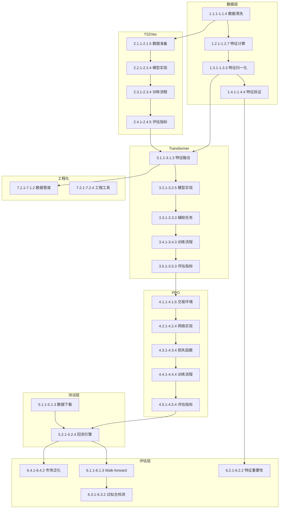

# AI交易系统任务拆分文档

## 文档信息
- **项目名称**: 基于TS2Vec-Transformer-PPO的智能交易系统
- **文档版本**: v1.0
- **创建日期**: 2025-11-20
- **最后更新**: 2025-11-20

---

## 1. 项目概述

### 1.1 项目目标
构建一个融合"形态识别 → 状态建模 → 动作决策"的三层智能交易系统，用于5分钟级别期货交易。本项目以**快速训练验证模型效果**为核心目标，按照**最简单的路线**实现核心功能。

### 1.2 核心约束
- ✅ 以验证模型效果为核心目标
- ✅ 按照最简单的路线实现
- ✅ 不拓展其他复杂功能
- ✅ 不考虑如何部署
- ✅ 使用面向对象风格
- ✅ 要求高内聚低耦合

### 1.3 技术栈
- **深度学习**: PyTorch 2.9.0, CUDA 12.6, Python 3.11.14
- **强化学习**: Stable-Baselines3 或 CleanRL
- **数据处理**: Pandas, NumPy, Pandas-TA
- **回测框架**: Backtrader
- **数据源**: yfinance

---

## 2. 任务总览

### 2.1 统计信息
- **总任务数**: 87个
- **预估总工时**: 280-350小时
- **开发周期**: 16周
- **核心里程碑**: 7个

### 2.2 任务汇总表

| 编号 | 任务标题 | 模块 | 优先级 | 工时 | 依赖 | 状态 |
|------|---------|------|--------|------|------|------|
| 1.1.1 | 实现OHLC数据缺失值处理函数 | 数据层 | P0 | 2h | - | 待开始 |
| 1.1.2 | 实现价格异常值检测与处理 | 数据层 | P0 | 2h | - | 待开始 |
| 1.1.3 | 实现时间对齐与时区处理 | 数据层 | P0 | 2h | - | 待开始 |
| 1.1.4 | 实现数据质量验证器 | 数据层 | P0 | 2h | 1.1.1-1.1.3 | 待开始 |
| 1.2.1 | 实现价格与收益特征计算（5维） | 特征层 | P0 | 3h | 1.1.4 | 待开始 |
| 1.2.2 | 实现波动率特征计算（5维） | 特征层 | P0 | 3h | 1.1.4 | 待开始 |
| 1.2.3 | 实现技术指标特征计算（4维） | 特征层 | P0 | 3h | 1.1.4 | 待开始 |
| 1.2.4 | 实现成交量特征计算（4维） | 特征层 | P0 | 2h | 1.1.4 | 待开始 |
| 1.2.5 | 实现K线形态特征计算（7维） | 特征层 | P0 | 4h | 1.1.4 | 待开始 |
| 1.2.6 | 实现时间周期特征计算（2维） | 特征层 | P0 | 1h | 1.1.4 | 待开始 |
| 1.2.7 | 实现FVG公允价值缺口计算 | 特征层 | P1 | 2h | 1.1.4 | 待开始 |
| 1.3.1 | 实现StandardScaler归一化器 | 特征层 | P0 | 2h | 1.2.1-1.2.6 | 待开始 |
| 1.3.2 | 实现RobustScaler归一化器 | 特征层 | P0 | 2h | 1.2.1-1.2.6 | 待开始 |
| 1.3.3 | 实现归一化器的保存与加载 | 特征层 | P0 | 1h | 1.3.1-1.3.2 | 待开始 |
| 1.4.1 | 实现单特征信息量测试 | 特征层 | P1 | 3h | 1.3.3 | 待开始 |
| 1.4.2 | 实现置换重要性测试 | 特征层 | P1 | 3h | 1.3.3 | 待开始 |
| 1.4.3 | 实现特征相关性检测 | 特征层 | P1 | 2h | 1.3.3 | 待开始 |
| 1.4.4 | 实现VIF多重共线性检测 | 特征层 | P1 | 2h | 1.3.3 | 待开始 |
| 2.1.1 | 实现滑动窗口数据生成器 | 特征层 | P0 | 2h | 1.1.4 | 待开始 |
| 2.1.2 | 实现时间遮蔽数据增强 | 特征层 | P0 | 2h | 2.1.1 | 待开始 |
| 2.1.3 | 实现时间扭曲数据增强 | 特征层 | P1 | 2h | 2.1.1 | 待开始 |
| 2.1.4 | 实现幅度缩放数据增强 | 特征层 | P1 | 1h | 2.1.1 | 待开始 |
| 2.1.5 | 实现对比学习样本对生成器 | 特征层 | P0 | 2h | 2.1.2-2.1.4 | 待开始 |
| 2.2.1 | 实现膨胀卷积编码器 | 模型层 | P0 | 4h | 2.1.5 | 待开始 |
| 2.2.2 | 实现投影头网络 | 模型层 | P0 | 2h | 2.2.1 | 待开始 |
| 2.2.3 | 实现NT-Xent对比损失函数 | 模型层 | P0 | 3h | 2.2.2 | 待开始 |
| 2.2.4 | 实现TS2Vec完整模型 | 模型层 | P0 | 2h | 2.2.1-2.2.3 | 待开始 |
| 2.3.1 | 实现TS2Vec训练循环 | 模型层 | P0 | 3h | 2.2.4 | 待开始 |
| 2.3.2 | 实现学习率调度器（Warmup+CosineAnnealing） | 模型层 | P0 | 2h | 2.3.1 | 待开始 |
| 2.3.3 | 实现早停机制 | 模型层 | P0 | 2h | 2.3.1 | 待开始 |
| 2.3.4 | 实现模型检查点保存 | 模型层 | P0 | 1h | 2.3.1 | 待开始 |
| 2.4.1 | 实现对比损失监控 | 评估层 | P0 | 2h | 2.3.1 | 待开始 |
| 2.4.2 | 实现embedding质量评估 | 评估层 | P0 | 3h | 2.3.4 | 待开始 |
| 2.4.3 | 实现线性探测评估 | 评估层 | P1 | 3h | 2.3.4 | 待开始 |
| 2.4.4 | 实现聚类质量评估 | 评估层 | P1 | 2h | 2.3.4 | 待开始 |
| 2.4.5 | 实现t-SNE可视化 | 评估层 | P2 | 2h | 2.3.4 | 待开始 |
| 3.1.1 | 实现TS2Vec embedding生成器 | 特征层 | P0 | 2h | 2.3.4 | 待开始 |
| 3.1.2 | 实现特征融合模块 | 特征层 | P0 | 2h | 3.1.1, 1.3.3 | 待开始 |
| 3.1.3 | 实现时序窗口序列构建器 | 特征层 | P0 | 2h | 3.1.2 | 待开始 |
| 3.2.1 | 实现正弦位置编码 | 模型层 | P0 | 2h | - | 待开始 |
| 3.2.2 | 实现多头自注意力层 | 模型层 | P0 | 3h | 3.2.1 | 待开始 |
| 3.2.3 | 实现前馈网络层 | 模型层 | P0 | 2h | 3.2.2 | 待开始 |
| 3.2.4 | 实现Transformer编码器层 | 模型层 | P0 | 2h | 3.2.2-3.2.3 | 待开始 |
| 3.2.5 | 实现完整Transformer模型 | 模型层 | P0 | 2h | 3.2.4 | 待开始 |
| 3.3.1 | 实现回归辅助头 | 模型层 | P1 | 2h | 3.2.5 | 待开始 |
| 3.3.2 | 实现分类辅助头 | 模型层 | P1 | 2h | 3.2.5 | 待开始 |
| 3.3.3 | 实现多任务损失函数 | 模型层 | P1 | 2h | 3.3.1-3.3.2 | 待开始 |
| 3.4.1 | 实现Transformer预训练循环 | 模型层 | P0 | 3h | 3.2.5, 3.3.3 | 待开始 |
| 3.4.2 | 实现梯度裁剪 | 模型层 | P0 | 1h | 3.4.1 | 待开始 |
| 3.4.3 | 实现Transformer模型保存 | 模型层 | P0 | 1h | 3.4.1 | 待开始 |
| 3.5.1 | 实现监督学习指标计算 | 评估层 | P0 | 2h | 3.4.1 | 待开始 |
| 3.5.2 | 实现状态表征质量评估 | 评估层 | P1 | 2h | 3.4.3 | 待开始 |
| 3.5.3 | 实现注意力权重可视化 | 评估层 | P2 | 3h | 3.4.3 | 待开始 |
| 4.1.1 | 实现交易环境状态空间 | 信号层 | P0 | 3h | 3.4.3 | 待开始 |
| 4.1.2 | 实现交易环境动作空间 | 信号层 | P0 | 3h | 4.1.1 | 待开始 |
| 4.1.3 | 实现奖励函数（盈利奖励） | 信号层 | P0 | 3h | 4.1.2 | 待开始 |
| 4.1.4 | 实现奖励函数（风险控制） | 信号层 | P0 | 2h | 4.1.3 | 待开始 |
| 4.1.5 | 实现奖励函数（稳定性奖励） | 信号层 | P1 | 2h | 4.1.3 | 待开始 |
| 4.1.6 | 实现完整交易环境 | 信号层 | P0 | 3h | 4.1.1-4.1.5 | 待开始 |
| 4.2.1 | 实现PPO策略网络（Actor） | 模型层 | P0 | 4h | 4.1.6 | 待开始 |
| 4.2.2 | 实现PPO价值网络（Critic） | 模型层 | P0 | 3h | 4.1.6 | 待开始 |
| 4.2.3 | 实现动作采样与分布 | 模型层 | P0 | 3h | 4.2.1 | 待开始 |
| 4.2.4 | 实现GAE优势函数计算 | 模型层 | P0 | 3h | 4.2.2 | 待开始 |
| 4.3.1 | 实现PPO策略损失 | 模型层 | P0 | 3h | 4.2.3-4.2.4 | 待开始 |
| 4.3.2 | 实现PPO价值损失 | 模型层 | P0 | 2h | 4.2.4 | 待开始 |
| 4.3.3 | 实现熵正则化 | 模型层 | P0 | 2h | 4.2.3 | 待开始 |
| 4.3.4 | 实现PPO总损失函数 | 模型层 | P0 | 2h | 4.3.1-4.3.3 | 待开始 |
| 4.4.1 | 实现经验缓冲区 | 模型层 | P0 | 3h | 4.1.6 | 待开始 |
| 4.4.2 | 实现PPO训练主循环 | 模型层 | P0 | 4h | 4.3.4, 4.4.1 | 待开始 |
| 4.4.3 | 实现多环境并行采样 | 模型层 | P1 | 3h | 4.4.2 | 待开始 |
| 4.4.4 | 实现PPO模型保存与加载 | 模型层 | P0 | 2h | 4.4.2 | 待开始 |
| 4.5.1 | 实现训练过程指标监控 | 评估层 | P0 | 2h | 4.4.2 | 待开始 |
| 4.5.2 | 实现交易性能指标计算 | 评估层 | P0 | 3h | 4.4.2 | 待开始 |
| 4.5.3 | 实现风险调整收益指标 | 评估层 | P0 | 2h | 4.5.2 | 待开始 |
| 4.5.4 | 实现交易行为分析 | 评估层 | P1 | 2h | 4.5.2 | 待开始 |
| 5.1.1 | 实现yfinance数据下载器 | 测试层 | P0 | 2h | - | 待开始 |
| 5.1.2 | 实现数据增量更新 | 测试层 | P1 | 2h | 5.1.1 | 待开始 |
| 5.1.3 | 实现数据存储（Parquet/HDF5） | 测试层 | P0 | 2h | 5.1.1 | 待开始 |
| 5.2.1 | 实现Backtrader回测引擎集成 | 测试层 | P0 | 4h | 4.4.4 | 待开始 |
| 5.2.2 | 实现订单执行模拟 | 测试层 | P0 | 3h | 5.2.1 | 待开始 |
| 5.2.3 | 实现滑点与手续费模拟 | 测试层 | P1 | 2h | 5.2.2 | 待开始 |
| 5.2.4 | 实现回测结果记录 | 测试层 | P0 | 2h | 5.2.1 | 待开始 |
| 6.1.1 | 实现Walk-forward验证框架 | 评估层 | P0 | 4h | 5.2.4 | 待开始 |
| 6.1.2 | 实现时间窗口滚动生成器 | 评估层 | P0 | 2h | 6.1.1 | 待开始 |
| 6.1.3 | 实现多折验证结果汇总 | 评估层 | P0 | 2h | 6.1.1 | 待开始 |
| 6.2.1 | 实现消融实验框架 | 评估层 | P1 | 3h | 1.4.2 | 待开始 |
| 6.2.2 | 实现特征组贡献度分析 | 评估层 | P1 | 2h | 6.2.1 | 待开始 |
| 6.3.1 | 实现过拟合检测器 | 评估层 | P0 | 3h | 6.1.3 | 待开始 |
| 6.3.2 | 实现多Seed稳定性测试 | 评估层 | P0 | 3h | 4.4.4 | 待开始 |
| 6.4.1 | 实现市场状态识别器 | 评估层 | P1 | 3h | 5.2.4 | 待开始 |
| 6.4.2 | 实现分状态性能评估 | 评估层 | P1 | 2h | 6.4.1 | 待开始 |
| 7.1.1 | 实现训练数据管道 | 数据层 | P0 | 3h | 3.1.3 | 待开始 |
| 7.1.2 | 实现推理数据管道 | 数据层 | P0 | 3h | 7.1.1 | 待开始 |
| 7.2.1 | 编写项目配置文件 | 工程化 | P0 | 2h | - | 待开始 |
| 7.2.2 | 编写训练脚本 | 工程化 | P0 | 3h | 4.4.2 | 待开始 |
| 7.2.3 | 编写评估脚本 | 工程化 | P0 | 2h | 6.1.3 | 待开始 |
| 7.2.4 | 编写日志记录模块 | 工程化 | P1 | 2h | - | 待开始 |

---

## 3. 详细任务列表

### 模块1: 数据层（Data Layer）

#### 1.1 数据清洗模块

##### 任务 1.1.1: 实现OHLC数据缺失值处理函数
- **优先级**: P0（核心）
- **预估工时**: 2小时
- **依赖任务**: 无
- **所属模块**: 数据层

**任务描述**:
实现一个数据清洗类，专门处理OHLC数据中的缺失值。需要支持多种填充策略：
- 前向填充（forward fill）用于价格数据
- 零填充用于成交量数据
- 线性插值用于短期缺失
- 删除连续缺失超过5根K线的数据段

输入：包含缺失值的DataFrame（列：Open, High, Low, Close, Volume）
处理逻辑：
1. 检测缺失值位置和连续性
2. 根据缺失类型选择填充策略
3. 标记已插值的数据点
4. 记录处理日志

输出：清洗后的DataFrame + 缺失值处理报告

**验收标准**:
1. 能正确识别所有缺失值位置
2. 前向填充不引入未来信息
3. 连续缺失>5根K线的数据段被正确删除
4. 生成详细的缺失值处理报告
5. 通过单元测试（覆盖率>90%）

---

##### 任务 1.1.2: 实现价格异常值检测与处理
- **优先级**: P0（核心）
- **预估工时**: 2小时
- **依赖任务**: 无
- **所属模块**: 数据层

**任务描述**:
实现异常值检测器，识别并处理价格数据中的异常值。使用3σ原则检测价格跳变，区分真实跳空和数据错误。

输入：OHLC DataFrame
处理逻辑：
1. 计算对数收益率
2. 使用3σ原则检测异常（|ret - mean| > 3σ）
3. 区分尖峰异常和跳空异常
4. 尖峰用前后均值替代，跳空保留
5. 修正OHLC一致性（High >= max(O,C), Low <= min(O,C)）

输出：清洗后的DataFrame + 异常值报告

**验收标准**:
1. 能正确识别价格异常值（准确率>95%）
2. 区分尖峰和跳空的逻辑正确
3. OHLC一致性约束得到满足
4. 不引入未来信息
5. 通过边界情况测试

---

##### 任务 1.1.3: 实现时间对齐与时区处理
- **优先级**: P0（核心）
- **预估工时**: 2小时
- **依赖任务**: 无
- **所属模块**: 数据层

**任务描述**:
实现时间处理模块，统一时区、过滤非交易时段、确保严格的时间间隔。

输入：带时间索引的DataFrame
处理逻辑：
1. 转换时区到UTC或指定时区
2. 处理夏令时切换
3. 过滤非交易时段数据
4. 重采样确保严格5分钟间隔
5. 删除空K线

输出：时间对齐后的DataFrame

**验收标准**:
1. 时区转换正确无误
2. 夏令时切换处理正确
3. 时间间隔严格为5分钟（±10秒容差）
4. 非交易时段数据被正确过滤
5. 通过不同时区的测试用例

---

##### 任务 1.1.4: 实现数据质量验证器
- **优先级**: P0（核心）
- **预估工时**: 2小时
- **依赖任务**: 1.1.1, 1.1.2, 1.1.3
- **所属模块**: 数据层

**任务描述**:
实现数据质量检查器，对清洗后的数据进行全面验证。

输入：清洗后的DataFrame
验证逻辑：
1. 完整性检查：缺失值比例<1%
2. 一致性检查：High>=max(O,C), Low<=min(O,C)
3. 异常值检查：价格跳变<5σ
4. 时间检查：间隔严格、无重复

输出：验证报告（通过/失败 + 详细问题列表）

**验收标准**:
1. 能检测所有类型的数据质量问题
2. 验证报告清晰详细
3. 对不合格数据给出明确的修复建议
4. 验证速度快（<1秒/10万条数据）
5. 通过各种边界情况测试

---

#### 1.2 手工特征计算模块

##### 任务 1.2.1: 实现价格与收益特征计算（5维）
- **优先级**: P0（核心）
- **预估工时**: 3小时
- **依赖任务**: 1.1.4
- **所属模块**: 特征层

**任务描述**:
实现价格与收益特征组的计算，包含5个特征维度。

输入：清洗后的OHLC DataFrame
计算特征：
1. ret_1: log(close[t] / close[t-1])
2. ret_5: log(close[t] / close[t-5])
3. ret_20: log(close[t] / close[t-20])
4. price_slope_20: 20周期价格线性回归斜率
5. C_div_MA20: close[t] / MA(close, 20)

输出：包含5个新特征列的DataFrame

**验收标准**:
1. 所有特征计算公式正确
2. 不引入未来信息（严格使用历史数据）
3. 边界处理正确（前20根K线）
4. 数值稳定性好（无inf/nan）
5. 通过单元测试和数值验证

---

##### 任务 1.2.2: 实现波动率特征计算（5维）
- **优先级**: P0（核心）
- **预估工时**: 3小时
- **依赖任务**: 1.1.4
- **所属模块**: 特征层

**任务描述**:
实现波动率特征组的计算，使用Pandas-TA库。

输入：清洗后的OHLC DataFrame
计算特征：
1. ATR14_norm: ATR(14) / close[t]
2. vol_20: std(close[-20:])
3. range_20_norm: (HH20 - LL20) / close[t]
4. BB_width_norm: (BB_upper - BB_lower) / close[t]
5. parkinson_vol: sqrt(1/(4*log(2)) * log(high/low)^2)

输出：包含5个新特征列的DataFrame

**验收标准**:
1. 正确使用Pandas-TA库计算ATR和布林带
2. 归一化处理正确
3. Parkinson波动率公式正确
4. 数值稳定性好
5. 通过与标准实现的对比测试

---

##### 任务 1.2.3: 实现技术指标特征计算（4维）
- **优先级**: P0（核心）
- **预估工时**: 3小时
- **依赖任务**: 1.1.4
- **所属模块**: 特征层

**任务描述**:
实现技术指标特征组的计算，使用TA库。

输入：清洗后的OHLC DataFrame
计算特征：
1. EMA20: EMA(close, 20)
2. stoch: Stochastic(9, 3, 3) 的%K值
3. MACD: MACD(12, 26, 9) 的MACD线
4. VWAP: 成交量加权平均价

输出：包含4个新特征列的DataFrame

**验收标准**:
1. 正确使用Pandas-TA库
2. 参数设置符合设计文档
3. VWAP计算考虑成交量
4. 数值范围合理
5. 通过与标准实现的对比测试

---

##### 任务 1.2.4: 实现成交量特征计算（4维）
- **优先级**: P0（核心）
- **预估工时**: 2小时
- **依赖任务**: 1.1.4
- **所属模块**: 特征层

**任务描述**:
实现成交量特征组的计算。

输入：清洗后的OHLC DataFrame
计算特征：
1. volume: 原始成交量
2. volume_zscore: (volume - mean(volume[-20:])) / std(volume[-20:])
3. volume_change_1: (volume[t] - volume[t-1]) / volume[t-1]
4. OBV_slope_20: OBV的20周期线性回归斜率

输出：包含4个新特征列的DataFrame

**验收标准**:
1. Z-score计算正确
2. OBV使用Pandas-TA库计算
3. 斜率计算使用scipy.stats.linregress
4. 处理成交量为0的情况
5. 通过单元测试

---

##### 任务 1.2.5: 实现K线形态特征计算（7维）
- **优先级**: P0（核心）
- **预估工时**: 4小时
- **依赖任务**: 1.1.4
- **所属模块**: 特征层

**任务描述**:
实现K线形态特征组的计算，包括相对位置、影线比例等。

输入：清洗后的OHLC DataFrame
计算特征：
1. pos_in_range_20: (close - LL20) / (HH20 - LL20)
2. dist_to_HH20_norm: (close - HH20) / close
3. dist_to_LL20_norm: (close - LL20) / close
4. body_ratio: |close - open| / (high - low)
5. upper_shadow_ratio: (high - max(open, close)) / (high - low)
6. lower_shadow_ratio: (min(open, close) - low) / (high - low)
7. FVG: 公允价值缺口（见任务1.2.7）

输出：包含7个新特征列的DataFrame

**验收标准**:
1. 所有比例特征在[0,1]范围内
2. 处理high=low的情况（避免除零）
3. 相对位置计算正确
4. 影线比例计算正确
5. 通过各种K线形态的测试用例

---

##### 任务 1.2.6: 实现时间周期特征计算（2维）
- **优先级**: P0（核心）
- **预估工时**: 1小时
- **依赖任务**: 1.1.4
- **所属模块**: 特征层

**任务描述**:
实现时间周期特征的正弦余弦编码。

输入：带时间索引的DataFrame
计算特征：
1. sin_tod: sin(2π * hour / 24)
2. cos_tod: cos(2π * hour / 24)

输出：包含2个新特征列的DataFrame

**验收标准**:
1. 正确提取小时信息
2. 正弦余弦编码正确
3. 特征值在[-1, 1]范围内
4. 能正确处理跨天情况
5. 通过单元测试

---

##### 任务 1.2.7: 实现FVG公允价值缺口计算
- **优先级**: P1（重要）
- **预估工时**: 2小时
- **依赖任务**: 1.1.4
- **所属模块**: 特征层

**任务描述**:
实现FVG（Fair Value Gap）公允价值缺口的检测与量化。

输入：清洗后的OHLC DataFrame
计算逻辑：
1. 检测多头FVG：第一根K线最高价 < 第三根K线最低价
2. 检测空头FVG：第一根K线最低价 > 第三根K线最高价
3. 计算缺口大小并归一化

输出：FVG特征列（正值=多头FVG，负值=空头FVG，0=无FVG）

**验收标准**:
1. 正确识别多头和空头FVG
2. 缺口大小计算正确
3. 归一化处理合理
4. 前两根K线返回0
5. 通过典型FVG形态的测试用例

---

#### 1.3 特征归一化模块

##### 任务 1.3.1: 实现StandardScaler归一化器
- **优先级**: P0（核心）
- **预估工时**: 2小时
- **依赖任务**: 1.2.1-1.2.6
- **所属模块**: 特征层

**任务描述**:
实现StandardScaler归一化器，用于收益率、价格斜率等特征。

输入：训练集特征DataFrame
处理逻辑：
1. 仅使用训练集计算均值和标准差
2. 应用z-score标准化：z = (x - μ) / σ
3. 保存scaler参数用于验证集和测试集

输出：归一化后的特征 + scaler对象

**验收标准**:
1. 仅使用训练集统计量（无数据泄露）
2. 归一化后均值≈0，标准差≈1
3. 能正确处理常数特征（σ=0）
4. 支持增量更新（实盘场景）
5. 通过单元测试

---

##### 任务 1.3.2: 实现RobustScaler归一化器
- **优先级**: P0（核心）
- **预估工时**: 2小时
- **依赖任务**: 1.2.1-1.2.6
- **所属模块**: 特征层

**任务描述**:
实现RobustScaler归一化器，用于波动率、技术指标等对异常值敏感的特征。

输入：训练集特征DataFrame
处理逻辑：
1. 仅使用训练集计算中位数和IQR
2. 应用鲁棒标准化：z = (x - median) / IQR
3. 保存scaler参数

输出：归一化后的特征 + scaler对象

**验收标准**:
1. 仅使用训练集统计量
2. 对异常值鲁棒
3. 归一化后中位数≈0
4. 能正确处理IQR=0的情况
5. 通过单元测试

---

##### 任务 1.3.3: 实现归一化器的保存与加载
- **优先级**: P0（核心）
- **预估工时**: 1小时
- **依赖任务**: 1.3.1, 1.3.2
- **所属模块**: 特征层

**任务描述**:
实现scaler的序列化保存和加载功能，用于推理阶段。

输入：训练好的scaler对象
处理逻辑：
1. 使用joblib保存scaler
2. 保存为.pkl文件
3. 实现加载函数
4. 验证加载后的scaler与原始一致

输出：scaler文件 + 加载函数

**验收标准**:
1. 保存和加载无损
2. 文件大小合理
3. 加载速度快（<100ms）
4. 支持版本兼容性检查
5. 通过保存-加载-验证测试

---

#### 1.4 特征验证模块

##### 任务 1.4.1: 实现单特征信息量测试
- **优先级**: P1（重要）
- **预估工时**: 3小时
- **依赖任务**: 1.3.3
- **所属模块**: 特征层

**任务描述**:
实现单特征信息量评估，使用线性回归R²和互信息。

输入：特征DataFrame + 目标变量（未来收益）
评估逻辑：
1. 对每个特征单独训练线性回归
2. 计算R²分数
3. 计算互信息（mutual_info_regression）
4. 排序并生成报告

输出：特征信息量排名表

**验收标准**:
1. R²和互信息计算正确
2. 排名合理（符合金融直觉）
3. 生成可视化报告
4. 识别无效特征（MI≈0）
5. 通过合成数据测试

---

##### 任务 1.4.2: 实现置换重要性测试
- **优先级**: P1（重要）
- **预估工时**: 3小时
- **依赖任务**: 1.3.3
- **所属模块**: 特征层

**任务描述**:
实现置换重要性测试，评估每个特征对模型性能的贡献。

输入：训练好的模型 + 验证集
测试逻辑：
1. 计算基线性能
2. 对每个特征进行置换（打乱顺序）
3. 重新评估性能
4. 计算性能下降幅度（重要性）
5. 重复100次取平均
6. 计算p-value

输出：特征重要性排名 + 显著性检验结果

**验收标准**:
1. 置换逻辑正确（不影响其他特征）
2. 重要性计算准确
3. p-value计算正确（单侧t检验）
4. 识别显著特征（p<0.05）
5. 通过已知重要性的合成数据测试

---

##### 任务 1.4.3: 实现特征相关性检测
- **优先级**: P1（重要）
- **预估工时**: 2小时
- **依赖任务**: 1.3.3
- **所属模块**: 特征层

**任务描述**:
实现特征间相关性分析，识别高度相关的特征对。

输入：特征DataFrame
分析逻辑：
1. 计算Pearson相关矩阵
2. 可视化热力图
3. 识别高度相关对（|ρ|>0.85）
4. 建议移除冗余特征

输出：相关矩阵 + 热力图 + 冗余特征列表

**验收标准**:
1. 相关系数计算正确
2. 热力图清晰美观
3. 正确识别高度相关对
4. 冗余特征建议合理
5. 通过已知相关性的测试数据

---

##### 任务 1.4.4: 实现VIF多重共线性检测
- **优先级**: P1（重要）
- **预估工时**: 2小时
- **依赖任务**: 1.3.3
- **所属模块**: 特征层

**任务描述**:
实现方差膨胀因子（VIF）检测，识别多重共线性问题。

输入：特征DataFrame
检测逻辑：
1. 对每个特征计算VIF
2. VIF = 1 / (1 - R²)，其中R²是该特征对其他特征回归的决定系数
3. 识别VIF>10的特征
4. 建议移除顺序

输出：VIF表 + 高VIF特征列表

**验收标准**:
1. VIF计算正确
2. 正确识别多重共线性
3. 移除建议合理
4. 计算效率高
5. 通过已知共线性的测试数据

---

### 模块2: TS2Vec形态编码器

#### 2.1 数据准备模块

##### 任务 2.1.1: 实现滑动窗口数据生成器
- **优先级**: P0（核心）
- **预估工时**: 2小时
- **依赖任务**: 1.1.4
- **所属模块**: 特征层

**任务描述**:
实现滑动窗口生成器，为TS2Vec训练准备数据。

输入：OHLC DataFrame
生成逻辑：
1. 窗口长度L=256（可配置）
2. 步长stride=1（密集采样）
3. 生成所有可能的窗口
4. 窗口内归一化（z-score）

输出：窗口数组 [N, 256, 4]

**验收标准**:
1. 窗口生成正确无遗漏
2. 窗口内归一化正确
3. 不引入未来信息
4. 内存效率高（使用生成器）
5. 通过边界情况测试

---

##### 任务 2.1.2: 实现时间遮蔽数据增强
- **优先级**: P0（核心）
- **预估工时**: 2小时
- **依赖任务**: 2.1.1
- **所属模块**: 特征层

**任务描述**:
实现时间遮蔽（Temporal Masking）数据增强，用于对比学习。

输入：窗口数组 [256, 4]
增强逻辑：
1. 随机选择10-30%的时间步
2. 将选中的时间步置零或用均值替代
3. 保持时间顺序

输出：增强后的窗口数组

**验收标准**:
1. 遮蔽比例可控
2. 遮蔽位置随机
3. 不破坏时间顺序
4. 可重复（设置seed）
5. 通过单元测试

---

##### 任务 2.1.3: 实现时间扭曲数据增强
- **优先级**: P1（重要）
- **预估工时**: 2小时
- **依赖任务**: 2.1.1
- **所属模块**: 特征层

**任务描述**:
实现时间扭曲（Time Warping）数据增强。

输入：窗口数组 [256, 4]
增强逻辑：
1. 轻微拉伸/压缩时间轴（±5%）
2. 使用插值保持数据连续性
3. 保持价格趋势不变

输出：增强后的窗口数组

**验收标准**:
1. 扭曲幅度可控
2. 插值平滑
3. 趋势保持
4. 可重复
5. 通过视觉检查

---

##### 任务 2.1.4: 实现幅度缩放数据增强
- **优先级**: P1（重要）
- **预估工时**: 1小时
- **依赖任务**: 2.1.1
- **所属模块**: 特征层

**任务描述**:
实现幅度缩放（Magnitude Scaling）数据增强。

输入：窗口数组 [256, 4]
增强逻辑：
1. 随机缩放因子（0.9-1.1）
2. 对所有价格维度统一缩放
3. 保持相对关系

输出：增强后的窗口数组

**验收标准**:
1. 缩放因子范围正确
2. 相对关系保持
3. 可重复
4. 不改变趋势
5. 通过单元测试

---

##### 任务 2.1.5: 实现对比学习样本对生成器
- **优先级**: P0（核心）
- **预估工时**: 2小时
- **依赖任务**: 2.1.2-2.1.4
- **所属模块**: 特征层

**任务描述**:
实现对比学习的正负样本对生成器。

输入：原始窗口数组
生成逻辑：
1. 对同一窗口应用两次不同的增强 → 正样本对
2. 不同窗口的增强 → 负样本对
3. 批次内构建对比对

输出：(anchor, positive, negatives)元组

**验收标准**:
1. 正样本对来自同一原始窗口
2. 负样本对来自不同窗口
3. 批次构建高效
4. 支持多种增强组合
5. 通过对比学习训练验证

---

#### 2.2 模型实现模块

##### 任务 2.2.1: 实现膨胀卷积编码器
- **优先级**: P0（核心）
- **预估工时**: 4小时
- **依赖任务**: 2.1.5
- **所属模块**: 模型层

**任务描述**:
实现TS2Vec的核心组件：膨胀卷积编码器。

输入：窗口数组 [batch, 256, 4]
网络结构：
1. 10层膨胀卷积
2. 膨胀率：[1,2,4,8,16,32,64,128,256,512]
3. 通道数：[64,64,128,128,256,256,256,256,256,256]
4. 卷积核大小：3
5. 激活函数：ReLU
6. 层归一化

输出：编码特征 [batch, 256, 256]

**验收标准**:
1. 网络结构符合设计
2. 膨胀卷积实现正确
3. 感受野覆盖全序列
4. 梯度流畅（无梯度消失）
5. 通过前向传播测试

---

##### 任务 2.2.2: 实现投影头网络
- **优先级**: P0（核心）
- **预估工时**: 2小时
- **依赖任务**: 2.2.1
- **所属模块**: 模型层

**任务描述**:
实现投影头，将编码特征映射到对比学习空间。

输入：编码特征 [batch, 256, 256]
网络结构：
1. FC1: 256 → 128, ReLU
2. FC2: 128 → 128
3. L2归一化

输出：embedding [batch, 256, 128]

**验收标准**:
1. 网络结构正确
2. L2归一化实现正确
3. 输出范数为1
4. 梯度流畅
5. 通过前向传播测试

---

##### 任务 2.2.3: 实现NT-Xent对比损失函数
- **优先级**: P0（核心）
- **预估工时**: 3小时
- **依赖任务**: 2.2.2
- **所属模块**: 模型层

**任务描述**:
实现归一化温度交叉熵（NT-Xent）对比损失。

输入：正样本对的embeddings (z_i, z_j)
损失计算：
1. 计算余弦相似度矩阵
2. 应用温度参数τ=0.1
3. 计算对比损失：L = -log(exp(sim(z_i,z_j)/τ) / Σ_k exp(sim(z_i,z_k)/τ))
4. 对称化损失

输出：标量损失值

**验收标准**:
1. 损失公式实现正确
2. 温度参数可调
3. 数值稳定（无inf/nan）
4. 梯度正确
5. 通过已知结果的测试用例

---

##### 任务 2.2.4: 实现TS2Vec完整模型
- **优先级**: P0（核心）
- **预估工时**: 2小时
- **依赖任务**: 2.2.1-2.2.3
- **所属模块**: 模型层

**任务描述**:
整合编码器、投影头和损失函数，构建完整的TS2Vec模型。

组件集成：
1. 膨胀卷积编码器
2. 投影头
3. NT-Xent损失
4. 前向传播逻辑
5. 推理接口（生成embedding）

输出：完整的TS2Vec模型类

**验收标准**:
1. 模型结构完整
2. 训练和推理模式分离
3. 接口清晰易用
4. 支持模型保存和加载
5. 通过端到端测试

---

#### 2.3 训练流程模块

##### 任务 2.3.1: 实现TS2Vec训练循环
- **优先级**: P0（核心）
- **预估工时**: 3小时
- **依赖任务**: 2.2.4
- **所属模块**: 模型层

**任务描述**:
实现TS2Vec的训练主循环。

训练流程：
1. 数据加载（批次生成）
2. 生成增强视图对
3. 前向传播
4. 计算对比损失
5. 反向传播
6. 参数更新
7. 验证评估
8. 日志记录

输出：训练好的模型 + 训练日志

**验收标准**:
1. 训练循环稳定
2. 损失持续下降
3. 验证集性能提升
4. 支持断点续训
5. 日志详细清晰

---

##### 任务 2.3.2: 实现学习率调度器（Warmup+CosineAnnealing）
- **优先级**: P0（核心）
- **预估工时**: 2小时
- **依赖任务**: 2.3.1
- **所属模块**: 模型层

**任务描述**:
实现学习率调度策略：Warmup + Cosine Annealing。

调度逻辑：
1. Warmup阶段（前5 epoch）：线性增长
2. Cosine Annealing阶段：余弦衰减
3. 最小学习率：1e-6

输出：学习率调度器对象

**验收标准**:
1. Warmup阶段学习率线性增长
2. Cosine阶段平滑衰减
3. 最小学习率不低于设定值
4. 可视化学习率曲线合理
5. 通过单元测试

---

##### 任务 2.3.3: 实现早停机制
- **优先级**: P0（核心）
- **预估工时**: 2小时
- **依赖任务**: 2.3.1
- **所属模块**: 模型层

**任务描述**:
实现早停（Early Stopping）机制，防止过拟合。

早停逻辑：
1. 监控验证集损失
2. 连续10个epoch无改善则停止
3. 保存最佳模型
4. 恢复最佳权重

输出：早停控制器

**验收标准**:
1. 正确监控验证指标
2. patience参数可配置
3. 最佳模型保存正确
4. 提前停止逻辑正确
5. 通过模拟训练测试

---

##### 任务 2.3.4: 实现模型检查点保存
- **优先级**: P0（核心）
- **预估工时**: 1小时
- **依赖任务**: 2.3.1
- **所属模块**: 模型层

**任务描述**:
实现模型检查点的保存和加载功能。

保存内容：
1. 模型权重
2. 优化器状态
3. 训练epoch
4. 最佳验证指标
5. 配置参数

输出：检查点文件 + 加载函数

**验收标准**:
1. 保存内容完整
2. 加载后可继续训练
3. 文件大小合理
4. 支持版本兼容
5. 通过保存-加载-验证测试

---

#### 2.4 评估指标模块

##### 任务 2.4.1: 实现对比损失监控
- **优先级**: P0（核心）
- **预估工时**: 2小时
- **依赖任务**: 2.3.1
- **所属模块**: 评估层

**任务描述**:
实现对比损失的监控和可视化。

监控指标：
1. 训练损失曲线
2. 验证损失曲线
3. 损失下降速度
4. 收敛判断

输出：损失曲线图 + 收敛报告

**验收标准**:
1. 损失记录准确
2. 曲线可视化清晰
3. 收敛判断合理
4. 支持TensorBoard
5. 通过训练过程验证

---

##### 任务 2.4.2: 实现embedding质量评估
- **优先级**: P0（核心）
- **预估工时**: 3小时
- **依赖任务**: 2.3.4
- **所属模块**: 评估层

**任务描述**:
实现embedding质量的定量评估。

评估指标：
1. 正样本对相似度（目标>0.8）
2. 负样本对相似度（目标<0.3）
3. 分离度（正负差距>0.5）
4. embedding方差

输出：质量评估报告

**验收标准**:
1. 相似度计算正确
2. 指标达到目标值
3. 报告清晰详细
4. 支持批量评估
5. 通过已知质量的embedding测试

---

##### 任务 2.4.3: 实现线性探测评估
- **优先级**: P1（重要）
- **预估工时**: 3小时
- **依赖任务**: 2.3.4
- **所属模块**: 评估层

**任务描述**:
实现线性探测（Linear Probing）评估embedding的下游任务性能。

评估流程：
1. 冻结TS2Vec权重
2. 训练线性分类器（预测未来涨跌）
3. 计算准确率和AUC
4. 对比随机baseline

输出：线性探测性能报告

**验收标准**:
1. TS2Vec权重正确冻结
2. 分类器训练正确
3. 准确率>随机baseline
4. AUC>0.6
5. 通过对比测试

---

##### 任务 2.4.4: 实现聚类质量评估
- **优先级**: P1（重要）
- **预估工时**: 2小时
- **依赖任务**: 2.3.4
- **所属模块**: 评估层

**任务描述**:
实现embedding的聚类质量评估。

评估流程：
1. 对embedding进行K-means聚类
2. 计算轮廓系数（Silhouette Score）
3. 可视化聚类结果
4. 分析聚类的金融意义

输出：聚类质量报告 + 可视化

**验收标准**:
1. K-means聚类正确
2. 轮廓系数>0.3
3. 聚类数量合理（3-10）
4. 可视化清晰
5. 通过已知聚类结构的测试

---

##### 任务 2.4.5: 实现t-SNE可视化
- **优先级**: P2（优化）
- **预估工时**: 2小时
- **依赖任务**: 2.3.4
- **所属模块**: 评估层

**任务描述**:
实现embedding的t-SNE降维可视化。

可视化流程：
1. 对embedding进行t-SNE降维到2D
2. 按市场状态着色
3. 检查相似形态是否聚集
4. 生成交互式可视化

输出：t-SNE可视化图

**验收标准**:
1. t-SNE降维正确
2. 可视化美观清晰
3. 相似形态聚集
4. 支持交互式探索
5. 通过视觉检查

---

### 模块3: Transformer状态建模器

#### 3.1 特征融合模块

##### 任务 3.1.1: 实现TS2Vec embedding生成器
- **优先级**: P0（核心）
- **预估工时**: 2小时
- **依赖任务**: 2.3.4
- **所属模块**: 特征层

**任务描述**:
实现TS2Vec embedding的批量生成器，用于Transformer训练。

输入：OHLC数据
生成流程：
1. 加载预训练TS2Vec模型
2. 生成滑动窗口
3. 批量推理生成embedding
4. L2归一化

输出：embedding序列 [N, 128]

**验收标准**:
1. 正确加载预训练模型
2. 批量推理高效
3. embedding归一化正确
4. 不引入未来信息
5. 通过端到端测试

---

##### 任务 3.1.2: 实现特征融合模块
- **优先级**: P0（核心）
- **预估工时**: 2小时
- **依赖任务**: 3.1.1, 1.3.3
- **所属模块**: 特征层

**任务描述**:
实现TS2Vec embedding与手工特征的融合。

输入：
- TS2Vec embedding [N, 128]
- 手工特征 [N, 27]

融合策略：
1. 简单拼接：concat([z_t, f_t]) → [N, 155]
2. 可选：加权融合（学习权重α）

输出：融合特征 [N, 155]

**验收标准**:
1. 拼接维度正确
2. 时间对齐准确
3. 加权融合可选实现
4. 数值稳定
5. 通过单元测试

---

##### 任务 3.1.3: 实现时序窗口序列构建器
- **优先级**: P0（核心）
- **预估工时**: 2小时
- **依赖任务**: 3.1.2
- **所属模块**: 特征层

**任务描述**:
实现Transformer输入序列的构建器。

输入：融合特征 [N, 155]
构建逻辑：
1. 序列长度T=64（可配置）
2. 滑动步长=1
3. 生成所有可能的序列
4. 可选：生成标签（未来收益）

输出：序列数组 [M, 64, 155] + 标签（可选）

**验收标准**:
1. 序列生成正确
2. 不引入未来信息
3. 标签对齐准确
4. 内存效率高
5. 通过边界测试

---

#### 3.2 Transformer模型实现

##### 任务 3.2.1: 实现正弦位置编码
- **优先级**: P0（核心）
- **预估工时**: 2小时
- **依赖任务**: 无
- **所属模块**: 模型层

**任务描述**:
实现Transformer的正弦位置编码。

编码公式：
- PE(pos, 2i) = sin(pos / 10000^(2i/d_model))
- PE(pos, 2i+1) = cos(pos / 10000^(2i/d_model))

输入：序列长度T, 模型维度d_model
输出：位置编码矩阵 [T, d_model]

**验收标准**:
1. 编码公式实现正确
2. 支持任意序列长度
3. 可缓存重用
4. 数值稳定
5. 通过与标准实现对比测试

---

##### 任务 3.2.2: 实现多头自注意力层
- **优先级**: P0（核心）
- **预估工时**: 3小时
- **依赖任务**: 3.2.1
- **所属模块**: 模型层

**任务描述**:
实现多头自注意力（Multi-Head Attention）层。

网络结构：
1. 头数：8
2. 每头维度：d_model / 8 = 32
3. Q, K, V线性投影
4. 缩放点积注意力
5. 因果掩码（防止看到未来）
6. Dropout: 0.1

输入：[batch, seq_len, d_model]
输出：[batch, seq_len, d_model]

**验收标准**:
1. 注意力计算正确
2. 因果掩码实现正确
3. 多头机制正确
4. Dropout应用正确
5. 通过前向传播测试

---

##### 任务 3.2.3: 实现前馈网络层
- **优先级**: P0（核心）
- **预估工时**: 2小时
- **依赖任务**: 3.2.2
- **所属模块**: 模型层

**任务描述**:
实现Transformer的前馈网络（Feed-Forward Network）层。

网络结构：
1. FC1: d_model → d_model*4 (256 → 1024)
2. 激活函数：GELU
3. Dropout: 0.1
4. FC2: d_model*4 → d_model (1024 → 256)
5. Dropout: 0.1

输入：[batch, seq_len, d_model]
输出：[batch, seq_len, d_model]

**验收标准**:
1. 网络结构正确
2. GELU激活函数正确
3. Dropout应用正确
4. 梯度流畅
5. 通过前向传播测试

---

##### 任务 3.2.4: 实现Transformer编码器层
- **优先级**: P0（核心）
- **预估工时**: 2小时
- **依赖任务**: 3.2.2-3.2.3
- **所属模块**: 模型层

**任务描述**:
实现单个Transformer编码器层。

层结构：
1. 多头自注意力子层
2. 残差连接 + 层归一化
3. 前馈网络子层
4. 残差连接 + 层归一化

输入：[batch, seq_len, d_model]
输出：[batch, seq_len, d_model]

**验收标准**:
1. 子层顺序正确
2. 残差连接实现正确
3. 层归一化位置正确
4. 梯度流畅
5. 通过前向传播测试

---

##### 任务 3.2.5: 实现完整Transformer模型
- **优先级**: P0（核心）
- **预估工时**: 2小时
- **依赖任务**: 3.2.4
- **所属模块**: 模型层

**任务描述**:
整合所有组件，构建完整的Transformer模型。

模型结构：
1. 输入嵌入层：Linear(155, 256)
2. 位置编码
3. 6层Transformer编码器
4. 输出层：取最后时间步或平均池化
5. 状态向量：[batch, 256]

输入：[batch, 64, 155]
输出：[batch, 256]

**验收标准**:
1. 模型结构完整
2. 前向传播正确
3. 支持训练和推理模式
4. 接口清晰
5. 通过端到端测试

---

#### 3.3 辅助任务模块

##### 任务 3.3.1: 实现回归辅助头
- **优先级**: P1（重要）
- **预估工时**: 2小时
- **依赖任务**: 3.2.5
- **所属模块**: 模型层

**任务描述**:
实现回归辅助头，预测未来收益率。

网络结构：
- Linear(256, 1)
- 输出：预测的未来收益率

损失函数：MSE

**验收标准**:
1. 网络结构正确
2. 损失计算正确
3. 预测值范围合理
4. 梯度流畅
5. 通过训练测试

---

##### 任务 3.3.2: 实现分类辅助头
- **优先级**: P1（重要）
- **预估工时**: 2小时
- **依赖任务**: 3.2.5
- **所属模块**: 模型层

**任务描述**:
实现分类辅助头，预测未来涨跌方向。

网络结构：
- Linear(256, 3)
- 输出：3类概率（涨/平/跌）

损失函数：CrossEntropy

**验收标准**:
1. 网络结构正确
2. 损失计算正确
3. 概率和为1
4. 梯度流畅
5. 通过训练测试

---

##### 任务 3.3.3: 实现多任务损失函数
- **优先级**: P1（重要）
- **预估工时**: 2小时
- **依赖任务**: 3.3.1-3.3.2
- **所属模块**: 模型层

**任务描述**:
实现多任务学习的联合损失函数。

损失组合：
- L_total = L_RL + λ1*L_reg + λ2*L_cls
- λ1 = 0.1（回归权重）
- λ2 = 0.05（分类权重）

**验收标准**:
1. 损失组合正确
2. 权重可配置
3. 梯度正确
4. 数值稳定
5. 通过训练测试

---

#### 3.4 训练流程模块

##### 任务 3.4.1: 实现Transformer预训练循环
- **优先级**: P0（核心）
- **预估工时**: 3小时
- **依赖任务**: 3.2.5, 3.3.3
- **所属模块**: 模型层

**任务描述**:
实现Transformer的监督预训练循环。

训练流程：
1. 数据加载
2. 前向传播
3. 计算多任务损失
4. 反向传播
5. 参数更新
6. 验证评估
7. 日志记录

输出：预训练模型 + 训练日志

**验收标准**:
1. 训练循环稳定
2. 损失持续下降
3. 验证性能提升
4. 支持断点续训
5. 日志详细清晰

---

##### 任务 3.4.2: 实现梯度裁剪
- **优先级**: P0（核心）
- **预估工时**: 1小时
- **依赖任务**: 3.4.1
- **所属模块**: 模型层

**任务描述**:
实现梯度裁剪，防止梯度爆炸。

裁剪策略：
- 最大梯度范数：0.5
- 使用torch.nn.utils.clip_grad_norm_

**验收标准**:
1. 裁剪逻辑正确
2. 梯度范数被正确限制
3. 不影响正常梯度
4. 训练稳定性提升
5. 通过训练测试

---

##### 任务 3.4.3: 实现Transformer模型保存
- **优先级**: P0（核心）
- **预估工时**: 1小时
- **依赖任务**: 3.4.1
- **所属模块**: 模型层

**任务描述**:
实现Transformer模型的保存和加载。

保存内容：
1. 模型权重
2. 优化器状态
3. 训练epoch
4. 最佳验证指标
5. 配置参数

输出：检查点文件 + 加载函数

**验收标准**:
1. 保存内容完整
2. 加载后可继续训练
3. 文件大小合理
4. 支持版本兼容
5. 通过保存-加载-验证测试

---

#### 3.5 评估指标模块

##### 任务 3.5.1: 实现监督学习指标计算
- **优先级**: P0（核心）
- **预估工时**: 2小时
- **依赖任务**: 3.4.1
- **所属模块**: 评估层

**任务描述**:
实现监督学习阶段的评估指标。

回归指标：
- MSE, MAE, R², 方向准确率

分类指标：
- 准确率, AUC-ROC, F1-Score

**验收标准**:
1. 所有指标计算正确
2. 指标达到目标值
3. 报告清晰详细
4. 支持批量计算
5. 通过已知结果测试

---

##### 任务 3.5.2: 实现状态表征质量评估
- **优先级**: P1（重要）
- **预估工时**: 2小时
- **依赖任务**: 3.4.3
- **所属模块**: 评估层

**任务描述**:
实现状态向量质量的评估。

评估指标：
1. 状态向量方差（避免坍缩）
2. 状态向量范数分布
3. t-SNE可视化
4. 不同市场状态的分离度

输出：质量评估报告

**验收标准**:
1. 方差>0.1
2. 范数分布合理
3. 可视化清晰
4. 不同状态可分离
5. 通过质量检查

---

##### 任务 3.5.3: 实现注意力权重可视化
- **优先级**: P2（优化）
- **预估工时**: 3小时
- **依赖任务**: 3.4.3
- **所属模块**: 评估层

**任务描述**:
实现注意力权重的提取和可视化。

可视化内容：
1. 各层注意力权重热力图
2. 特征关注度分析
3. 时间步关注度分析
4. 交互式可视化

输出：注意力可视化图

**验收标准**:
1. 权重提取正确
2. 可视化美观清晰
3. 支持多层多头
4. 交互式探索
5. 通过视觉检查

---

### 模块4: PPO强化学习

#### 4.1 交易环境模块

##### 任务 4.1.1: 实现交易环境状态空间
- **优先级**: P0（核心）
- **预估工时**: 3小时
- **依赖任务**: 3.4.3
- **所属模块**: 信号层

**任务描述**:
实现交易环境的状态空间定义。

状态组成：
1. Transformer状态向量 [256]
2. 持仓信息 [4]: position_size, entry_price, holding_time, unrealized_pnl
3. 风险参数 [3]: account_balance, leverage, max_drawdown
4. 总维度：263

归一化策略：
- 持仓信息和风险参数需要归一化

输出：状态向量 [263]

**验收标准**:
1. 状态维度正确
2. 归一化合理
3. 不引入未来信息
4. 数值稳定
5. 通过单元测试

---

##### 任务 4.1.2: 实现交易环境动作空间
- **优先级**: P0（核心）
- **预估工时**: 3小时
- **依赖任务**: 4.1.1
- **所属模块**: 信号层

**任务描述**:
实现交易环境的动作空间定义。

动作组成：
1. 离散动作：direction ∈ {0, 1, 2}（平仓/做多/做空）
2. 连续动作：
   - position_size ∈ [0, 1]
   - stop_loss ∈ [0.001, 0.05]
   - take_profit ∈ [0.002, 0.10]

动作映射：
- 网络输出 → 实际交易指令

输出：动作向量

**验收标准**:
1. 动作空间定义正确
2. 映射逻辑合理
3. 约束满足
4. 支持采样和确定性输出
5. 通过单元测试

---

##### 任务 4.1.3: 实现奖励函数（盈利奖励）
- **优先级**: P0（核心）
- **预估工时**: 3小时
- **依赖任务**: 4.1.2
- **所属模块**: 信号层

**任务描述**:
实现奖励函数的盈利奖励部分。

计算逻辑：
- r_profit = realized_pnl / account_balance
- 归一化到[-1, 1]
- 平仓时计算

输出：盈利奖励值

**验收标准**:
1. 计算公式正确
2. 归一化合理
3. 仅在平仓时计算
4. 数值稳定
5. 通过模拟交易测试

---

##### 任务 4.1.4: 实现奖励函数（风险控制）
- **优先级**: P0（核心）
- **预估工时**: 2小时
- **依赖任务**: 4.1.3
- **所属模块**: 信号层

**任务描述**:
实现奖励函数的风险控制部分。

惩罚项：
1. 回撤惩罚：-max(0, drawdown - threshold) * penalty_weight
2. 持仓时长惩罚：-max(0, holding_time - max_holding) * time_penalty
3. 杠杆惩罚：-max(0, leverage - max_leverage) * leverage_penalty

输出：风险惩罚值

**验收标准**:
1. 惩罚逻辑合理
2. 权重可配置
3. 鼓励风险控制
4. 数值稳定
5. 通过模拟测试

---

##### 任务 4.1.5: 实现奖励函数（稳定性奖励）
- **优先级**: P1（重要）
- **预估工时**: 2小时
- **依赖任务**: 4.1.3
- **所属模块**: 信号层

**任务描述**:
实现奖励函数的稳定性奖励部分。

奖励项：
1. 夏普率奖励（episode结束时）
2. 连续正确方向奖励
3. 连续错误方向惩罚

输出：稳定性奖励值

**验收标准**:
1. 夏普率计算正确
2. 连续性判断合理
3. 鼓励稳定盈利
4. 权重可配置
5. 通过模拟测试

---

##### 任务 4.1.6: 实现完整交易环境
- **优先级**: P0（核心）
- **预估工时**: 3小时
- **依赖任务**: 4.1.1-4.1.5
- **所属模块**: 信号层

**任务描述**:
整合所有组件，实现完整的交易环境（符合Gym接口）。

环境接口：
1. reset(): 重置环境
2. step(action): 执行动作，返回(state, reward, done, info)
3. render(): 可视化（可选）

环境逻辑：
1. 维护账户状态
2. 执行交易指令
3. 计算奖励
4. 更新状态

输出：完整的交易环境类

**验收标准**:
1. 符合Gym接口规范
2. 状态转移正确
3. 奖励计算准确
4. 支持回测数据
5. 通过端到端测试

---

#### 4.2 PPO网络实现

##### 任务 4.2.1: 实现PPO策略网络（Actor）
- **优先级**: P0（核心）
- **预估工时**: 4小时
- **依赖任务**: 4.1.6
- **所属模块**: 模型层

**任务描述**:
实现PPO的策略网络（Actor）。

网络结构：
1. 共享层：
   - FC1: 263 → 512, ReLU, Dropout(0.1)
   - FC2: 512 → 256, ReLU, Dropout(0.1)
2. 离散动作头：
   - FC: 256 → 3（direction）
3. 连续动作头：
   - position_size: FC_mean(256→1), FC_std(256→1)
   - stop_loss: FC(256→1), Sigmoid
   - take_profit: FC(256→1), Sigmoid

输入：状态 [batch, 263]
输出：动作分布参数

**验收标准**:
1. 网络结构正确
2. 支持离散+连续动作
3. 动作分布合理
4. 梯度流畅
5. 通过前向传播测试

---

##### 任务 4.2.2: 实现PPO价值网络（Critic）
- **优先级**: P0（核心）
- **预估工时**: 3小时
- **依赖任务**: 4.1.6
- **所属模块**: 模型层

**任务描述**:
实现PPO的价值网络（Critic）。

网络结构：
1. FC1: 263 → 512, ReLU, Dropout(0.1)
2. FC2: 512 → 256, ReLU, Dropout(0.1)
3. FC3: 256 → 1

输入：状态 [batch, 263]
输出：状态价值 [batch, 1]

**验收标准**:
1. 网络结构正确
2. 价值估计合理
3. 梯度流畅
4. 数值稳定
5. 通过前向传播测试

---

##### 任务 4.2.3: 实现动作采样与分布
- **优先级**: P0（核心）
- **预估工时**: 3小时
- **依赖任务**: 4.2.1
- **所属模块**: 模型层

**任务描述**:
实现动作采样和对数概率计算。

采样逻辑：
1. 离散动作：Categorical分布采样
2. 连续动作：Normal分布采样
3. 计算联合对数概率

输入：策略网络输出
输出：采样动作 + 对数概率

**验收标准**:
1. 采样逻辑正确
2. 对数概率计算准确
3. 支持确定性输出（推理）
4. 数值稳定
5. 通过单元测试

---

##### 任务 4.2.4: 实现GAE优势函数计算
- **优先级**: P0（核心）
- **预估工时**: 3小时
- **依赖任务**: 4.2.2
- **所属模块**: 模型层

**任务描述**:
实现广义优势估计（GAE）。

计算公式：
- δ_t = r_t + γ * V(s_{t+1}) - V(s_t)
- A_t = Σ_{l=0}^{∞} (γλ)^l * δ_{t+l}
- γ = 0.99, λ = 0.95

输入：奖励序列 + 价值估计
输出：优势函数 + 回报

**验收标准**:
1. GAE公式实现正确
2. 反向计算高效
3. 数值稳定
4. 归一化合理
5. 通过已知结果测试

---

#### 4.3 PPO损失函数

##### 任务 4.3.1: 实现PPO策略损失
- **优先级**: P0（核心）
- **预估工时**: 3小时
- **依赖任务**: 4.2.3-4.2.4
- **所属模块**: 模型层

**任务描述**:
实现PPO的策略损失（带裁剪）。

损失公式：
- ratio = π_new(a|s) / π_old(a|s)
- L_clip = min(ratio * A, clip(ratio, 1-ε, 1+ε) * A)
- L_policy = -E[L_clip]
- ε = 0.2

输入：新旧对数概率 + 优势函数
输出：策略损失

**验收标准**:
1. 损失公式正确
2. 裁剪机制正确
3. 梯度正确
4. 数值稳定
5. 通过单元测试

---

##### 任务 4.3.2: 实现PPO价值损失
- **优先级**: P0（核心）
- **预估工时**: 2小时
- **依赖任务**: 4.2.4
- **所属模块**: 模型层

**任务描述**:
实现PPO的价值损失（带裁剪）。

损失公式：
- V_clipped = V_old + clip(V_new - V_old, -ε, ε)
- L_value = E[max((V_target - V_new)^2, (V_target - V_clipped)^2)]

输入：价值估计 + 目标回报
输出：价值损失

**验收标准**:
1. 损失公式正确
2. 裁剪机制正确
3. 梯度正确
4. 数值稳定
5. 通过单元测试

---

##### 任务 4.3.3: 实现熵正则化
- **优先级**: P0（核心）
- **预估工时**: 2小时
- **依赖任务**: 4.2.3
- **所属模块**: 模型层

**任务描述**:
实现熵正则化，鼓励探索。

熵计算：
- H(π) = -Σ π(a|s) log π(a|s)
- 熵系数：0.01

输入：动作分布
输出：熵损失

**验收标准**:
1. 熵计算正确
2. 系数可配置
3. 鼓励探索
4. 梯度正确
5. 通过单元测试

---

##### 任务 4.3.4: 实现PPO总损失函数
- **优先级**: P0（核心）
- **预估工时**: 2小时
- **依赖任务**: 4.3.1-4.3.3
- **所属模块**: 模型层

**任务描述**:
整合所有损失项，实现PPO总损失。

总损失：
- L_total = L_policy + c1 * L_value - c2 * L_entropy
- c1 = 0.5, c2 = 0.01

输入：各项损失
输出：总损失

**验收标准**:
1. 损失组合正确
2. 权重可配置
3. 梯度正确
4. 数值稳定
5. 通过训练测试

---

#### 4.4 PPO训练流程

##### 任务 4.4.1: 实现经验缓冲区
- **优先级**: P0（核心）
- **预估工时**: 3小时
- **依赖任务**: 4.1.6
- **所属模块**: 模型层

**任务描述**:
实现经验缓冲区，存储交互数据。

存储内容：
1. 状态、动作、奖励
2. 下一状态、完成标志
3. 价值估计、对数概率
4. 优势函数（计算后）

缓冲区大小：10,000步

输出：经验缓冲区类

**验收标准**:
1. 存储逻辑正确
2. 支持批量采样
3. 内存效率高
4. 支持清空重置
5. 通过单元测试

---

##### 任务 4.4.2: 实现PPO训练主循环
- **优先级**: P0（核心）
- **预估工时**: 4小时
- **依赖任务**: 4.3.4, 4.4.1
- **所属模块**: 模型层

**任务描述**:
实现PPO的训练主循环。

训练流程：
1. 收集经验（n_steps=2048）
2. 计算GAE优势函数
3. 多epoch更新（n_epochs=10）
4. Mini-batch训练（batch_size=64）
5. 验证评估
6. 日志记录

输出：训练好的PPO模型 + 训练日志

**验收标准**:
1. 训练循环稳定
2. 奖励持续上升
3. 策略性能提升
4. 支持断点续训
5. 日志详细清晰

---

##### 任务 4.4.3: 实现多环境并行采样
- **优先级**: P1（重要）
- **预估工时**: 3小时
- **依赖任务**: 4.4.2
- **所属模块**: 模型层

**任务描述**:
实现多个环境并行采样，加速训练。

并行策略：
1. 创建多个环境实例
2. 并行执行动作
3. 收集所有环境的经验
4. 合并到缓冲区

输出：并行采样器

**验收标准**:
1. 并行逻辑正确
2. 加速效果明显
3. 不引入数据竞争
4. 内存使用合理
5. 通过并行训练测试

---

##### 任务 4.4.4: 实现PPO模型保存与加载
- **优先级**: P0（核心）
- **预估工时**: 2小时
- **依赖任务**: 4.4.2
- **所属模块**: 模型层

**任务描述**:
实现PPO模型的保存和加载。

保存内容：
1. Actor和Critic权重
2. 优化器状态
3. 训练iteration
4. 最佳性能指标
5. 配置参数

输出：检查点文件 + 加载函数

**验收标准**:
1. 保存内容完整
2. 加载后可继续训练
3. 文件大小合理
4. 支持版本兼容
5. 通过保存-加载-验证测试

---

#### 4.5 PPO评估指标

##### 任务 4.5.1: 实现训练过程指标监控
- **优先级**: P0（核心）
- **预估工时**: 2小时
- **依赖任务**: 4.4.2
- **所属模块**: 评估层

**任务描述**:
实现训练过程的关键指标监控。

监控指标：
1. 平均episode奖励
2. 策略损失、价值损失
3. KL散度、熵
4. 裁剪比例
5. 解释方差

输出：训练曲线 + 监控报告

**验收标准**:
1. 指标计算正确
2. 曲线可视化清晰
3. 支持TensorBoard
4. 实时更新
5. 通过训练过程验证

---

##### 任务 4.5.2: 实现交易性能指标计算
- **优先级**: P0（核心）
- **预估工时**: 3小时
- **依赖任务**: 4.4.2
- **所属模块**: 评估层

**任务描述**:
实现交易性能的核心指标计算。

性能指标：
1. 累积收益率、年化收益率
2. 最大回撤、波动率
3. 胜率、盈亏比
4. 平均持仓时长、交易频率

输出：性能指标报告

**验收标准**:
1. 所有指标计算正确
2. 符合金融标准定义
3. 报告清晰详细
4. 支持时间序列分析
5. 通过已知结果测试

---

##### 任务 4.5.3: 实现风险调整收益指标
- **优先级**: P0（核心）
- **预估工时**: 2小时
- **依赖任务**: 4.5.2
- **所属模块**: 评估层

**任务描述**:
实现风险调整收益指标。

指标计算：
1. 夏普比率（Sharpe Ratio）
2. 索提诺比率（Sortino Ratio）
3. 卡玛比率（Calmar Ratio）
4. 信息比率（Information Ratio）

输出：风险调整收益报告

**验收标准**:
1. 所有指标计算正确
2. 符合标准定义
3. 目标值达成（Sharpe>1.5）
4. 报告清晰
5. 通过已知结果测试

---

##### 任务 4.5.4: 实现交易行为分析
- **优先级**: P1（重要）
- **预估工时**: 2小时
- **依赖任务**: 4.5.2
- **所属模块**: 评估层

**任务描述**:
实现交易行为的深度分析。

分析内容：
1. 交易分布（多空比例）
2. 持仓时长分布
3. 盈亏分布
4. 连续盈亏分析
5. 交易时段分析

输出：交易行为分析报告

**验收标准**:
1. 分析维度全面
2. 可视化清晰
3. 发现异常行为
4. 提供优化建议
5. 通过实际交易数据验证

---

### 模块5: 测试层

#### 5.1 数据下载管理

##### 任务 5.1.1: 实现yfinance数据下载器
- **优先级**: P0（核心）
- **预估工时**: 2小时
- **依赖任务**: 无
- **所属模块**: 测试层

**任务描述**:
实现基于yfinance的数据下载器。

功能：
1. 支持多品种下载
2. 支持5分钟K线
3. 支持日期范围指定
4. 错误处理和重试

输入：品种代码、日期范围
输出：OHLC DataFrame

**验收标准**:
1. 下载功能正常
2. 数据格式正确
3. 错误处理完善
4. 支持断点续传
5. 通过实际下载测试

---

##### 任务 5.1.2: 实现数据增量更新
- **优先级**: P1（重要）
- **预估工时**: 2小时
- **依赖任务**: 5.1.1
- **所属模块**: 测试层

**任务描述**:
实现数据的增量更新功能。

功能：
1. 检测最新数据时间
2. 仅下载新数据
3. 合并到现有数据
4. 去重处理

输入：现有数据 + 品种代码
输出：更新后的数据

**验收标准**:
1. 增量更新正确
2. 无重复数据
3. 时间连续性保持
4. 效率高
5. 通过增量更新测试

---

##### 任务 5.1.3: 实现数据存储（Parquet/HDF5）
- **优先级**: P0（核心）
- **预估工时**: 2小时
- **依赖任务**: 5.1.1
- **所属模块**: 测试层

**任务描述**:
实现高效的数据存储方案。

存储格式：
1. Parquet：高压缩比，快速读取
2. HDF5：支持增量写入

功能：
1. 保存数据
2. 加载数据
3. 追加数据

输出：存储和加载函数

**验收标准**:
1. 存储格式正确
2. 压缩比高
3. 读写速度快
4. 支持大文件
5. 通过读写测试

---

#### 5.2 回测引擎

##### 任务 5.2.1: 实现Backtrader回测引擎集成
- **优先级**: P0（核心）
- **预估工时**: 4小时
- **依赖任务**: 4.4.4
- **所属模块**: 测试层

**任务描述**:
集成Backtrader回测框架。

集成内容：
1. 数据源适配
2. 策略接口
3. 订单执行
4. 性能分析

输入：历史数据 + PPO策略
输出：回测结果

**验收标准**:
1. 集成正确无误
2. 策略执行准确
3. 性能分析完整
4. 支持多品种
5. 通过回测测试

---

##### 任务 5.2.2: 实现订单执行模拟
- **优先级**: P0（核心）
- **预估工时**: 3小时
- **依赖任务**: 5.2.1
- **所属模块**: 测试层

**任务描述**:
实现订单执行的模拟逻辑。

模拟内容：
1. 市价单执行
2. 限价单执行
3. 止损止盈触发
4. 部分成交处理

输入：订单 + 市场数据
输出：成交记录

**验收标准**:
1. 执行逻辑正确
2. 价格滑点合理
3. 止损止盈准确
4. 支持各种订单类型
5. 通过模拟测试

---

##### 任务 5.2.3: 实现滑点与手续费模拟
- **优先级**: P1（重要）
- **预估工时**: 2小时
- **依赖任务**: 5.2.2
- **所属模块**: 测试层

**任务描述**:
实现滑点和手续费的模拟。

模拟内容：
1. 固定滑点模型
2. 比例手续费
3. 最小手续费

输入：订单 + 配置
输出：实际成交价格和成本

**验收标准**:
1. 滑点模型合理
2. 手续费计算正确
3. 参数可配置
4. 符合实际情况
5. 通过成本计算测试

---

##### 任务 5.2.4: 实现回测结果记录
- **优先级**: P0（核心）
- **预估工时**: 2小时
- **依赖任务**: 5.2.1
- **所属模块**: 测试层

**任务描述**:
实现回测结果的详细记录。

记录内容：
1. 每笔交易记录
2. 账户权益曲线
3. 持仓变化
4. 性能指标

输出：回测报告 + 可视化

**验收标准**:
1. 记录完整详细
2. 可视化清晰
3. 支持导出
4. 便于分析
5. 通过回测验证

---

### 模块6: 评估层

#### 6.1 Walk-forward验证

##### 任务 6.1.1: 实现Walk-forward验证框架
- **优先级**: P0（核心）
- **预估工时**: 4小时
- **依赖任务**: 5.2.4
- **所属模块**: 评估层

**任务描述**:
实现Walk-forward验证框架。

验证配置：
1. 训练窗口：24个月
2. 验证窗口：6个月
3. 测试窗口：6个月
4. 滚动步长：3个月

输入：历史数据 + 模型
输出：多折验证结果

**验收标准**:
1. 窗口划分正确
2. 无数据泄露
3. 支持多折验证
4. 结果汇总清晰
5. 通过验证测试

---

##### 任务 6.1.2: 实现时间窗口滚动生成器
- **优先级**: P0（核心）
- **预估工时**: 2小时
- **依赖任务**: 6.1.1
- **所属模块**: 评估层

**任务描述**:
实现时间窗口的滚动生成器。

生成逻辑：
1. 根据配置生成所有fold
2. 确保时间连续性
3. 无重叠

输入：数据时间范围 + 配置
输出：fold列表

**验收标准**:
1. fold生成正确
2. 时间连续无重叠
3. 覆盖全部数据
4. 配置灵活
5. 通过单元测试

---

##### 任务 6.1.3: 实现多折验证结果汇总
- **优先级**: P0（核心）
- **预估工时**: 2小时
- **依赖任务**: 6.1.1
- **所属模块**: 评估层

**任务描述**:
实现多折验证结果的统计汇总。

汇总内容：
1. 各指标的均值和标准差
2. 稳定性分析（CV）
3. 泛化能力评估
4. 可视化对比

输出：汇总报告

**验收标准**:
1. 统计计算正确
2. 稳定性判断合理
3. 报告清晰详细
4. 可视化美观
5. 通过验证测试

---

#### 6.2 特征重要性分析

##### 任务 6.2.1: 实现消融实验框架
- **优先级**: P1（重要）
- **预估工时**: 3小时
- **依赖任务**: 1.4.2
- **所属模块**: 评估层

**任务描述**:
实现消融实验框架，评估特征组贡献。

实验流程：
1. 全量基线
2. 逐组移除特征
3. 重新训练评估
4. 计算贡献度

输入：特征组定义 + 模型
输出：特征组贡献报告

**验收标准**:
1. 实验流程正确
2. 贡献度计算准确
3. 识别关键特征组
4. 报告清晰
5. 通过消融测试

---

##### 任务 6.2.2: 实现特征组贡献度分析
- **优先级**: P1（重要）
- **预估工时**: 2小时
- **依赖任务**: 6.2.1
- **所属模块**: 评估层

**任务描述**:
分析各特征组对模型性能的贡献。

分析内容：
1. 绝对贡献度
2. 相对贡献度
3. 特征组排名
4. 冗余特征识别

输出：贡献度分析报告

**验收标准**:
1. 分析维度全面
2. 排名合理
3. 识别冗余特征
4. 提供优化建议
5. 通过分析验证

---

#### 6.3 过拟合检测

##### 任务 6.3.1: 实现过拟合检测器
- **优先级**: P0（核心）
- **预估工时**: 3小时
- **依赖任务**: 6.1.3
- **所属模块**: 评估层

**任务描述**:
实现过拟合的自动检测。

检测信号：
1. 训练/验证性能差距>20%
2. 验证集性能提前达峰
3. 训练提升但验证停滞
4. 验证集方差增大

输入：训练历史
输出：过拟合信号列表

**验收标准**:
1. 检测逻辑合理
2. 信号准确
3. 阈值可配置
4. 提供修复建议
5. 通过模拟训练测试

---

##### 任务 6.3.2: 实现多Seed稳定性测试
- **优先级**: P0（核心）
- **预估工时**: 3小时
- **依赖任务**: 4.4.4
- **所属模块**: 评估层

**任务描述**:
实现多随机种子的稳定性测试。

测试流程：
1. 使用10个不同seed训练
2. 评估各seed的性能
3. 计算均值、标准差、CV
4. 判断稳定性

输入：模型配置
输出：稳定性报告

**验收标准**:
1. 多seed训练正确
2. 统计计算准确
3. CV<0.3为稳定
4. 报告清晰
5. 通过稳定性测试

---

#### 6.4 市场状态泛化

##### 任务 6.4.1: 实现市场状态识别器
- **优先级**: P1（重要）
- **预估工时**: 3小时
- **依赖任务**: 5.2.4
- **所属模块**: 评估层

**任务描述**:
实现市场状态的自动识别。

状态分类：
1. 牛市（上涨趋势）
2. 熊市（下跌趋势）
3. 震荡市（横盘）
4. 高波动期

识别方法：
- 基于趋势强度和波动率

输入：历史数据
输出：状态标签序列

**验收标准**:
1. 识别逻辑合理
2. 分类准确
3. 阈值可配置
4. 支持可视化
5. 通过历史数据验证

---

##### 任务 6.4.2: 实现分状态性能评估
- **优先级**: P1（重要）
- **预估工时**: 2小时
- **依赖任务**: 6.4.1
- **所属模块**: 评估层

**任务描述**:
实现不同市场状态下的性能评估。

评估内容：
1. 各状态下的收益指标
2. 各状态下的风险指标
3. 状态间性能对比
4. 泛化能力评估

输出：分状态性能报告

**验收标准**:
1. 评估维度全面
2. 对比清晰
3. 识别弱点
4. 提供优化建议
5. 通过实际数据验证

---

### 模块7: 工程化

#### 7.1 数据管道

##### 任务 7.1.1: 实现训练数据管道
- **优先级**: P0（核心）
- **预估工时**: 3小时
- **依赖任务**: 3.1.3
- **所属模块**: 数据层

**任务描述**:
实现端到端的训练数据管道。

管道流程：
1. 加载原始数据
2. 数据清洗
3. 特征计算
4. 特征归一化
5. 生成TS2Vec embedding
6. 创建序列
7. 划分数据集

输入：原始数据路径
输出：训练/验证/测试集

**验收标准**:
1. 管道流程完整
2. 各步骤正确
3. 接口清晰
4. 可配置
5. 通过端到端测试

---

##### 任务 7.1.2: 实现推理数据管道
- **优先级**: P0（核心）
- **预估工时**: 3小时
- **依赖任务**: 7.1.1
- **所属模块**: 数据层

**任务描述**:
实现实时推理的数据管道。

管道流程：
1. 接收新K线数据
2. 计算特征
3. 归一化（使用训练scaler）
4. 生成embedding
5. 维护滑动窗口
6. 输出模型输入

输入：新K线数据
输出：模型输入序列

**验收标准**:
1. 实时处理正确
2. 使用训练scaler
3. 滑动窗口维护正确
4. 延迟低（<50ms）
5. 通过实时测试

---

#### 7.2 工程化工具

##### 任务 7.2.1: 编写项目配置文件
- **优先级**: P0（核心）
- **预估工时**: 2小时
- **依赖任务**: 无
- **所属模块**: 工程化

**任务描述**:
编写统一的项目配置文件。

配置内容：
1. 数据路径
2. 模型超参数
3. 训练配置
4. 评估配置
5. 日志配置

格式：YAML或JSON

**验收标准**:
1. 配置完整
2. 结构清晰
3. 易于修改
4. 支持多环境
5. 通过加载测试

---

##### 任务 7.2.2: 编写训练脚本
- **优先级**: P0（核心）
- **预估工时**: 3小时
- **依赖任务**: 4.4.2
- **所属模块**: 工程化

**任务描述**:
编写统一的训练脚本。

脚本功能：
1. 加载配置
2. 初始化模型
3. 执行训练
4. 保存模型
5. 生成报告

输入：配置文件
输出：训练好的模型

**验收标准**:
1. 脚本功能完整
2. 命令行参数支持
3. 错误处理完善
4. 日志清晰
5. 通过训练测试

---

##### 任务 7.2.3: 编写评估脚本
- **优先级**: P0（核心）
- **预估工时**: 2小时
- **依赖任务**: 6.1.3
- **所属模块**: 工程化

**任务描述**:
编写统一的评估脚本。

脚本功能：
1. 加载模型
2. 执行评估
3. 生成报告
4. 可视化结果

输入：模型路径 + 测试数据
输出：评估报告

**验收标准**:
1. 脚本功能完整
2. 支持多种评估模式
3. 报告详细
4. 可视化清晰
5. 通过评估测试

---

##### 任务 7.2.4: 编写日志记录模块
- **优先级**: P1（重要）
- **预估工时**: 2小时
- **依赖任务**: 无
- **所属模块**: 工程化

**任务描述**:
实现统一的日志记录模块。

日志功能：
1. 多级别日志（DEBUG/INFO/WARNING/ERROR）
2. 文件和控制台输出
3. 日志轮转
4. 结构化日志

输出：日志记录器

**验收标准**:
1. 日志级别正确
2. 输出格式清晰
3. 支持多目标
4. 性能影响小
5. 通过日志测试

---

## 4. 任务依赖关系图

---

## 5. 里程碑节点

### 里程碑1: 数据基础设施完成（第2周）
**包含任务**: 1.1.1-1.1.4, 1.2.1-1.2.7, 1.3.1-1.3.3

**交付物**:
- 数据清洗模块
- 27维手工特征计算器
- 特征归一化器

**验收标准**:
1. 数据质量检查通过率>99%
2. 所有特征计算正确
3. 归一化后特征分布合理
4. 通过单元测试（覆盖率>90%）
5. 文档完整

---

### 里程碑2: TS2Vec模型完成（第4周）
**包含任务**: 2.1.1-2.1.5, 2.2.1-2.2.4, 2.3.1-2.3.4, 2.4.1-2.4.5

**交付物**:
- 预训练TS2Vec模型权重
- Embedding生成器
- 评估报告

**验收标准**:
1. 对比损失收敛（<0.5）
2. 正样本相似度>0.8
3. 负样本相似度<0.3
4. 线性探测准确率>55%
5. 聚类轮廓系数>0.3

---

### 里程碑3: Transformer模型完成（第7周）
**包含任务**: 3.1.1-3.1.3, 3.2.1-3.2.5, 3.3.1-3.3.3, 3.4.1-3.4.3, 3.5.1-3.5.3

**交付物**:
- 预训练Transformer模型权重
- 状态向量生成器
- 评估报告

**验收标准**:
1. 回归MSE<0.01
2. 分类准确率>55%
3. 状态向量方差>0.1
4. 验证集性能与训练集差距<20%
5. 注意力权重可视化合理

---

### 里程碑4: PPO策略完成（第11周）
**包含任务**: 4.1.1-4.1.6, 4.2.1-4.2.4, 4.3.1-4.3.4, 4.4.1-4.4.4, 4.5.1-4.5.4

**交付物**:
- 训练好的PPO策略
- 交易环境
- 性能评估报告

**验收标准**:
1. 回测夏普比率>1.5
2. 最大回撤<20%
3. 年化收益率>15%
4. 胜率>50%
5. 训练稳定（多seed CV<0.3）

---

### 里程碑5: 回测系统完成（第13周）
**包含任务**: 5.1.1-5.1.3, 5.2.1-5.2.4

**交付物**:
- 数据下载管理器
- Backtrader回测引擎
- 回测报告生成器

**验收标准**:
1. 数据下载稳定可靠
2. 回测引擎运行正确
3. 订单执行模拟准确
4. 性能指标计算正确
5. 报告清晰详细

---

### 里程碑6: 验证体系完成（第15周）
**包含任务**: 6.1.1-6.1.3, 6.2.1-6.2.2, 6.3.1-6.3.2, 6.4.1-6.4.2

**交付物**:
- Walk-forward验证框架
- 特征重要性分析报告
- 过拟合检测报告
- 市场泛化测试报告

**验收标准**:
1. Walk-forward验证通过（测试集Sharpe>训练集*0.8）
2. 识别关键特征组
3. 无明显过拟合信号
4. 各市场状态均正收益
5. 多seed稳定性CV<0.3

---

### 里程碑7: 系统集成完成（第16周）
**包含任务**: 7.1.1-7.1.2, 7.2.1-7.2.4

**交付物**:
- 完整的训练/推理管道
- 配置文件
- 训练/评估脚本
- 项目文档

**验收标准**:
1. 端到端流程运行正常
2. 推理延迟<100ms
3. 配置灵活易用
4. 脚本功能完整
5. 文档清晰完整

---

## 6. 风险与应对

### 6.1 技术风险

#### 风险1: TS2Vec训练不收敛
- **概率**: 中
- **影响**: 高
- **应对措施**:
  1. 调整学习率和batch size
  2. 增加数据增强多样性
  3. 调整温度参数
  4. 参考开源实现

#### 风险2: Transformer过拟合
- **概率**: 高
- **影响**: 高
- **应对措施**:
  1. 增加Dropout
  2. 使用更强的正则化
  3. 减少模型复杂度
  4. 增加训练数据

#### 风险3: PPO训练不稳定
- **概率**: 高
- **影响**: 高
- **应对措施**:
  1. 调整奖励函数权重
  2. 使用奖励塑形
  3. 降低学习率
  4. 增加训练步数

### 6.2 数据风险

#### 风险4: 数据质量问题
- **概率**: 中
- **影响**: 高
- **应对措施**:
  1. 多数据源验证
  2. 严格的质量检查
  3. 异常值处理
  4. 建立数据监控

#### 风险5: 数据不足
- **概率**: 低
- **影响**: 中
- **应对措施**:
  1. 扩展时间范围
  2. 增加品种数量
  3. 使用数据增强
  4. 迁移学习

### 6.3 资源风险

#### 风险6: 计算资源不足
- **概率**: 中
- **影响**: 中
- **应对措施**:
  1. 使用云GPU
  2. 优化代码效率
  3. 减小模型规模
  4. 分阶段训练

#### 风险7: 时间不足
- **概率**: 中
- **影响**: 高
- **应对措施**:
  1. 优先完成P0任务
  2. 简化P1/P2任务
  3. 并行开发
  4. 复用开源代码

---

## 7. 开发建议

### 7.1 开发顺序
1. **第一阶段（1-2周）**: 数据层 → 为所有后续工作打基础
2. **第二阶段（3-4周）**: TS2Vec → 独立训练，可并行
3. **第三阶段（5-7周）**: Transformer → 依赖TS2Vec
4. **第四阶段（8-11周）**: PPO → 依赖Transformer
5. **第五阶段（12-13周）**: 测试层 → 验证模型效果
6. **第六阶段（14-15周）**: 评估层 → 全面评估
7. **第七阶段（16周）**: 工程化 → 系统集成

### 7.2 质量保证
1. **单元测试**: 每个函数都要有单元测试
2. **集成测试**: 每个模块完成后进行集成测试
3. **代码审查**: 关键代码需要审查
4. **文档同步**: 代码和文档同步更新
5. **版本控制**: 使用Git管理代码

### 7.3 性能优化
1. **数据加载**: 使用多进程加载数据
2. **模型训练**: 使用混合精度训练
3. **推理优化**: 使用ONNX或TorchScript
4. **内存管理**: 及时释放不用的变量
5. **批处理**: 尽可能使用批处理

---

## 8. 附录

### 8.1 术语表
- **OHLC**: Open, High, Low, Close（开高低收）
- **TS2Vec**: Time Series to Vector（时间序列到向量）
- **PPO**: Proximal Policy Optimization（近端策略优化）
- **GAE**: Generalized Advantage Estimation（广义优势估计）
- **Walk-forward**: 前向验证（时间序列交叉验证）
- **Sharpe Ratio**: 夏普比率（风险调整收益指标）

### 8.2 参考资源
- TS2Vec论文: https://arxiv.org/abs/2106.10466
- PPO论文: https://arxiv.org/abs/1707.06347
- Backtrader文档: https://www.backtrader.com/
- Pandas-TA文档: https://github.com/twopirllc/pandas-ta

---

**文档结束**