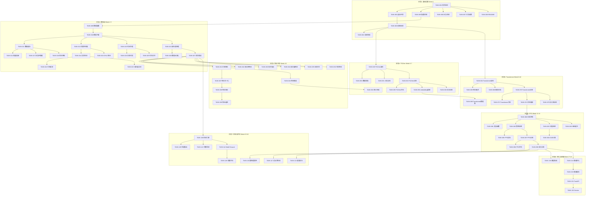

# AI交易系统任务拆分文档

## 文档信息
- **项目名称**: 基于TS2Vec-Transformer-PPO的智能交易系统
- **文档版本**: v1.0
- **创建日期**: 2025-11-20
- **任务总数**: 156个子任务

---

## 任务总览表格

| 模块 | 任务数量 | 预估总工时 | 优先级分布 |
|------|---------|-----------|-----------|
| 1. 项目初始化与环境搭建 | 8 | 8小时 | P0: 8 |
| 2. 数据采集模块 | 12 | 20小时 | P0: 8, P1: 4 |
| 3. 数据清洗模块 | 10 | 16小时 | P0: 7, P1: 3 |
| 4. 特征工程模块 | 18 | 32小时 | P0: 12, P1: 6 |
| 5. TS2Vec模型实现 | 15 | 40小时 | P0: 10, P1: 5 |
| 6. Transformer模型实现 | 16 | 48小时 | P0: 11, P1: 5 |
| 7. PPO强化学习实现 | 20 | 64小时 | P0: 14, P1: 6 |
| 8. 回测引擎实现 | 14 | 32小时 | P0: 10, P1: 4 |
| 9. 评估与验证体系 | 16 | 40小时 | P0: 10, P1: 6 |
| 10. 防过拟合策略 | 12 | 24小时 | P1: 8, P2: 4 |
| 11. 模型集成与优化 | 8 | 20小时 | P1: 5, P2: 3 |
| 12. 部署与API开发 | 7 | 16小时 | P1: 5, P2: 2 |
| **总计** | **156** | **360小时** | **P0: 90, P1: 52, P2: 14** |

---

## 模块1: 项目初始化与环境搭建

### TASK-001: 创建项目目录结构
- **优先级**: P0
- **预估工时**: 1小时
- **依赖**: 无
- **描述**: 创建完整的项目目录结构，包括数据、模型、配置、日志等目录
- **详细要求**:
  - 创建以下目录结构:
    ```
    ai-trader/
    ├── data/
    │   ├── raw/
    │   ├── processed/
    │   └── cache/
    ├── models/
    │   ├── ts2vec/
    │   ├── transformer/
    │   └── ppo/
    ├── src/
    │   ├── data/
    │   ├── features/
    │   ├── models/
    │   ├── training/
    │   ├── evaluation/
    │   └── utils/
    ├── configs/
    ├── logs/
    ├── notebooks/
    ├── tests/
    └── scalers/
    ```
- **验收标准**:
  - 所有目录创建成功
  - 每个目录包含.gitkeep文件
  - 目录结构符合Python项目最佳实践

### TASK-002: 配置Python虚拟环境
- **优先级**: P0
- **预估工时**: 0.5小时
- **依赖**: TASK-001
- **描述**: 创建并配置Python虚拟环境
- **详细要求**:
  - 使用Python 3.9+
  - 创建虚拟环境: `python -m venv venv`
  - 配置.gitignore排除venv目录
- **验收标准**:
  - 虚拟环境创建成功
  - 可以正常激活和停用
  - .gitignore配置正确

### TASK-003: 安装核心依赖包
- **优先级**: P0
- **预估工时**: 1小时
- **依赖**: TASK-002
- **描述**: 安装项目所需的所有核心依赖包
- **详细要求**:
  - 创建requirements.txt包含:
    - torch>=2.0.0
    - numpy>=1.24.0
    - pandas>=2.0.0
    - scikit-learn>=1.3.0
    - yfinance>=0.2.0
    - pandas-ta>=0.3.14
    - stable-baselines3>=2.0.0
    - gymnasium>=0.29.0
  - 安装所有依赖
- **验收标准**:
  - 所有包安装成功
  - 无版本冲突
  - 可以正常导入所有包

### TASK-004: 配置实验管理工具
- **优先级**: P0
- **预估工时**: 1小时
- **依赖**: TASK-003
- **描述**: 配置MLflow或TensorBoard用于实验跟踪
- **详细要求**:
  - 安装mlflow或tensorboard
  - 创建实验跟踪配置文件
  - 设置日志目录
- **验收标准**:
  - 实验管理工具可以正常启动
  - 可以记录和查看实验结果
  - 配置文件正确

### TASK-005: 创建配置管理系统
- **优先级**: P0
- **预估工时**: 2小时
- **依赖**: TASK-001
- **描述**: 实现统一的配置管理系统
- **详细要求**:
  - 创建[`configs/base_config.yaml`](configs/base_config.yaml:1)
  - 实现[`src/utils/config_loader.py`](src/utils/config_loader.py:1)配置加载器
  - 支持YAML格式配置文件
  - 支持环境变量覆盖
- **验收标准**:
  - 配置文件格式正确
  - 配置加载器可以正常工作
  - 支持嵌套配置和默认值

### TASK-006: 实现日志系统
- **优先级**: P0
- **预估工时**: 1.5小时
- **依赖**: TASK-001
- **描述**: 实现统一的日志记录系统
- **详细要求**:
  - 创建[`src/utils/logger.py`](src/utils/logger.py:1)
  - 支持多级别日志(DEBUG, INFO, WARNING, ERROR)
  - 同时输出到控制台和文件
  - 支持日志轮转
- **验收标准**:
  - 日志系统可以正常工作
  - 日志格式清晰易读
  - 日志文件自动轮转

### TASK-007: 创建工具函数库
- **优先级**: P0
- **预估工时**: 1小时
- **依赖**: TASK-001
- **描述**: 实现常用工具函数
- **详细要求**:
  - 创建[`src/utils/helpers.py`](src/utils/helpers.py:1)
  - 实现随机种子设置函数
  - 实现时间处理函数
  - 实现文件IO辅助函数
- **验收标准**:
  - 所有工具函数正常工作
  - 函数有完整的文档字符串
  - 通过单元测试

### TASK-008: 编写项目README
- **优先级**: P0
- **预估工时**: 1小时
- **依赖**: TASK-001
- **描述**: 编写项目README文档
- **详细要求**:
  - 项目简介
  - 安装说明
  - 快速开始指南
  - 项目结构说明
- **验收标准**:
  - README内容完整
  - 格式规范
  - 包含必要的示例代码

---

## 模块2: 数据采集模块

### TASK-009: 实现数据源配置管理
- **优先级**: P0
- **预估工时**: 1小时
- **依赖**: TASK-005
- **描述**: 实现数据源配置管理
- **详细要求**:
  - 创建[`configs/data_config.yaml`](configs/data_config.yaml:1)
  - 配置支持的期货品种列表
  - 配置数据时间范围
  - 配置数据频率(5分钟)
- **验收标准**:
  - 配置文件格式正确
  - 支持多品种配置
  - 可以灵活修改参数

### TASK-010: 实现Yahoo Finance数据下载器
- **优先级**: P0
- **预估工时**: 2小时
- **依赖**: TASK-009
- **描述**: 实现基于yfinance的数据下载功能
- **详细要求**:
  - 创建[`src/data/downloader.py`](src/data/downloader.py:1)
  - 实现[`YahooFinanceDownloader`](src/data/downloader.py:10)类
  - 支持指定品种、时间范围、频率下载
  - 实现错误处理和重试机制
- **验收标准**:
  - 可以成功下载OHLCV数据
  - 数据格式正确(DataFrame)
  - 错误处理完善

### TASK-011: 实现数据缓存机制
- **优先级**: P0
- **预估工时**: 2小时
- **依赖**: TASK-010
- **描述**: 实现本地数据缓存功能
- **详细要求**:
  - 支持Parquet格式存储
  - 实现数据版本管理
  - 支持增量更新
  - 实现缓存过期检查
- **验收标准**:
  - 数据可以正确保存和加载
  - 增量更新功能正常
  - 缓存管理有效

### TASK-012: 实现增量数据更新
- **优先级**: P0
- **预估工时**: 2小时
- **依赖**: TASK-011
- **描述**: 实现增量数据更新功能
- **详细要求**:
  - 检测本地最新数据时间戳
  - 仅下载新增数据
  - 合并到现有数据集
  - 避免重复数据
- **验收标准**:
  - 增量更新正确
  - 无数据重复
  - 时间连续性保持

### TASK-013: 实现数据完整性检查
- **优先级**: P0
- **预估工时**: 2小时
- **依赖**: TASK-010
- **描述**: 实现数据完整性验证
- **详细要求**:
  - 检查缺失值比例(<1%)
  - 检查时间间隔连续性
  - 检查OHLC数据一致性(High>=Low等)
  - 生成数据质量报告
- **验收标准**:
  - 所有检查项正常工作
  - 质量报告清晰
  - 可以识别问题数据

### TASK-014: 实现数据异常值检测
- **优先级**: P0
- **预估工时**: 2小时
- **依赖**: TASK-013
- **描述**: 实现价格和成交量异常检测
- **详细要求**:
  - 价格跳变检测(|ret| > 5σ)
  - 成交量异常检测(volume > 10 * MA20)
  - 零成交量检测
  - 标记异常数据点
- **验收标准**:
  - 异常检测准确
  - 可以生成异常报告
  - 支持可视化展示

### TASK-015: 实现时区处理
- **优先级**: P0
- **预估工时**: 1.5小时
- **依赖**: TASK-010
- **描述**: 实现统一的时区处理
- **详细要求**:
  - 统一转换为UTC时区
  - 处理夏令时切换
  - 支持不同交易所时区
- **验收标准**:
  - 时区转换正确
  - 夏令时处理正确
  - 时间戳一致

### TASK-016: 实现交易时段过滤
- **优先级**: P1
- **预估工时**: 1.5小时
- **依赖**: TASK-015
- **描述**: 过滤非交易时段数据
- **详细要求**:
  - 配置各品种交易时间
  - 过滤非交易时段数据
  - 支持盘前盘后数据选项
- **验收标准**:
  - 交易时段过滤正确
  - 配置灵活
  - 数据完整性保持

### TASK-017: 实现多品种数据管理
- **优先级**: P1
- **预估工时**: 2小时
- **依赖**: TASK-011
- **描述**: 实现多品种数据统一管理
- **详细要求**:
  - 支持同时管理多个品种
  - 实现品种数据索引
  - 支持批量操作
- **验收标准**:
  - 多品种管理正常
  - 数据隔离正确
  - 批量操作高效

### TASK-018: 实现数据版本控制
- **优先级**: P1
- **预估工时**: 2小时
- **依赖**: TASK-011
- **描述**: 实现数据版本管理
- **详细要求**:
  - 记录数据版本信息
  - 支持版本回退
  - 记录数据变更历史
- **验收标准**:
  - 版本管理正常
  - 可以回退到历史版本
  - 变更历史完整

### TASK-019: 编写数据采集单元测试
- **优先级**: P1
- **预估工时**: 2小时
- **依赖**: TASK-010, TASK-011, TASK-013
- **描述**: 编写数据采集模块的单元测试
- **详细要求**:
  - 测试数据下载功能
  - 测试缓存机制
  - 测试数据验证
  - 测试覆盖率>80%
- **验收标准**:
  - 所有测试通过
  - 测试覆盖率达标
  - 测试用例完整

### TASK-020: 编写数据采集文档
- **优先级**: P1
- **预估工时**: 1小时
- **依赖**: TASK-010 到 TASK-018
- **描述**: 编写数据采集模块使用文档
- **详细要求**:
  - API文档
  - 使用示例
  - 配置说明
  - 常见问题
- **验收标准**:
  - 文档完整清晰
  - 示例可运行
  - 格式规范

---

## 模块3: 数据清洗模块

### TASK-021: 实现缺失值处理器
- **优先级**: P0
- **预估工时**: 2小时
- **依赖**: TASK-010
- **描述**: 实现缺失值检测和处理
- **详细要求**:
  - 创建[`src/data/cleaner.py`](src/data/cleaner.py:1)
  - 实现前向填充(ffill)
  - 实现线性插值
  - 实现缺失段删除(连续>5根K线)
- **验收标准**:
  - 缺失值处理正确
  - 支持多种策略
  - 保持数据完整性

### TASK-022: 实现价格异常值处理
- **优先级**: P0
- **预估工时**: 2小时
- **依赖**: TASK-014
- **描述**: 实现价格异常值修正
- **详细要求**:
  - 检测价格尖峰(spike)
  - 使用前后均值替代
  - 保留真实跳空(gap)
  - 记录处理日志
- **验收标准**:
  - 异常值识别准确
  - 修正方法合理
  - 不影响真实数据

### TASK-023: 实现成交量异常处理
- **优先级**: P0
- **预估工时**: 1.5小时
- **依赖**: TASK-014
- **描述**: 实现成交量异常值处理
- **详细要求**:
  - 检测异常大成交量
  - Cap到合理范围(MA+3σ)
  - 处理零成交量
- **验收标准**:
  - 成交量异常处理正确
  - 不影响正常数据
  - 处理记录完整

### TASK-024: 实现OHLC一致性修正
- **优先级**: P0
- **预估工时**: 1小时
- **依赖**: TASK-013
- **描述**: 修正OHLC数据不一致问题
- **详细要求**:
  - 确保High >= max(Open, Close)
  - 确保Low <= min(Open, Close)
  - 确保High >= Low
  - 自动修正不一致数据
- **验收标准**:
  - OHLC关系正确
  - 修正逻辑合理
  - 不破坏数据

### TASK-025: 实现时间对齐功能
- **优先级**: P0
- **预估工时**: 2小时
- **依赖**: TASK-015
- **描述**: 实现严格的时间对齐
- **详细要求**:
  - 重采样到5分钟间隔
  - 聚合OHLCV数据
  - 删除空K线
  - 确保时间连续性
- **验收标准**:
  - 时间间隔严格5分钟
  - 数据聚合正确
  - 无时间跳跃

### TASK-026: 实现数据标准化
- **优先级**: P0
- **预估工时**: 1.5小时
- **依赖**: TASK-021
- **描述**: 实现数据标准化处理
- **详细要求**:
  - 价格数据归一化
  - 成交量数据归一化
  - 保存归一化参数
- **验收标准**:
  - 归一化正确
  - 参数可保存加载
  - 可逆转换

### TASK-027: 实现数据清洗管道
- **优先级**: P0
- **预估工时**: 2小时
- **依赖**: TASK-021 到 TASK-026
- **描述**: 实现完整的数据清洗管道
- **详细要求**:
  - 创建[`DataCleaningPipeline`](src/data/cleaner.py:100)类
  - 串联所有清洗步骤
  - 支持配置化流程
  - 生成清洗报告
- **验收标准**:
  - 管道流程正确
  - 配置灵活
  - 报告详细

### TASK-028: 实现清洗前后对比
- **优先级**: P1
- **预估工时**: 1.5小时
- **依赖**: TASK-027
- **描述**: 实现清洗前后数据对比
- **详细要求**:
  - 统计清洗前后差异
  - 可视化对比结果
  - 生成对比报告
- **验收标准**:
  - 对比统计准确
  - 可视化清晰
  - 报告完整

### TASK-029: 实现数据质量评分
- **优先级**: P1
- **预估工时**: 2小时
- **依赖**: TASK-027
- **描述**: 实现数据质量评分系统
- **详细要求**:
  - 定义质量评分标准
  - 计算综合质量分数
  - 生成质量报告
- **验收标准**:
  - 评分标准合理
  - 分数计算正确
  - 报告有指导意义

### TASK-030: 编写数据清洗单元测试
- **优先级**: P1
- **预估工时**: 2小时
- **依赖**: TASK-021 到 TASK-027
- **描述**: 编写数据清洗模块单元测试
- **详细要求**:
  - 测试各清洗功能
  - 测试边界情况
  - 测试覆盖率>80%
- **验收标准**:
  - 所有测试通过
  - 覆盖率达标
  - 测试用例完整

---

## 模块4: 特征工程模块

### TASK-031: 实现价格与收益特征计算
- **优先级**: P0
- **预估工时**: 2小时
- **依赖**: TASK-027
- **描述**: 实现5维价格与收益特征
- **详细要求**:
  - 创建[`src/features/price_features.py`](src/features/price_features.py:1)
  - 实现ret_1, ret_5, ret_20(对数收益率)
  - 实现price_slope_20(线性回归斜率)
  - 实现C_div_MA20(价格/均线比)
- **验收标准**:
  - 所有特征计算正确
  - 使用向量化计算
  - 性能优化

### TASK-032: 实现波动率特征计算
- **优先级**: P0
- **预估工时**: 2.5小时
- **依赖**: TASK-027
- **描述**: 实现5维波动率特征
- **详细要求**:
  - 创建[`src/features/volatility_features.py`](src/features/volatility_features.py:1)
  - 实现ATR14_norm(归一化ATR)
  - 实现vol_20(滚动标准差)
  - 实现range_20_norm(归一化区间)
  - 实现BB_width_norm(布林带宽度)
  - 实现parkinson_vol(Parkinson波动率)
- **验收标准**:
  - 所有特征计算正确
  - 使用pandas-ta库
  - 归一化处理正确

### TASK-033: 实现技术指标特征计算
- **优先级**: P0
- **预估工时**: 2小时
- **依赖**: TASK-027
- **描述**: 实现4维技术指标特征
- **详细要求**:
  - 创建[`src/features/technical_features.py`](src/features/technical_features.py:1)
  - 实现EMA20(指数移动平均)
  - 实现stoch(随机指标)
  - 实现MACD(MACD指标)
  - 实现VWAP(成交量加权平均价)
- **验收标准**:
  - 所有指标计算正确
  - 使用pandas-ta库
  - 参数可配置

### TASK-034: 实现成交量特征计算
- **优先级**: P0
- **预估工时**: 2小时
- **依赖**: TASK-027
- **描述**: 实现4维成交量特征
- **详细要求**:
  - 创建[`src/features/volume_features.py`](src/features/volume_features.py:1)
  - 实现volume(原始成交量)
  - 实现volume_zscore(Z-score标准化)
  - 实现volume_change_1(变化率)
  - 实现OBV_slope_20(OBV斜率)
- **验收标准**:
  - 所有特征计算正确
  - 使用pandas-ta库
  - 处理零成交量情况

### TASK-035: 实现K线形态特征计算
- **优先级**: P0
- **预估工时**: 3小时
- **依赖**: TASK-027
- **描述**: 实现7维K线形态特征
- **详细要求**:
  - 创建[`src/features/candlestick_features.py`](src/features/candlestick_features.py:1)
  - 实现pos_in_range_20(相对位置)
  - 实现dist_to_HH20_norm, dist_to_LL20_norm(距离高低点)
  - 实现body_ratio(实体比例)
  - 实现upper_shadow_ratio, lower_shadow_ratio(影线比例)
  - 实现FVG(公允价值缺口)
- **验收标准**:
  - 所有特征计算正确
  - FVG计算准确
  - 边界情况处理

### TASK-036: 实现时间周期特征计算
- **优先级**: P0
- **预估工时**: 1小时
- **依赖**: TASK-027
- **描述**: 实现2维时间特征
- **详细要求**:
  - 创建[`src/features/time_features.py`](src/features/time_features.py:1)
  - 实现sin_tod(时间正弦编码)
  - 实现cos_tod(时间余弦编码)
- **验收标准**:
  - 时间编码正确
  - 周期性保持
  - 范围在[-1,1]

### TASK-037: 实现特征归一化器
- **优先级**: P0
- **预估工时**: 2小时
- **依赖**: TASK-031 到 TASK-036
- **描述**: 实现特征归一化功能
- **详细要求**:
  - 创建[`src/features/normalizer.py`](src/features/normalizer.py:1)
  - 实现StandardScaler归一化(12维特征)
  - 实现RobustScaler归一化(13维特征)
  - 支持scaler保存和加载
- **验收标准**:
  - 归一化正确
  - scaler可序列化
  - 避免look-ahead bias

### TASK-038: 实现特征验证器
- **优先级**: P0
- **预估工时**: 2.5小时
- **依赖**: TASK-037
- **描述**: 实现特征有效性验证
- **详细要求**:
  - 创建[`src/features/validator.py`](src/features/validator.py:1)
  - 实现单特征信息量测试(R², MI)
  - 实现特征相关性检测
  - 实现VIF检测
- **验收标准**:
  - 验证方法正确
  - 可以识别无效特征
  - 生成验证报告

### TASK-039: 实现特征选择器
- **优先级**: P1
- **预估工时**: 2小时
- **依赖**: TASK-038
- **描述**: 实现特征选择功能
- **详细要求**:
  - 实现递归特征消除(RFE)
  - 实现基于重要性的选择
  - 实现相关性过滤
- **验收标准**:
  - 特征选择合理
  - 支持多种策略
  - 可配置阈值

### TASK-040: 实现特征工程管道
- **优先级**: P0
- **预估工时**: 3小时
- **依赖**: TASK-031 到 TASK-039
- **描述**: 实现完整的特征工程管道
- **详细要求**:
  - 创建[`src/features/pipeline.py`](src/features/pipeline.py:1)
  - 实现[`FeatureEngineeringPipeline`](src/features/pipeline.py:10)类
  - 串联所有特征计算步骤
  - 支持配置化流程
- **验收标准**:
  - 管道流程正确
  - 所有27维特征计算正确
  - 性能优化

### TASK-041: 实现特征缓存机制
- **优先级**: P1
- **预估工时**: 2小时
- **依赖**: TASK-040
- **描述**: 实现特征计算结果缓存
- **详细要求**:
  - 缓存计算好的特征
  - 支持增量更新
  - 实现缓存失效检查
- **验收标准**:
  - 缓存机制正常
  - 增量更新正确
  - 性能提升明显

### TASK-042: 实现特征可视化
- **优先级**: P1
- **预估工时**: 2小时
- **依赖**: TASK-040
- **描述**: 实现特征分布和相关性可视化
- **详细要求**:
  - 特征分布直方图
  - 特征相关性热力图
  - 特征时序图
- **验收标准**:
  - 可视化清晰
  - 支持多种图表
  - 可保存图片

### TASK-043: 实现特征重要性分析
- **优先级**: P1
- **预估工时**: 2.5小时
- **依赖**: TASK-040
- **描述**: 实现特征重要性评估
- **详细要求**:
  - 实现置换重要性分析
  - 实现SHAP值计算
  - 生成重要性排序
- **验收标准**:
  - 重要性计算正确
  - 支持多种方法
  - 结果可视化

### TASK-044: 实现特征监控
- **优先级**: P1
- **预估工时**: 2小时
- **依赖**: TASK-040
- **描述**: 实现特征分布监控
- **详细要求**:
  - 监控特征分布变化
  - 检测特征漂移
  - 生成监控报告
- **验收标准**:
  - 监控功能正常
  - 可以检测异常
  - 报告及时

### TASK-045: 实现特征版本管理
- **优先级**: P1
- **预估工时**: 1.5小时
- **依赖**: TASK-040
- **描述**: 实现特征版本控制
- **详细要求**:
  - 记录特征计算版本
  - 支持版本回退
  - 记录特征变更
- **验收标准**:
  - 版本管理正常
  - 可以追溯历史
  - 变更记录完整

### TASK-046: 编写特征工程单元测试
- **优先级**: P1
- **预估工时**: 3小时
- **依赖**: TASK-031 到 TASK-040
- **描述**: 编写特征工程模块单元测试
- **详细要求**:
  - 测试所有特征计算
  - 测试归一化功能
  - 测试管道流程
  - 测试覆盖率>80%
- **验收标准**:
  - 所有测试通过
  - 覆盖率达标
  - 测试用例完整

### TASK-047: 编写特征工程文档
- **优先级**: P1
- **预估工时**: 2小时
- **依赖**: TASK-031 到 TASK-045
- **描述**: 编写特征工程模块文档
- **详细要求**:
  - 特征定义文档
  - 计算公式说明
  - 使用示例
  - API文档
- **验收标准**:
  - 文档完整清晰
  - 公式准确
  - 示例可运行

### TASK-048: 实现特征工程性能优化
- **优先级**: P2
- **预估工时**: 2小时
- **依赖**: TASK-040
- **描述**: 优化特征计算性能
- **详细要求**:
  - 使用向量化计算
  - 并行计算优化
  - 内存使用优化
- **验收标准**:
  - 性能提升>30%
  - 内存使用合理
  - 不影响准确性

---

## 模块5: TS2Vec模型实现

### TASK-049: 实现TS2Vec模型架构
- **优先级**: P0
- **预估工时**: 4小时
- **依赖**: TASK-003
- **描述**: 实现TS2Vec模型的核心架构
- **详细要求**:
  - 创建[`src/models/ts2vec/model.py`](src/models/ts2vec/model.py:1)
  - 实现Dilated CNN编码器(10层)
  - 实现投影头(256→128→128)
  - 实现对比学习头
- **验收标准**:
  - 模型架构正确
  - 可以正常前向传播
  - 参数量合理

### TASK-050: 实现数据增强策略
- **优先级**: P0
- **预估工时**: 3小时
- **依赖**: TASK-049
- **描述**: 实现TS2Vec的数据增强
- **详细要求**:
  - 创建[`src/models/ts2vec/augmentation.py`](src/models/ts2vec/augmentation.py:1)
  - 实现时间遮蔽(Temporal Masking)
  - 实现时间扭曲(Time Warping)
  - 实现幅度缩放(Magnitude Scaling)
  - 实现时间平移(Time Shifting)
- **验收标准**:
  - 所有增强方法正确
  - 保持数据特性
  - 可配置增强强度

### TASK-051: 实现对比学习损失函数
- **优先级**: P0
- **预估工时**: 2小时
- **依赖**: TASK-049
- **描述**: 实现NT-Xent对比损失
- **详细要求**:
  - 实现NT-Xent损失函数
  - 实现余弦相似度计算
  - 实现温度参数控制
- **验收标准**:
  - 损失函数正确
  - 梯度计算正常
  - 数值稳定

### TASK-052: 实现滑动窗口数据生成器
- **优先级**: P0
- **预估工时**: 2小时
- **依赖**: TASK-040
- **描述**: 实现TS2Vec训练数据生成
- **详细要求**:
  - 创建[`src/models/ts2vec/dataset.py`](src/models/ts2vec/dataset.py:1)
  - 实现滑动窗口采样(窗口256, 步长1)
  - 实现数据增强集成
  - 实现批次生成
- **验收标准**:
  - 数据生成正确
  - 支持多种窗口大小
  - 性能优化

### TASK-053: 实现TS2Vec训练器
- **优先级**: P0
- **预估工时**: 4小时
- **依赖**: TASK-049, TASK-051, TASK-052
- **描述**: 实现TS2Vec训练流程
- **详细要求**:
  - 创建[`src/models/ts2vec/trainer.py`](src/models/ts2vec/trainer.py:1)
  - 实现训练循环
  - 实现验证流程
  - 实现早停机制
  - 实现模型保存
- **验收标准**:
  - 训练流程正确
  - 支持断点续训
  - 日志记录完整

### TASK-054: 实现学习率调度器
- **优先级**: P0
- **预估工时**: 1.5小时
- **依赖**: TASK-053
- **描述**: 实现学习率调度策略
- **详细要求**:
  - 实现Warmup阶段(前5 epoch)
  - 实现CosineAnnealingLR
  - 支持自定义调度策略
- **验收标准**:
  - 学习率调度正确
  - 支持可视化
  - 可配置参数

### TASK-055: 实现TS2Vec评估器
- **优先级**: P0
- **预估工时**: 3小时
- **依赖**: TASK-053
- **描述**: 实现TS2Vec模型评估
- **详细要求**:
  - 创建[`src/models/ts2vec/evaluator.py`](src/models/ts2vec/evaluator.py:1)
  - 实现embedding质量评估
  - 实现线性探测(Linear Probing)
  - 实现聚类质量评估
- **验收标准**:
  - 评估指标正确
  - 支持多种评估方法
  - 生成评估报告

### TASK-056: 实现embedding提取器
- **优先级**: P0
- **预估工时**: 2小时
- **依赖**: TASK-053
- **描述**: 实现embedding批量提取
- **详细要求**:
  - 加载预训练模型
  - 批量提取embedding
  - 支持GPU加速
  - 实现缓存机制
- **验收标准**:
  - 提取功能正常
  - 性能优化
  - 支持大规模数据

### TASK-057: 实现embedding可视化
- **优先级**: P1
- **预估工时**: 2小时
- **依赖**: TASK-056
- **描述**: 实现embedding可视化
- **详细要求**:
  - 实现t-SNE降维
  - 实现UMAP降维
  - 可视化embedding分布
- **验收标准**:
  - 可视化清晰
  - 支持交互式展示
  - 可保存图片

### TASK-058: 实现TS2Vec配置管理
- **优先级**: P0
- **预估工时**: 1小时
- **依赖**: TASK-005
- **描述**: 创建TS2Vec配置文件
- **详细要求**:
  - 创建[`configs/ts2vec_config.yaml`](configs/ts2vec_config.yaml:1)
  - 配置模型超参数
  - 配置训练参数
  - 配置数据参数
- **验收标准**:
  - 配置文件完整
  - 参数合理
  - 易于修改

### TASK-059: 实现TS2Vec模型保存和加载
- **优先级**: P0
- **预估工时**: 1.5小时
- **依赖**: TASK-053
- **描述**: 实现模型序列化
- **详细要求**:
  - 保存模型权重
  - 保存训练状态
  - 保存配置信息
  - 实现模型加载
- **验收标准**:
  - 保存加载正确
  - 支持断点续训
  - 版本兼容

### TASK-060: 实现TS2Vec训练监控
- **优先级**: P1
- **预估工时**: 2小时
- **依赖**: TASK-053
- **描述**: 实现训练过程监控
- **详细要求**:
  - 记录训练指标
  - 可视化训练曲线
  - 实时监控GPU使用
- **验收标准**:
  - 监控功能完整
  - 可视化清晰
  - 实时更新

### TASK-061: 编写TS2Vec单元测试
- **优先级**: P1
- **预估工时**: 3小时
- **依赖**: TASK-049 到 TASK-056
- **描述**: 编写TS2Vec模块单元测试
- **详细要求**:
  - 测试模型架构
  - 测试训练流程
  - 测试评估功能
  - 测试覆盖率>75%
- **验收标准**:
  - 所有测试通过
  - 覆盖率达标
  - 测试用例完整

### TASK-062: 编写TS2Vec使用文档
- **优先级**: P1
- **预估工时**: 2小时
- **依赖**: TASK-049 到 TASK-060
- **描述**: 编写TS2Vec模块文档
- **详细要求**:
  - 模型架构说明
  - 训练指南
  - API文档
  - 使用示例
- **验收标准**:
  - 文档完整清晰
  - 示例可运行
  - 格式规范

### TASK-063: 执行TS2Vec模型训练
- **优先级**: P0
- **预估工时**: 8小时(实际训练时间)
- **依赖**: TASK-053, TASK-058
- **描述**: 训练TS2Vec模型
- **详细要求**:
  - 准备训练数据
  - 执行完整训练
  - 评估模型质量
  - 保存最佳模型
- **验收标准**:
  - 训练收敛
  - embedding质量达标
  - 模型保存成功

---

## 模块6: Transformer模型实现

### TASK-064: 实现Transformer模型架构
- **优先级**: P0
- **预估工时**: 4小时
- **依赖**: TASK-003
- **描述**: 实现Transformer编码器架构
- **详细要求**:
  - 创建[`src/models/transformer/model.py`](src/models/transformer/model.py:1)
  - 实现多头自注意力机制(8头)
  - 实现前馈网络(FFN)
  - 实现位置编码
  - 实现6层Transformer编码器
- **验收标准**:
  - 模型架构正确
  - 可以正常前向传播
  - 支持因果掩码

### TASK-065: 实现特征融合层
- **优先级**: P0
- **预估工时**: 2小时
- **依赖**: TASK-064
- **描述**: 实现TS2Vec embedding与手工特征融合
- **详细要求**:
  - 实现特征拼接(128+27=155维)
  - 实现输入嵌入层(155→256)
  - 支持可选的加权融合
- **验收标准**:
  - 特征融合正确
  - 维度匹配
  - 支持多种融合策略

### TASK-066: 实现位置编码
- **优先级**: P0
- **预估工时**: 1.5小时
- **依赖**: TASK-064
- **描述**: 实现正弦位置编码
- **详细要求**:
  - 实现Sinusoidal位置编码
  - 支持可学习位置编码(可选)
  - 正确添加到输入
- **验收标准**:
  - 位置编码正确
  - 保持时间顺序信息
  - 数值稳定

### TASK-067: 实现因果注意力掩码
- **优先级**: P0
- **预估工时**: 1.5小时
- **依赖**: TASK-064
- **描述**: 实现防止未来信息泄露的掩码
- **详细要求**:
  - 实现上三角掩码矩阵
  - 正确应用到注意力层
  - 支持批处理
- **验收标准**:
  - 掩码正确
  - 无未来信息泄露
  - 性能优化

### TASK-068: 实现辅助任务头
- **优先级**: P0
- **预估工时**: 2小时
- **依赖**: TASK-064
- **描述**: 实现监督学习辅助任务
- **详细要求**:
  - 实现回归头(预测收益率)
  - 实现分类头(预测方向)
  - 支持多任务学习
- **验收标准**:
  - 辅助头正确
  - 损失计算正确
  - 可配置权重

### TASK-069: 实现Transformer数据集
- **优先级**: P0
- **预估工时**: 2.5小时
- **依赖**: TASK-056, TASK-040
- **描述**: 实现Transformer训练数据集
- **详细要求**:
  - 创建[`src/models/transformer/dataset.py`](src/models/transformer/dataset.py:1)
  - 融合TS2Vec embedding和手工特征
  - 实现序列采样(长度64)
  - 生成辅助任务标签
- **验收标准**:
  - 数据集正确
  - 特征对齐
  - 支持批处理

### TASK-070: 实现Transformer训练器
- **优先级**: P0
- **预估工时**: 4小时
- **依赖**: TASK-064, TASK-068, TASK-069
- **描述**: 实现Transformer训练流程
- **详细要求**:
  - 创建[`src/models/transformer/trainer.py`](src/models/transformer/trainer.py:1)
  - 实现预训练阶段(监督学习)
  - 实现多任务损失
  - 实现梯度裁剪
  - 实现模型保存
- **验收标准**:
  - 训练流程正确
  - 支持断点续训
  - 日志记录完整

### TASK-071: 实现Warmup学习率调度
- **优先级**: P0
- **预估工时**: 1.5小时
- **依赖**: TASK-070
- **描述**: 实现Warmup+余弦退火学习率
- **详细要求**:
  - 实现Warmup阶段(1000步)
  - 实现余弦退火
  - 支持自定义调度
- **验收标准**:
  - 学习率调度正确
  - 训练稳定
  - 可配置参数

### TASK-072: 实现Transformer评估器
- **优先级**: P0
- **预估工时**: 3小时
- **依赖**: TASK-070
- **描述**: 实现Transformer模型评估
- **详细要求**:
  - 创建[`src/models/transformer/evaluator.py`](src/models/transformer/evaluator.py:1)
  - 实现回归任务评估(MSE, MAE, R²)
  - 实现分类任务评估(Accuracy, AUC)
  - 实现状态表征质量评估
- **验收标准**:
  - 评估指标正确
  - 支持多种指标
  - 生成评估报告

### TASK-073: 实现注意力权重可视化
- **优先级**: P1
- **预估工时**: 2小时
- **依赖**: TASK-070
- **描述**: 实现注意力权重可视化
- **详细要求**:
  - 提取各层注意力权重
  - 可视化注意力模式
  - 分析特征关注度
- **验收标准**:
  - 可视化清晰
  - 支持多层展示
  - 可保存图片

### TASK-074: 实现状态向量提取器
- **优先级**: P0
- **预估工时**: 2小时
- **依赖**: TASK-070
- **描述**: 实现状态向量批量提取
- **详细要求**:
  - 加载预训练模型
  - 批量提取状态向量(256维)
  - 支持GPU加速
- **验收标准**:
  - 提取功能正常
  - 性能优化
  - 支持大规模数据

### TASK-075: 实现Transformer配置管理
- **优先级**: P0
- **预估工时**: 1小时
- **依赖**: TASK-005
- **描述**: 创建Transformer配置文件
- **详细要求**:
  - 创建[`configs/transformer_config.yaml`](configs/transformer_config.yaml:1)
  - 配置模型超参数
  - 配置训练参数
  - 配置辅助任务权重
- **验收标准**:
  - 配置文件完整
  - 参数合理
  - 易于修改

### TASK-076: 实现Transformer模型保存和加载
- **优先级**: P0
- **预估工时**: 1.5小时
- **依赖**: TASK-070
- **描述**: 实现模型序列化
- **详细要求**:
  - 保存模型权重
  - 保存训练状态
  - 保存配置信息
  - 实现模型加载
- **验收标准**:
  - 保存加载正确
  - 支持断点续训
  - 版本兼容

### TASK-077: 编写Transformer单元测试
- **优先级**: P1
- **预估工时**: 3小时
- **依赖**: TASK-064 到 TASK-074
- **描述**: 编写Transformer模块单元测试
- **详细要求**:
  - 测试模型架构
  - 测试训练流程
  - 测试评估功能
  - 测试覆盖率>75%
- **验收标准**:
  - 所有测试通过
  - 覆盖率达标
  - 测试用例完整

### TASK-078: 编写Transformer使用文档
- **优先级**: P1
- **预估工时**: 2小时
- **依赖**: TASK-064 到 TASK-076
- **描述**: 编写Transformer模块文档
- **详细要求**:
  - 模型架构说明
  - 训练指南
  - API文档
  - 使用示例
- **验收标准**:
  - 文档完整清晰
  - 示例可运行
  - 格式规范

### TASK-079: 执行Transformer模型预训练
- **优先级**: P0
- **预估工时**: 12小时(实际训练时间)
- **依赖**: TASK-070, TASK-075, TASK-063
- **描述**: 预训练Transformer模型
- **详细要求**:
  - 准备训练数据
  - 执行监督学习预训练
  - 评估模型质量
  - 保存最佳模型
- **验收标准**:
  - 训练收敛
  - 监督学习指标达标
  - 模型保存成功

---

## 模块7: PPO强化学习实现

### TASK-080: 实现交易环境
- **优先级**: P0
- **预估工时**: 4小时
- **依赖**: TASK-074
- **描述**: 实现强化学习交易环境
- **详细要求**:
  - 创建[`src/models/ppo/environment.py`](src/models/ppo/environment.py:1)
  - 实现Gymnasium接口
  - 定义状态空间(263维)
  - 定义动作空间(离散+连续)
  - 实现step函数
- **验收标准**:
  - 环境接口正确
  - 状态动作定义合理
  - 符合Gymnasium标准

### TASK-081: 实现奖励函数
- **优先级**: P0
- **预估工时**: 3小时
- **依赖**: TASK-080
- **描述**: 实现交易奖励函数
- **详细要求**:
  - 实现盈利奖励(主导项)
  - 实现风险控制奖励
  - 实现稳定性奖励
  - 实现奖励塑形
- **验收标准**:
  - 奖励函数合理
  - 权重可配置
  - 数值范围合理

### TASK-082: 实现PPO策略网络
- **优先级**: P0
- **预估工时**: 4小时
- **依赖**: TASK-080
- **描述**: 实现PPO Actor网络
- **详细要求**:
  - 创建[`src/models/ppo/policy.py`](src/models/ppo/policy.py:1)
  - 实现共享层(263→512→256)
  - 实现离散动作头(direction)
  - 实现连续动作头(position_size, stop_loss, take_profit)
- **验收标准**:
  - 网络架构正确
  - 支持混合动作空间
  - 可以正常采样动作

### TASK-083: 实现PPO价值网络
- **优先级**: P0
- **预估工时**: 2小时
- **依赖**: TASK-080
- **描述**: 实现PPO Critic网络
- **详细要求**:
  - 实现价值网络(263→512→256→1)
  - 支持状态价值估计
  - 可选参数共享
- **验收标准**:
  - 网络架构正确
  - 价值估计合理
  - 支持批处理

### TASK-084: 实现GAE优势函数计算
- **优先级**: P0
- **预估工时**: 2小时
- **依赖**: TASK-083
- **描述**: 实现广义优势估计
- **详细要求**:
  - 实现GAE算法(γ=0.99, λ=0.95)
  - 实现TD误差计算
  - 实现反向累积
- **验收标准**:
  - GAE计算正确
  - 数值稳定
  - 性能优化

### TASK-085: 实现PPO损失函数
- **优先级**: P0
- **预估工时**: 3小时
- **依赖**: TASK-082, TASK-083, TASK-084
- **描述**: 实现PPO的裁剪损失
- **详细要求**:
  - 实现策略损失(clip ε=0.2)
  - 实现价值损失
  - 实现熵损失
  - 实现总损失组合
- **验收标准**:
  - 损失函数正确
  - 裁剪机制有效
  - 梯度计算正常

### TASK-086: 实现经验缓冲区
- **优先级**: P0
- **预估工时**: 2.5小时
- **依赖**: TASK-080
- **描述**: 实现PPO经验存储
- **详细要求**:
  - 创建[`src/models/ppo/buffer.py`](src/models/ppo/buffer.py:1)
  - 存储状态、动作、奖励等
  - 实现GAE计算
  - 实现批次采样
- **验收标准**:
  - 缓冲区功能正常
  - 支持on-policy采样
  - 内存使用合理

### TASK-087: 实现PPO训练器
- **优先级**: P0
- **预估工时**: 5小时
- **依赖**: TASK-082, TASK-083, TASK-085, TASK-086
- **描述**: 实现PPO训练流程
- **详细要求**:
  - 创建[`src/models/ppo/trainer.py`](src/models/ppo/trainer.py:1)
  - 实现经验收集
  - 实现策略更新(多epoch)
  - 实现KL散度监控
  - 实现模型保存
- **验收标准**:
  - 训练流程正确
  - 策略更新稳定
  - 日志记录完整

### TASK-088: 实现课程学习
- **优先级**: P1
- **预估工时**: 3小时
- **依赖**: TASK-087
- **描述**: 实现课程学习策略
- **详细要求**:
  - 从简单市场开始
  - 逐步增加难度
  - 自适应难度调整
- **验收标准**:
  - 课程设计合理
  - 难度递增平滑
  - 提升训练效果

### TASK-089: 实现多环境并行
- **优先级**: P1
- **预估工时**: 3小时
- **依赖**: TASK-080
- **描述**: 实现并行环境训练
- **详细要求**:
  - 支持多个环境同时运行
  - 实现向量化环境
  - 加速数据收集
- **验收标准**:
  - 并行功能正常
  - 性能提升明显
  - 无数据竞争

### TASK-090: 实现PPO评估器
- **优先级**: P0
- **预估工时**: 3小时
- **依赖**: TASK-087
- **描述**: 实现PPO模型评估
- **详细要求**:
  - 创建[`src/models/ppo/evaluator.py`](src/models/ppo/evaluator.py:1)
  - 实现训练过程指标(奖励、KL散度等)
  - 实现交易性能指标(Sharpe、CAGR等)
  - 实现泛化能力评估
- **验收标准**:
  - 评估指标完整
  - 计算正确
  - 生成评估报告

### TASK-091: 实现策略可视化
- **优先级**: P1
- **预估工时**: 2.5小时
- **依赖**: TASK-087
- **描述**: 实现策略行为可视化
- **详细要求**:
  - 可视化动作分布
  - 可视化价值函数
  - 可视化训练曲线
- **验收标准**:
  - 可视化清晰
  - 支持多种图表
  - 可保存图片

### TASK-092: 实现PPO配置管理
- **优先级**: P0
- **预估工时**: 1小时
- **依赖**: TASK-005
- **描述**: 创建PPO配置文件
- **详细要求**:
  - 创建[`configs/ppo_config.yaml`](configs/ppo_config.yaml:1)
  - 配置PPO超参数
  - 配置环境参数
  - 配置奖励函数权重
- **验收标准**:
  - 配置文件完整
  - 参数合理
  - 易于修改

### TASK-093: 实现PPO模型保存和加载
- **优先级**: P0
- **预估工时**: 1.5小时
- **依赖**: TASK-087
- **描述**: 实现模型序列化
- **详细要求**:
  - 保存策略和价值网络
  - 保存训练状态
  - 保存配置信息
  - 实现模型加载
- **验收标准**:
  - 保存加载正确
  - 支持断点续训
  - 版本兼容

### TASK-094: 实现自适应学习率
- **优先级**: P1
- **预估工时**: 2小时
- **依赖**: TASK-087
- **描述**: 实现基于KL散度的学习率调整
- **详细要求**:
  - 监控KL散度
  - 自动调整学习率
  - 防止策略崩溃
- **验收标准**:
  - 自适应机制有效
  - 训练更稳定
  - 可配置阈值

### TASK-095: 实现经验回放增强
- **优先级**: P1
- **预估工时**: 2.5小时
- **依赖**: TASK-086
- **描述**: 实现经验回放优化
- **详细要求**:
  - 优先回放高奖励episode
  - 平衡正负样本
  - 数据增强
- **验收标准**:
  - 回放策略有效
  - 提升训练效果
  - 不影响on-policy特性

### TASK-096: 编写PPO单元测试
- **优先级**: P1
- **预估工时**: 3小时
- **依赖**: TASK-080 到 TASK-090
- **描述**: 编写PPO模块单元测试
- **详细要求**:
  - 测试环境功能
  - 测试网络架构
  - 测试训练流程
  - 测试覆盖率>75%
- **验收标准**:
  - 所有测试通过
  - 覆盖率达标
  - 测试用例完整

### TASK-097: 编写PPO使用文档
- **优先级**: P1
- **预估工时**: 2小时
- **依赖**: TASK-080 到 TASK-095
- **描述**: 编写PPO模块文档
- **详细要求**:
  - 算法原理说明
  - 环境设计文档
  - 训练指南
  - API文档
- **验收标准**:
  - 文档完整清晰
  - 示例可运行
  - 格式规范

### TASK-098: 执行PPO模型训练
- **优先级**: P0
- **预估工时**: 20小时(实际训练时间)
- **依赖**: TASK-087, TASK-092, TASK-079
- **描述**: 训练PPO交易策略
- **详细要求**:
  - 准备训练环境
  - 执行完整训练
  - 评估策略性能
  - 保存最佳模型
- **验收标准**:
  - 训练收敛
  - 交易性能达标(Sharpe>1.5)
  - 模型保存成功

### TASK-099: 执行超参数优化
- **优先级**: P1
- **预估工时**: 8小时
- **依赖**: TASK-098
- **描述**: 优化PPO超参数
- **详细要求**:
  - 使用网格搜索或贝叶斯优化
  - 优化关键超参数
  - 记录优化结果
- **验收标准**:
  - 找到最优参数组合
  - 性能提升明显
  - 结果可复现

---

## 模块8: 回测引擎实现

### TASK-100: 实现回测引擎核心
- **优先级**: P0
- **预估工时**: 4小时
- **依赖**: TASK-027
- **描述**: 实现回测引擎核心功能
- **详细要求**:
  - 创建[`src/backtest/engine.py`](src/backtest/engine.py:1)
  - 实现事件驱动架构
  - 实现订单管理
  - 实现持仓管理
- **验收标准**:
  - 引擎架构合理
  - 订单执行正确
  - 持仓计算准确

### TASK-101: 实现交易信号生成器
- **优先级**: P0
- **预估工时**: 2小时
- **依赖**: TASK-100
- **描述**: 将PPO动作转换为交易信号
- **详细要求**:
  - 解析PPO输出动作
  - 生成具体交易指令
  - 处理仓位调整
- **验收标准**:
  - 信号生成正确
  - 动作映射合理
  - 支持多种订单类型

### TASK-102: 实现风险管理器
- **优先级**: P0
- **预估工时**: 3小时
- **依赖**: TASK-100
- **描述**: 实现风险控制功能
- **详细要求**:
  - 实现仓位控制
  - 实现止损止盈
  - 实现最大回撤控制
  - 实现杠杆限制
- **验收标准**:
  - 风险控制有效
  - 参数可配置
  - 实时监控

### TASK-103: 实现订单执行模拟
- **优先级**: P0
- **预估工时**: 2.5小时
- **依赖**: TASK-100
- **描述**: 模拟真实订单执行
- **详细要求**:
  - 实现市价单执行
  - 实现限价单执行
  - 实现滑点模拟
  - 实现手续费计算
- **验收标准**:
  - 执行逻辑真实
  - 滑点模拟合理
  - 费用计算准确

### TASK-104: 实现持仓跟踪
- **优先级**: P0
- **预估工时**: 2小时
- **依赖**: TASK-100
- **描述**: 实现持仓状态跟踪
- **详细要求**:
  - 跟踪当前持仓
  - 计算浮盈浮亏
  - 记录持仓历史
- **验收标准**:
  - 持仓跟踪准确
  - 盈亏计算正确
  - 历史记录完整

### TASK-105: 实现性能指标计算
- **优先级**: P0
- **预估工时**: 3小时
- **依赖**: TASK-100
- **描述**: 实现交易性能指标计算
- **详细要求**:
  - 创建[`src/backtest/metrics.py`](src/backtest/metrics.py:1)
  - 实现Sharpe Ratio
  - 实现CAGR
  - 实现Max Drawdown
  - 实现Win Rate, Profit Factor等
- **验收标准**:
  - 所有指标计算正确
  - 支持年化处理
  - 结果可验证

### TASK-106: 实现回测报告生成
- **优先级**: P0
- **预估工时**: 2.5小时
- **依赖**: TASK-105
- **描述**: 生成详细的回测报告
- **详细要求**:
  - 生成性能摘要
  - 生成交易明细
  - 生成图表可视化
  - 导出HTML/PDF报告
- **验收标准**:
  - 报告内容完整
  - 格式美观
  - 支持多种格式

### TASK-107: 实现回测可视化
- **优先级**: P1
- **预估工时**: 3小时
- **依赖**: TASK-105
- **描述**: 实现回测结果可视化
- **详细要求**:
  - 绘制权益曲线
  - 绘制回撤曲线
  - 绘制交易点位图
  - 绘制收益分布图
- **验收标准**:
  - 可视化清晰
  - 支持交互式展示
  - 可保存图片

### TASK-108: 实现多策略对比
- **优先级**: P1
- **预估工时**: 2小时
- **依赖**: TASK-105
- **描述**: 实现多个策略对比功能
- **详细要求**:
  - 支持同时回测多个策略
  - 生成对比报告
  - 可视化对比结果
- **验收标准**:
  - 对比功能正常
  - 报告清晰
  - 支持基准对比

### TASK-109: 实现回测配置管理
- **优先级**: P0
- **预估工时**: 1小时
- **依赖**: TASK-005
- **描述**: 创建回测配置文件
- **详细要求**:
  - 创建[`configs/backtest_config.yaml`](configs/backtest_config.yaml:1)
  - 配置初始资金
  - 配置手续费率
  - 配置滑点参数
- **验收标准**:
  - 配置文件完整
  - 参数合理
  - 易于修改

### TASK-110: 实现回测结果缓存
- **优先级**: P1
- **预估工时**: 1.5小时
- **依赖**: TASK-100
- **描述**: 实现回测结果缓存
- **详细要求**:
  - 缓存回测结果
  - 支持增量回测
  - 实现结果版本管理
- **验收标准**:
  - 缓存机制有效
  - 加速重复回测
  - 版本管理正确

### TASK-111: 编写回测引擎单元测试
- **优先级**: P1
- **预估工时**: 3小时
- **依赖**: TASK-100 到 TASK-105
- **描述**: 编写回测引擎单元测试
- **详细要求**:
  - 测试订单执行
  - 测试持仓管理
  - 测试指标计算
  - 测试覆盖率>80%
- **验收标准**:
  - 所有测试通过
  - 覆盖率达标
  - 测试用例完整

### TASK-112: 编写回测引擎文档
- **优先级**: P1
- **预估工时**: 2小时
- **依赖**: TASK-100 到 TASK-110
- **描述**: 编写回测引擎文档
- **详细要求**:
  - 架构设计文档
  - 使用指南
  - API文档
  - 示例代码
- **验收标准**:
  - 文档完整清晰
  - 示例可运行
  - 格式规范

### TASK-113: 执行完整回测验证
- **优先级**: P0
- **预估工时**: 4小时
- **依赖**: TASK-100, TASK-098
- **描述**: 对训练好的模型执行完整回测
- **详细要求**:
  - 在测试集上回测
  - 生成完整报告
  - 验证性能指标
- **验收标准**:
  - 回测完成
  - 性能达标
  - 报告生成

---

## 模块9: 评估与验证体系

### TASK-114: 实现Walk-Forward验证框架
- **优先级**: P0
- **预估工时**: 4小时
- **依赖**: TASK-100
- **描述**: 实现Walk-Forward验证
- **详细要求**:
  - 创建[`src/evaluation/walk_forward.py`](src/evaluation/walk_forward.py:1)
  - 实现滚动窗口划分(24/6/6个月)
  - 实现多折验证
  - 生成稳定性报告
- **验收标准**:
  - 验证框架正确
  - 时间分割无重叠
  - 结果统计完整

### TASK-115: 实现置换重要性分析
- **优先级**: P0
- **预估工时**: 3小时
- **依赖**: TASK-098
- **描述**: 实现特征置换重要性分析
- **详细要求**:
  - 创建[`src/evaluation/feature_importance.py`](src/evaluation/feature_importance.py:1)
  - 实现置换测试(n_repeats=100)
  - 计算p-value
  - 生成重要性排序
- **验收标准**:
  - 置换分析正确
  - 统计检验有效
  - 结果可视化

### TASK-116: 实现消融实验
- **优先级**: P0
- **预估工时**: 3小时
- **依赖**: TASK-098
- **描述**: 实现特征消融实验
- **详细要求**:
  - 逐组移除特征
  - 评估性能变化
  - 识别关键特征组
- **验收标准**:
  - 消融实验正确
  - 结果分析清晰
  - 可视化对比

### TASK-117: 实现过拟合检测器
- **优先级**: P0
- **预估工时**: 2.5小时
- **依赖**: TASK-098
- **描述**: 实现过拟合检测
- **详细要求**:
  - 创建[`src/evaluation/overfitting_detector.py`](src/evaluation/overfitting_detector.py:1)
  - 分析训练/验证性能差距
  - 检测验证集性能下降
  - 检测方差增大
- **验收标准**:
  - 检测方法有效
  - 可以识别过拟合信号
  - 生成诊断报告

### TASK-118: 实现多Seed稳定性测试
- **优先级**: P0
- **预估工时**: 2小时
- **依赖**: TASK-098
- **描述**: 实现多随机种子稳定性测试
- **详细要求**:
  - 使用10个不同种子训练
  - 计算性能统计量(均值、标准差、CV)
  - 评估稳定性
- **验收标准**:
  - 测试流程正确
  - 统计分析完整
  - 稳定性评估合理

### TASK-119: 实现市场状态识别
- **优先级**: P0
- **预估工时**: 2.5小时
- **依赖**: TASK-027
- **描述**: 实现市场状态划分
- **详细要求**:
  - 创建[`src/evaluation/market_regime.py`](src/evaluation/market_regime.py:1)
  - 识别牛市/熊市/震荡市/高波动
  - 基于趋势和波动率
  - 标记每个时间段的市场状态
- **验收标准**:
  - 状态识别合理
  - 分类清晰
  - 可视化展示

### TASK-120: 实现分状态评估
- **优先级**: P0
- **预估工时**: 2.5小时
- **依赖**: TASK-119, TASK-098
- **描述**: 在不同市场状态下评估模型
- **详细要求**:
  - 分别评估各市场状态性能
  - 生成分状态报告
  - 可视化对比
- **验收标准**:
  - 分状态评估正确
  - 报告完整
  - 可视化清晰

### TASK-121: 实现压力测试
- **优先级**: P1
- **预估工时**: 3小时
- **依赖**: TASK-098
- **描述**: 在极端市场条件下测试
- **详细要求**:
  - 选择历史极端事件(2008, 2020等)
  - 评估模型表现
  - 分析风险控制效果
- **验收标准**:
  - 压力测试完整
  - 风险评估准确
  - 生成测试报告

### TASK-122: 实现基准策略对比
- **优先级**: P0
- **预估工时**: 3小时
- **依赖**: TASK-100
- **描述**: 实现基准策略并对比
- **详细要求**:
  - 实现Buy&Hold策略
  - 实现MA交叉策略
  - 实现动量策略
  - 对比AI策略与基准
- **验收标准**:
  - 基准策略正确
  - 对比全面
  - 结果可视化

### TASK-123: 实现评估报告生成器
- **优先级**: P0
- **预估工时**: 3小时
- **依赖**: TASK-114 到 TASK-122
- **描述**: 生成综合评估报告
- **详细要求**:
  - 创建[`src/evaluation/report_generator.py`](src/evaluation/report_generator.py:1)
  - 整合所有评估结果
  - 生成HTML/PDF报告
  - 包含图表和分析
- **验收标准**:
  - 报告内容完整
  - 格式专业
  - 易于理解

### TASK-124: 实现评估配置管理
- **优先级**: P0
- **预估工时**: 1小时
- **依赖**: TASK-005
- **描述**: 创建评估配置文件
- **详细要求**:
  - 创建[`configs/evaluation_config.yaml`](configs/evaluation_config.yaml:1)
  - 配置验证参数
  - 配置评估指标
  - 配置报告选项
- **验收标准**:
  - 配置文件完整
  - 参数合理
  - 易于修改

### TASK-125: 实现评估结果存储
- **优先级**: P1
- **预估工时**: 2小时
- **依赖**: TASK-123
- **描述**: 实现评估结果持久化
- **详细要求**:
  - 保存评估结果
  - 支持结果查询
  - 实现版本管理
- **验收标准**:
  - 存储机制有效
  - 查询功能正常
  - 版本管理正确

### TASK-126: 编写评估模块单元测试
- **优先级**: P1
- **预估工时**: 3小时
- **依赖**: TASK-114 到 TASK-123
- **描述**: 编写评估模块单元测试
- **详细要求**:
  - 测试各评估功能
  - 测试报告生成
  - 测试覆盖率>75%
- **验收标准**:
  - 所有测试通过
  - 覆盖率达标
  - 测试用例完整

### TASK-127: 编写评估模块文档
- **优先级**: P1
- **预估工时**: 2小时
- **依赖**: TASK-114 到 TASK-125
- **描述**: 编写评估模块文档
- **详细要求**:
  - 评估方法说明
  - 使用指南
  - API文档
  - 示例代码
- **验收标准**:
  - 文档完整清晰
  - 示例可运行
  - 格式规范

### TASK-128: 执行完整模型评估
- **优先级**: P0
- **预估工时**: 6小时
- **依赖**: TASK-114 到 TASK-124, TASK-098
- **描述**: 对最终模型执行完整评估
- **详细要求**:
  - 执行所有评估流程
  - 生成综合报告
  - 验证性能指标
- **验收标准**:
  - 评估完成
  - 所有指标达标
  - 报告生成

### TASK-129: 执行泛化能力验证
- **优先级**: P0
- **预估工时**: 4小时
- **依赖**: TASK-128
- **描述**: 验证模型泛化能力
- **详细要求**:
  - Walk-Forward验证
  - 多市场状态测试
  - 压力测试
  - 生成泛化报告
- **验收标准**:
  - 泛化能力达标
  - 测试全面
  - 报告详细

---

## 模块10: 防过拟合策略

### TASK-130: 实现权重衰减
- **优先级**: P1
- **预估工时**: 1小时
- **依赖**: TASK-070, TASK-087
- **描述**: 在模型中应用L2正则化
- **详细要求**:
  - 在优化器中配置weight_decay
  - 调整正则化强度
  - 验证效果
- **验收标准**:
  - 正则化应用正确
  - 过拟合减轻
  - 性能不下降

### TASK-131: 实现Dropout正则化
- **优先级**: P1
- **预估工时**: 1.5小时
- **依赖**: TASK-064, TASK-082
- **描述**: 在网络中应用Dropout
- **详细要求**:
  - 在Transformer中添加Dropout(0.1)
  - 在PPO网络中添加Dropout(0.1)
  - 调整Dropout率
- **验收标准**:
  - Dropout应用正确
  - 训练/推理模式切换正常
  - 泛化能力提升

### TASK-132: 实现梯度裁剪
- **优先级**: P1
- **预估工时**: 1小时
- **依赖**: TASK-070, TASK-087
- **描述**: 应用梯度裁剪防止梯度爆炸
- **详细要求**:
  - 设置max_grad_norm=0.5
  - 在训练循环中应用
  - 监控梯度范数
- **验收标准**:
  - 梯度裁剪有效
  - 训练稳定
  - 无梯度爆炸

### TASK-133: 实现数据增强
- **优先级**: P1
- **预估工时**: 2小时
- **依赖**: TASK-050
- **描述**: 应用时序数据增强
- **详细要求**:
  - 实现Jittering(添加噪声)
  - 实现Scaling(幅度缩放)
  - 实现Time Warping(时间扭曲)
- **验收标准**:
  - 增强方法正确
  - 数据多样性增加
  - 泛化能力提升

### TASK-134: 实现Mixup增强
- **优先级**: P2
- **预估工时**: 2小时
- **依赖**: TASK-133
- **描述**: 实现Mixup数据增强
- **详细要求**:
  - 实现样本混合
  - 实现标签混合
  - 应用到训练流程
- **验收标准**:
  - Mixup实现正确
  - 训练稳定
  - 性能提升

### TASK-135: 实现早停机制
- **优先级**: P1
- **预估工时**: 1.5小时
- **依赖**: TASK-070, TASK-087
- **描述**: 实现早停防止过拟合
- **详细要求**:
  - 监控验证集性能
  - 设置patience=10
  - 保存最佳模型
- **验收标准**:
  - 早停机制有效
  - 防止过度训练
  - 最佳模型保存

### TASK-136: 实现模型集成
- **优先级**: P1
- **预估工时**: 3小时
- **依赖**: TASK-098
- **描述**: 实现多模型集成
- **详细要求**:
  - 创建[`src/models/ensemble.py`](src/models/ensemble.py:1)
  - 训练多个模型(不同种子)
  - 实现集成预测(平均)
  - 计算预测不确定性
- **验收标准**:
  - 集成方法正确
  - 性能提升
  - 不确定性估计合理

### TASK-137: 实现特征选择
- **优先级**: P1
- **预估工时**: 2小时
- **依赖**: TASK-039, TASK-115
- **描述**: 应用特征选择减少过拟合
- **详细要求**:
  - 基于重要性选择特征
  - 移除冗余特征
  - 验证选择效果
- **验收标准**:
  - 特征选择合理
  - 模型简化
  - 性能不下降

### TASK-138: 实现PCA降维
- **优先级**: P2
- **预估工时**: 2小时
- **依赖**: TASK-040
- **描述**: 应用PCA降维(可选)
- **详细要求**:
  - 实现PCA降维
  - 保留95%方差
  - 对比降维前后性能
- **验收标准**:
  - PCA实现正确
  - 维度降低
  - 性能影响可接受

### TASK-139: 实现交叉验证
- **优先级**: P1
- **预估工时**: 2.5小时
- **依赖**: TASK-114
- **描述**: 实现时间序列交叉验证
- **详细要求**:
  - 实现K-fold时间序列分割
  - 避免数据泄露
  - 计算平均性能
- **验收标准**:
  - 交叉验证正确
  - 时间顺序保持
  - 结果稳定

### TASK-140: 实现正则化配置
- **优先级**: P1
- **预估工时**: 1小时
- **依赖**: TASK-005
- **描述**: 创建正则化配置文件
- **详细要求**:
  - 创建[`configs/regularization_config.yaml`](configs/regularization_config.yaml:1)
  - 配置各种正则化参数
  - 支持灵活调整
- **验收标准**:
  - 配置文件完整
  - 参数合理
  - 易于修改

### TASK-141: 编写防过拟合文档
- **优先级**: P2
- **预估工时**: 1.5小时
- **依赖**: TASK-130 到 TASK-140
- **描述**: 编写防过拟合策略文档
- **详细要求**:
  - 策略说明
  - 使用指南
  - 效果分析
- **验收标准**:
  - 文档完整清晰
  - 策略说明详细
  - 格式规范

---

## 模块11: 模型集成与优化

### TASK-142: 实现模型版本管理
- **优先级**: P1
- **预估工时**: 2小时
- **依赖**: TASK-063, TASK-079, TASK-098
- **描述**: 实现模型版本控制
- **详细要求**:
  - 创建[`src/models/version_manager.py`](src/models/version_manager.py:1)
  - 记录模型版本信息
  - 支持版本回退
  - 记录性能指标
- **验收标准**:
  - 版本管理正常
  - 可以追溯历史
  - 信息记录完整

### TASK-143: 实现模型压缩
- **优先级**: P2
- **预估工时**: 3小时
- **依赖**: TASK-098
- **描述**: 压缩模型减小体积
- **详细要求**:
  - 实现模型剪枝
  - 实现量化(可选)
  - 验证压缩后性能
- **验收标准**:
  - 模型体积减小
  - 推理速度提升
  - 性能损失<5%

### TASK-144: 实现推理优化
- **优先级**: P1
- **预估工时**: 3小时
- **依赖**: TASK-098
- **描述**: 优化模型推理性能
- **详细要求**:
  - 批处理优化
  - 缓存优化
  - GPU加速
  - 减少内存占用
- **验收标准**:
  - 推理延迟<100ms
  - 吞吐量提升
  - 资源使用合理

### TASK-145: 实现ONNX导出
- **优先级**: P1
- **预估工时**: 2小时
- **依赖**: TASK-098
- **描述**: 导出模型为ONNX格式
- **详细要求**:
  - 创建[`src/models/export.py`](src/models/export.py:1)
  - 导出TS2Vec、Transformer、PPO
  - 验证ONNX模型正确性
- **验收标准**:
  - 导出成功
  - ONNX模型可用
  - 性能一致

### TASK-146: 实现模型监控
- **优先级**: P1
- **预估工时**: 2.5小时
- **依赖**: TASK-098
- **描述**: 实现模型性能监控
- **详细要求**:
  - 创建[`src/models/monitor.py`](src/models/monitor.py:1)
  - 监控推理延迟
  - 监控预测分布
  - 检测模型退化
- **验收标准**:
  - 监控功能正常
  - 可以检测异常
  - 实时报警

### TASK-147: 实现A/B测试框架
- **优先级**: P2
- **预估工时**: 3小时
- **依赖**: TASK-098
- **描述**: 实现模型A/B测试
- **详细要求**:
  - 支持多模型并行测试
  - 统计显著性检验
  - 生成对比报告
- **验收标准**:
  - A/B测试正常
  - 统计分析正确
  - 报告清晰

### TASK-148: 实现模型更新策略
- **优先级**: P1
- **预估工时**: 2小时
- **依赖**: TASK-142
- **描述**: 实现模型更新机制
- **详细要求**:
  - 定义更新触发条件
  - 实现平滑切换
  - 回滚机制
- **验收标准**:
  - 更新策略合理
  - 切换平滑
  - 支持回滚

### TASK-149: 编写模型集成文档
- **优先级**: P2
- **预估工时**: 1.5小时
- **依赖**: TASK-142 到 TASK-148
- **描述**: 编写模型集成文档
- **详细要求**:
  - 集成方案说明
  - 优化策略文档
  - 使用指南
- **验收标准**:
  - 文档完整清晰
  - 方案说明详细
  - 格式规范

---

## 模块12: 部署与API开发

### TASK-150: 实现推理服务
- **优先级**: P1
- **预估工时**: 3小时
- **依赖**: TASK-144
- **描述**: 实现模型推理服务
- **详细要求**:
  - 创建[`src/api/inference_service.py`](src/api/inference_service.py:1)
  - 加载所有模型
  - 实现端到端推理
  - 返回交易信号
- **验收标准**:
  - 推理服务正常
  - 延迟<100ms
  - 结果正确

### TASK-151: 实现FastAPI接口
- **优先级**: P1
- **预估工时**: 3小时
- **依赖**: TASK-150
- **描述**: 实现RESTful API
- **详细要求**:
  - 创建[`src/api/app.py`](src/api/app.py:1)
  - 实现预测接口
  - 实现健康检查接口
  - 实现模型信息接口
- **验收标准**:
  - API接口正常
  - 文档自动生成
  - 支持异步处理

### TASK-152: 实现Docker容器化
- **优先级**: P1
- **预估工时**: 2小时
- **依赖**: TASK-151
- **描述**: 创建Docker镜像
- **详细要求**:
  - 创建Dockerfile
  - 优化镜像大小
  - 配置环境变量
- **验收标准**:
  - 镜像构建成功
  - 容器运行正常
  - 镜像大小合理

### TASK-153: 实现API文档
- **优先级**: P1
- **预估工时**: 2小时
- **依赖**: TASK-151
- **描述**: 编写API使用文档
- **详细要求**:
  - 接口说明
  - 请求/响应示例
  - 错误码说明
  - 使用示例
- **验收标准**:
  - 文档完整清晰
  - 示例可运行
  - 格式规范

### TASK-154: 实现部署脚本
- **优先级**: P1
- **预估工时**: 2小时
- **依赖**: TASK-152
- **描述**: 编写自动化部署脚本
- **详细要求**:
  - 创建部署脚本
  - 支持一键部署
  - 配置管理
- **验收标准**:
  - 部署脚本正常
  - 自动化程度高
  - 易于使用

### TASK-155: 实现监控告警
- **优先级**: P2
- **预估工时**: 2小时
- **依赖**: TASK-151
- **描述**: 实现服务监控和告警
- **详细要求**:
  - 监控服务状态
  - 监控性能指标
  - 异常告警
- **验收标准**:
  - 监控功能正常
  - 告警及时
  - 可视化展示

### TASK-156: 编写运维手册
- **优先级**: P2
- **预估工时**: 2小时
- **依赖**: TASK-150 到 TASK-155
- **描述**: 编写系统运维手册
- **详细要求**:
  - 部署指南
  - 运维流程
  - 故障排查
  - 性能调优
- **验收标准**:
  - 手册完整详细
  - 流程清晰
  - 格式规范

---

## 任务依赖关系图



---

## 里程碑节点

### 里程碑1: 基础设施完成 (Week 1)
- **时间**: 第1周结束
- **关键任务**: TASK-001 到 TASK-008
- **交付物**: 
  - 完整的项目目录结构
  - 配置好的开发环境
  - 基础工具库
- **验收标准**:
  - 所有依赖安装成功
  - 配置系统正常工作
  - 日志系统可用

### 里程碑2: 数据管道完成 (Week 3)
- **时间**: 第3周结束
- **关键任务**: TASK-009 到 TASK-030
- **交付物**:
  - 数据采集脚本
  - 数据清洗模块
  - 数据质量报告
- **验收标准**:
  - 可以成功下载和清洗数据
  - 数据质量检查通过
  - 缓存机制正常

### 里程碑3: 特征工程完成 (Week 5)
- **时间**: 第5周结束
- **关键任务**: TASK-031 到 TASK-048
- **交付物**:
  - 27维手工特征计算库
  - 特征归一化器
  - 特征验证报告
- **验收标准**:
  - 所有特征计算正确
  - 特征验证通过
  - 性能优化完成

### 里程碑4: TS2Vec模型完成 (Week 7)
- **时间**: 第7周结束
- **关键任务**: TASK-049 到 TASK-063
- **交付物**:
  - 预训练TS2Vec权重
  - Embedding生成器
  - 模型评估报告
- **验收标准**:
  - 模型训练收敛
  - Embedding质量达标
  - 评估指标满足要求

### 里程碑5: Transformer模型完成 (Week 10)
- **时间**: 第10周结束
- **关键任务**: TASK-064 到 TASK-079
- **交付物**:
  - 预训练Transformer权重
  - 状态向量生成器
  - 模型评估报告
- **验收标准**:
  - 模型训练收敛
  - 监督学习指标达标
  - 状态表征质量良好

### 里程碑6: PPO策略完成 (Week 14)
- **时间**: 第14周结束
- **关键任务**: TASK-080 到 TASK-099
- **交付物**:
  - 训练好的PPO策略
  - 交易环境
  - 训练评估报告
- **验收标准**:
  - 策略训练收敛
  - 回测Sharpe > 1.5
  - MaxDD < 20%

### 里程碑7: 评估验证完成 (Week 16)
- **时间**: 第16周结束
- **关键任务**: TASK-100 到 TASK-129
- **交付物**:
  - 完整回测报告
  - Walk-Forward验证报告
  - 泛化能力分析报告
- **验收标准**:
  - 所有评估完成
  - 泛化能力验证通过
  - 性能指标达标

### 里程碑8: 生产就绪 (Week 18)
- **时间**: 第18周结束
- **关键任务**: TASK-130 到 TASK-156
- **交付物**:
  - 优化后的模型
  - Docker部署包
  - API文档
  - 运维手册
- **验收标准**:
  - 推理延迟 < 100ms
  - API服务稳定运行
  - 文档完整

---

## 任务执行建议

### 1. 并行执行策略
- **数据层任务**可以与**项目初始化**并行
- **特征工程**的不同特征组可以并行开发
- **模型训练**可以在不同GPU上并行
- **评估验证**可以在训练完成后并行进行

### 2. 关键路径
```
项目初始化 → 数据采集 → 数据清洗 → 特征工程 → 
TS2Vec训练 → Transformer训练 → PPO训练 → 
回测评估 → 优化部署
```

### 3. 风险控制
- **数据质量**是基础，必须优先保证
- **TS2Vec训练**可能需要多次调参
- **PPO训练**是最大不确定性点，预留充足时间
- **评估验证**不能省略，确保模型质量

### 4. 质量保证
- 每个模块完成后必须通过单元测试
- 关键模块需要代码审查
- 定期进行集成测试
- 保持文档同步更新

---

## 附录

### A. 优先级说明
- **P0**: 核心功能，必须完成，阻塞后续任务
- **P1**: 重要功能，应该完成，影响系统质量
- **P2**: 优化功能，可选完成，提升用户体验

### B. 工时估算说明
- 工时为单人开发预估时间
- 包含编码、测试、文档时间
- 不包含模型训练等待时间
- 实际执行可能有±30%偏差

### C. 依赖关系说明
- **强依赖**: 必须等待前置任务完成
- **弱依赖**: 可以并行开始，但需要前置任务的部分输出
- **可选依赖**: 不影响核心功能，但影响质量

### D. 验收标准说明
- 所有验收标准必须满足才能标记任务完成
- 验收标准应该是可测试、可量化的
- 验收标准由技术负责人确认

---

**文档结束**

本任务拆分文档将设计文档中的所有功能点拆分成了156个最小颗粒度的可执行子任务，每个任务都包含：
- 唯一编号
- 清晰标题
- 详细描述
- 明确的验收标准
- 预估工时
- 优先级
- 依赖关系
- 所属模块

任务按照8个开发阶段组织，预计总工时360小时，约18周完成。